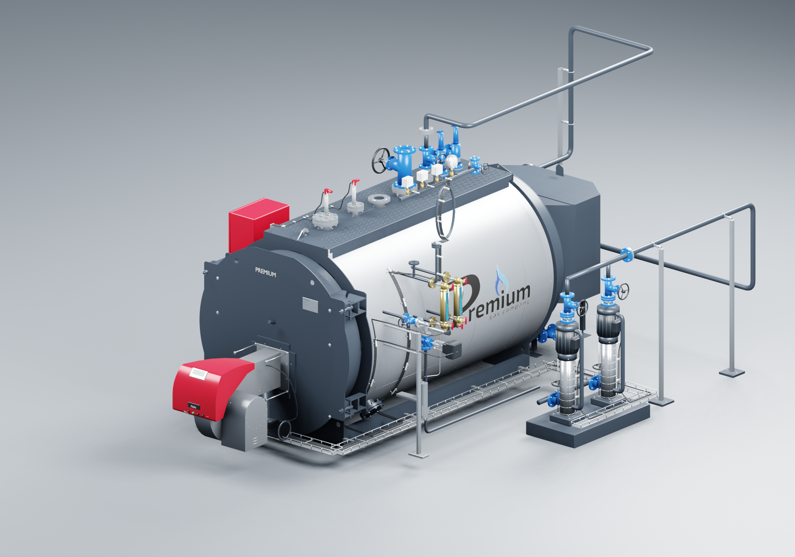
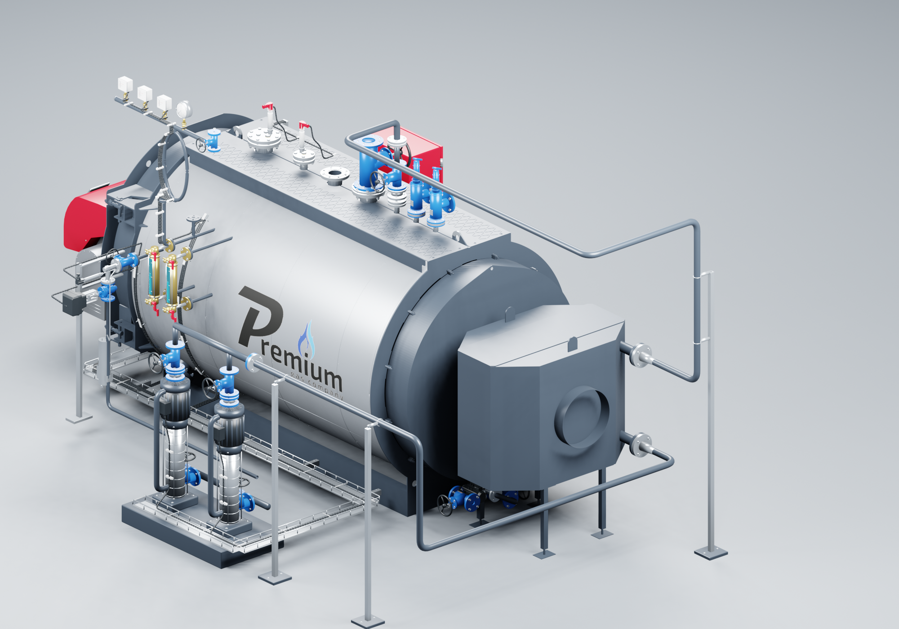
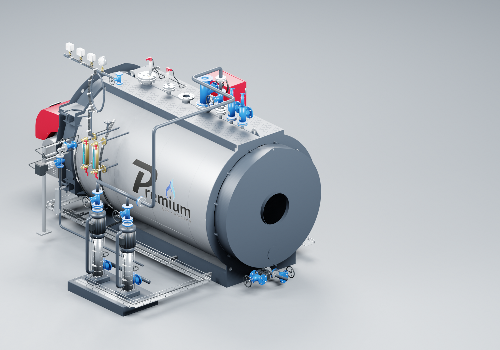
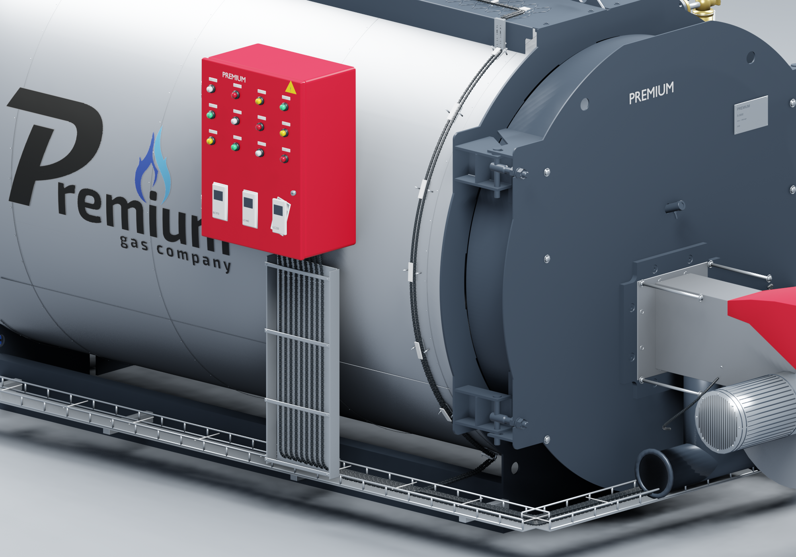
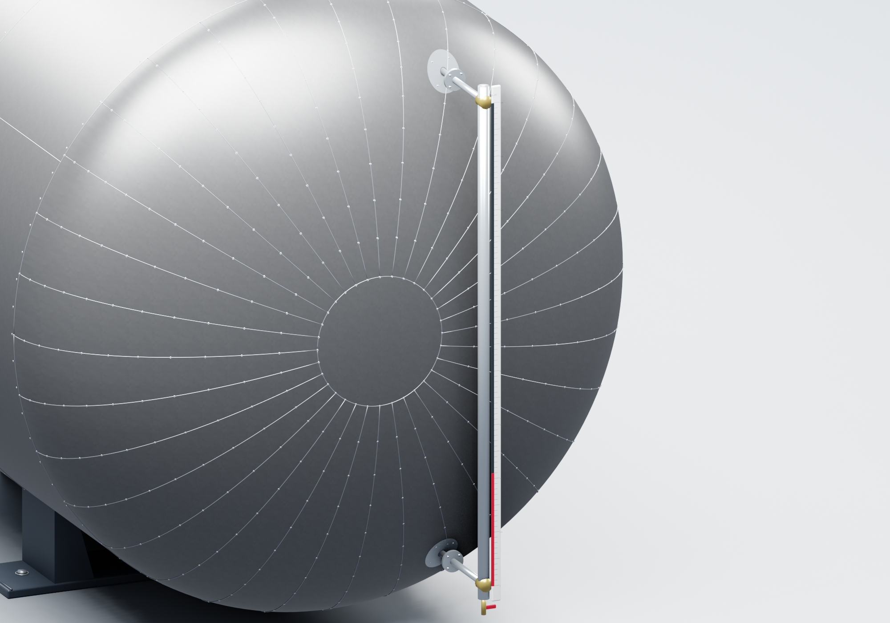

# PREMIUM S-3000 — 3D-сборка АДЛ, 8 бар

Последняя версия в этой ветке: **2026.09.09.3 от 9 сентября 2026 года**. Исполнитель: **Codex / GPT-6 Astra**. Версия npm: `2026.9.9-3`. Открывание реализовано для сайта и AutoCAD. Предыдущая исходная Blender-сборка **2026.09.08.4** сохранена без изменений.

Кнопки «Открыть шкаф» и «Открыть дверь котла» показывают внутреннее устройство. Горелка движется вместе с дверью котла, три контроллера — вместе с дверцей шкафа. Из предоставленного STEP перенесены только 80 дымогарных труб и одна жаровая труба; остальные 534 тела исключены. Аппараты и проводка шкафа построены по фотографии. В AutoCAD доступны команды открывания и панель с кнопками. [Состав, проверка и использование версии 2026.09.09.3](docs/s3000-opening-20260909.md).

В версии 2026.09.09.2 удален блок «Наименование по спецификации», сторонние бренды и обозначения моделей в описаниях оборудования. Сохранены Premium, функциональные названия, размеры и количества. Правка касается текстов; геометрия, материалы и переключение комплектации не изменены. Исходный коммит — `a1a525c`. [Протокол проверки текстов и публикации](docs/s3000-public-copy-20260909.json).

Публичный адрес — [prgz.ru/komplektacii4](https://prgz.ru/komplektacii4/). Предыдущая оптимизация **2026.09.09.1** из коммита `4b98b34` имеет отдельные [протокол публикации](docs/s3000-web-publication-20260909.json) и [измерения до/после](docs/s3000-performance-20260909.md). Сохранены [архив 2026.09.09.1](https://prgz.ru/komplektacii4-v2026.09.09.1/) и [архив подробной версии 2026.09.08.4](https://prgz.ru/komplektacii4-v2026.09.08.4/). Методика и решения описаны в [плане оптимизации](docs/s3000-performance-design-20260909.md).

Веб-сетка версии 2026.09.09.3 содержит **1 269 997 треугольников**, подробная модель — 3 270 373. После разделения дверей и добавления внутренностей в сборке 54 компонента, 27 карточек оборудования. Обе схемы питания, горелка и деаэратор сохранены. Четыре GLB суммарно **11 475 072 байта**, каждый меньше 6 МБ. Модели повторно используются из кеша. Тени обновляются при движении дверей и смене комплектации. После остановки отрисовка прекращается.

Конфигуратор открывает S-3000 с навесным оборудованием из выбранных колонок АДЛ листа S-3000. Экономайзер PREMIUM EQS2 дополнительно развёрнут на 180°: два водяных фланца обращены назад, дымовой порт состыкован с котлом. Оборудование можно выбирать в 3D или искать в списке. Карточка показывает название, количество, происхождение геометрии и сведения из спецификации.

В версии 4 питание переключается вместе с экономайзером. С ним вода идёт от насосов в нижний фланец экономайзера, затем из верхнего фланца в котёл. Без него остаётся прямая линия от насосов. Обе схемы подключены к верхнему патрубку между паровым вентилем и двумя предохранительными клапанами. Скрываются также фланцы и опоры исключённой трассы.

Девять кабельных линий от приборов и насосов доведены до вводов шкафа. На обшивке показаны крепления; снизу — перфорированные лотки и вертикальный канал под шкафом. Указатель уровня ДА-25 перенесён ближе к центру торца: оба патрубка входят в бак, вокруг них выполнены накладки по форме оцинкованной обшивки.

В версии 3 приборный коллектор перенесён на боковой отвод над смотровыми стёклами. LP200 установлен в передний большой фланец, LP400 — в следующий, по последнему скриншоту владельца с подписями. На котле использован предоставленный прозрачный PNG-логотип. Добавлены шкалы, крепёж, кабельная гофра, решётки двигателей, стыки обшивки и рифление площадки.

ДА5/2 заменён моделью **ДА-25/15 с оцинкованной обшивкой**. Владелец выбрал ДА-25; бак 15 м³ принят предварительно по найденному заводскому чертежу. Колонка и бак имеют листовые пояса, радиальные сегменты днищ, швы и заклёпки. Точное исполнение бака остаётся на уточнении.











В сборке 27 позиций спецификации, представленных 37 единицами или комплектами. Вместе с корпусом, дополнительными модулями и соединительными элементами — 49 логических компонентов. Горелка, экономайзер и деаэратор включаются отдельно. Выбор дополнительных модулей сохраняется в адресе страницы.

| Открытие | Результат |
| --- | --- |
| `dist/index.html` или корень сервера | S-3000, АДЛ, 8 бар; горелка и экономайзер включены |
| `?addons=` | Дополнительные модули выключены; питание напрямую в котёл |
| `?addons=burner,economizer,deaerator` | Все три модуля включены |
| `?assembly=legacy` | Прежний прототип трёх комплектаций с условной расстановкой |

## Запуск и встраивание

Требуется Node.js с npm. Проверено локально на Node.js 24.13.1.

```powershell
npm ci
npm run dev -- --host 127.0.0.1
npm run build
npm run preview -- --host 127.0.0.1
```

Веб-версия использует HTML, JS/CSS и отдельные GLB с именами по содержимому в `dist/assets`. HTML — около 2 КБ, модель больше не встроена в base64. Для прежнего режима `assembly=legacy` сохраняются его ресурсы. Публикуйте **весь каталог dist**, включая локальные `.htaccess`; не переносите эти настройки в корень сайта. Открывайте через HTTP(S) или `npm run preview`, а не двойным щелчком по HTML. Эта версия подключается через iframe как самостоятельный просмотрщик. Контракт `postMessage` прежнего прототипа в новом режиме не реализован.

Проверенная сборка опубликована на **https://prgz.ru/komplektacii4/** по запросу владельца от 9 сентября 2026 года. Встраивание в основной каталог `kotelpremium.ru` отдельно не выполнялось. Пример iframe и действующие параметры адреса — в [инструкции по встраиванию](docs/EMBED.md).

## Геометрия и точность

Котёл и экономайзер повторно получены из исходных STEP с более мелкой сеткой (линейное отклонение 0,1 мм). **RS_410.dwg уже содержит 3D:** один блок с 168 полигональными объектами в миллиметрах. Форма горелки взята из этого файла, мелкие детали добавлены по фото; маркировка посредника в BIM-шаблоне заменена на Riello по фотографиям. RFA 2025 не конвертировался. Деаэратор восстановлен по заводскому 2D-чертежу и фотографиям. Десять моделей приборов получены со [страницы 3D-моделей ATECH](https://atech-ltd.com/?page_id=9984); ссылки, имена файлов и SHA-256 сохранены в [sources.json](src/assets/s3000/sources.json). Длина стержней LP200/LP400 изменена с 500 до 1000 мм по выбранной спецификации. Для PCF20 и привода нижней продувки использованы доступные близкие исполнения; различия описаны в [технической записке](tools/s3000/README.md).

Указатели уровня RLG-16, арматура АДЛ, насосы Jetex и шкаф построены параметрически с опорой на фотографии. Фотографии включают S-4000 и установленные объекты; количество и наименования оборудования относятся к S-3000. Трассы обвязки и размеры деталей, восстановленных по фото, требуют проверки по монтажным чертежам. Выбор модели горелки для мощности S-3000 не подтверждён расчётом. Эта поставка предназначена для визуального согласования. Инженерная приёмка и подготовка STL для печати не выполнены.

Ранее файл `rs_410.glb` был ошибочно назван горелкой: это **экономайзер EQS2**. CP930 — **датчик проводимости**, охладитель проб — **SC9**. Исходный DN32×50 — **предохранительный клапан АСТА**, поэтому он не выдаётся за арматуру АДЛ. Подписи исправлены, прежняя предварительная сборка отмечена как архивная.

## Проверка и подключение приложений

- [Результаты версии 4](docs/s3000-routing-verification-20260908.json).
- [Архив результатов версии 3](docs/s3000-detail-verification-20260908.json).
- [История версий](CHANGELOG.md).
- [Повторяемое построение и происхождение моделей](tools/s3000/README.md).
- [Blender MCP](tools/blender_bridge/README.md): соединение и повторное открытие новой подробной сцены проверены. Управляется отдельная фоновая сцена Blender; открытое пользователем окно Blender — отдельный сеанс.
- [AutoCAD MCP, отдельный PR №2](https://github.com/lexcrirovs-prog/3d_komplektacii_na_par/pull/2): подключение к запущенному AutoCAD 2027 проверено в режиме чтения. Восстановление котельной и труб из DWG в эту сборку ещё не входит.

Исходные фотографии, Excel-файлы с ценами, DWG/RFA горелки, частные чертежи деаэратора, локальные настройки и архивы загрузок не включены в публичную поставку.
