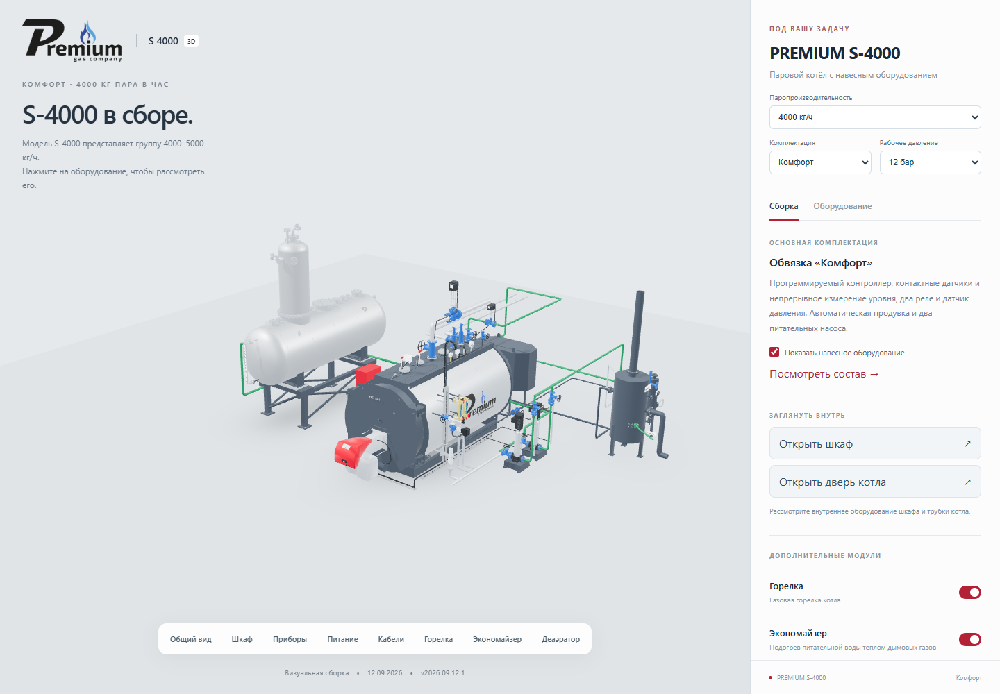
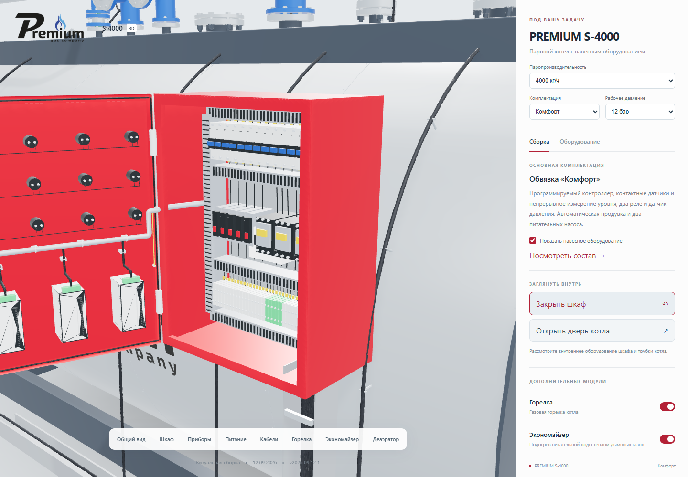
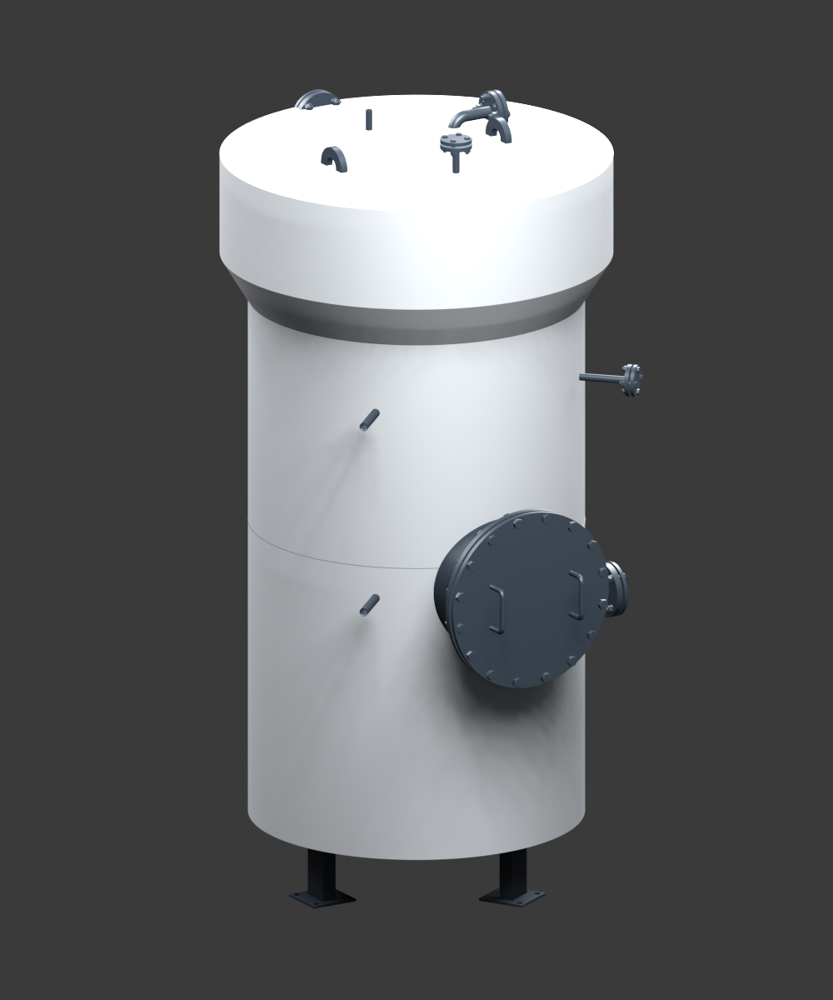

# PREMIUM boiler configurator — 2026.09.12.1

Date: 2026-09-12. Executor: Codex / GPT-6.

## Scope and source of truth

The S-4000 Comfort web derivative starts from the completed source task
«Спроектировать 3D-визуализацию котла», source commit
`ece59f86446be5c2d23443f8c08ba642e314bddb`.
Approved Blender file: `S4000_COMFORT_OPENING_v2026.09.11.1.blend`.
SHA-256: `6a6aa9f357c6d4f402e4ee59e6efd0673abffba05439ba125176905383e36c33`.
The dated filename alone is insufficient: source fixes reused this filename.

The canonical Blender/DWG files are not overwritten. Web geometry, additional
trim models and release manifests are derivatives with separate provenance.
Additional trim placements are visual layouts for review, not issued mounting
or electrical drawings. Update the engineering source task before manufacturing
from a changed configuration.

## Confirmed behavior

- Default: S-4000, Comfort, 12 bar; feedwater modulation and electric GPZ selected.
- Standard, Comfort and Comfort+ compositions come from the three user-approved
  June 2026 workbooks. Only descriptions, purposes and quantities are extracted.
- Modulation is optional in Comfort and Comfort+; unavailable in Standard,
  explicitly confirmed by the user on 2026-09-12.
- Independent BDV and FV controls hide each vessel and its local equipment.
  Incoming pipes retain their original coordinates and direction. The old CAD
  route that bypassed FV to BDV is not activated.
- Electric GPZ is mandatory from 4000 kg/h inclusive as the Premium product rule.
- 8/12 bar selects the corresponding pump and safety-valve BOM rows. The same
  external source illustration is retained, as accepted in the source task.
- Three independent level alarm controllers, two low-level probes and one high-
  level probe in Comfort+ use downloaded manufacturer CAD. Their placements in
  this web derivative need review before incorporation into engineering drawings.
- Original 96 smoke tubes, furnace tube, doors, wiring and feed routing are retained.
- Public descriptions use functional Russian names; supplier brands and original
  part numbers are absent. BDV/FV abbreviations remain as explicitly requested.

## Capacity-specific source quantities

The Comfort+ workbook lists one pressure relay for S-500, S-1500, S-2000,
S-2500, S-3500 and S-5000; two for S-1000, S-3000 and S-4000. Preserve the
actual worksheet quantities, not a copied S-4000 rule. S-3500 was not requested
as a selectable family member. No source workbook was changed.

## Remaining family integration

The current integrated S-4000 scene represents 4000–5000 kg/h. Rules and source
catalogs are prepared for 500/1000/1500, 2000/2500/3000 and 4000/5000 kg/h.
The complete 500–1500 and 2000–3000 scene integrations remain outstanding.
S-1000 BIM and DA-3 CAD were found in the local factory archive. The user supplied
two DA-3 appearance photographs. A separate DA-3 exterior preview preserves
the source CAD and adds a photo-derived insulation jacket; inferred jacket
dimensions are not issued engineering dimensions. Confirmation of the intended
S-1000 source revision was requested.

## Sources

- Equipment quantities and rows: `source-catalog.json`, extracted from columns
  I/J/K of the three source workbooks with SHA-256 provenance. No price columns.
- Factory CAD downloads: https://atech-ltd.com/?page_id=9984
- Remote GPZ control: point 49 of FNP, order 536 of 15.12.2020:
  https://www.gosnadzor.ru/industrial/equipment/acts/Пр-536%20от%2015.12.2020%20ФНП%20ОРПД.pdf
  The wording is **more than 4 t/h**, with drive type/location defined by the
  project. Electric drive from 4000 inclusive is the Premium implementation,
  not a claim that the norm expressly mandates electric drive at 4000.
- BDV: https://content.spiraxsarco.com/-/media/spiraxsarco/international/documents/en/ti/bdv60-ti-p405-33-en.ashx?rev=2bda389f41824effa20b42d041be7c1d
- FV: https://content.spiraxsarco.com/-/media/spiraxsarco/international/documents/en/ti/fv-ti-p404-03-en.ashx?rev=a439d8f3db6b4350937030d19cf92414

## Verification

Unit checks cover family rules, pressure variants, workbook quantities, independent
vessels, modulation/economizer routes and public descriptions. Browser checks
cover actual object visibility, pipe transforms, URL reload, trim switching,
door angles, stationary tube bundle and mobile overflow. Browser screenshots
are visually reviewed separately; an automated pass alone is not visual approval.
Publication: **PASSED_PUBLIC_COPY**, verified on 2026-09-12.
Live: https://prgz.ru/komplektacii4/
Rollback copy: https://prgz.ru/komplektacii4-v2026.09.09.5/

The staged and live copies passed HTTPS content hashes for 36 public files;
38 files including private server configuration were checked over SSH. Browser
interaction passed on both URLs, tied to the same manifest SHA-256:
`d392bcc73e803d4b385bcdab79fcf9ed7552f5c520ccefe98cc8a7c9ed2628f0`.
The site root, root routing and cascade page hashes remained unchanged.
Published application source commit: `5bb43676571e984591c4a9c8160508594ea8ab40`.
The later release commit stores this exact built copy, acceptance records and
publication-tool updates; it does not change the deployed application payload.

The shared publisher now has a separate browser-acceptance hook. S-3000 keeps
its original four browser records; S-4000 validates its current seven interaction
checks and manifest binding instead of looking for obsolete S-3000 test paths.
No fabricated acceptance records were used.

Desktop performance: Chrome 152, Intel UHD 770, 1280x720, simulated 10 Mbps and
100 ms latency, one cold and one warm run. First boiler: 4.94 s cold / 0.53 s warm;
complete assembly: 23.15 s cold / 0.95 s warm. Full-assembly rendered rotation:
66.8 / 65.8 fps. Cold transfer: 23.76 MB. Idle draw frames: zero. These are desktop
measurements, not physical-phone performance. The profiler explicitly waits for
the full scene before sampling rotation; the earlier core-only sample is not used.

TypeScript and nine local tests passed. Browser checks reported no page errors.
The live screenshots below were also inspected visually. No GitHub CI run is
claimed; these are local and deployed-browser acceptance records.

