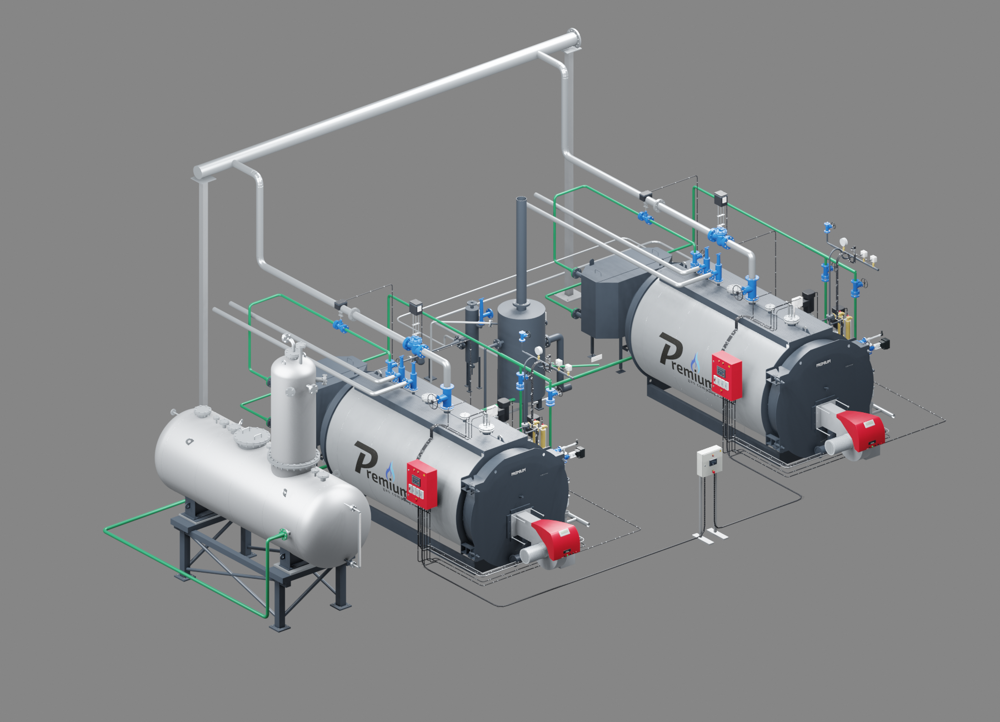
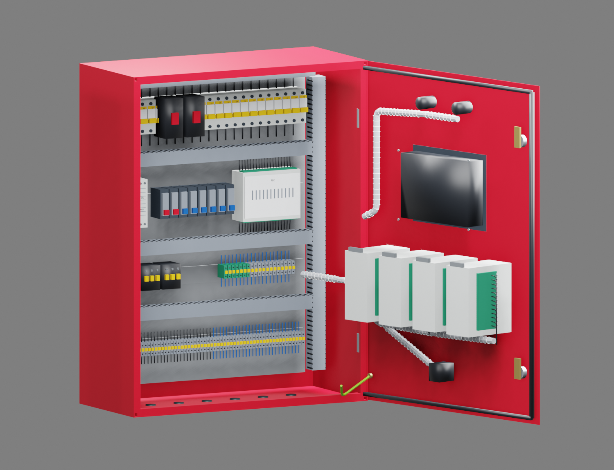

# Каскад PREMIUM S и шкафы «Комфорт+»

**Версия 2026.09.28.1 · 28.09.2026 · исполнитель Codex / GPT-6.**

В конфигураторе добавлен выбор установки «Каскад 2 × S-4000 · Комфорт+».
У каждого котла свой красный шкаф. Один серый шкаф обслуживает каскад.
Паропроводы после ГПЗ соединены с общим коллектором большего диаметра.
Исходная одиночная установка и три комплектации остаются доступны.

## Шкафы по фотографиям

Красный корпус: IEK IND-YKM40-03-54, высота 650, ширина 500, глубина 220 мм.
Размеры взяты с предоставленного шильдика. На фасаде сенсорная панель,
контроллер продувки, три контроллера уровня, сигнализация, аварийный стоп
и два замка. Внутри показаны четыре ряда DIN-аппаратуры, ПЛК, автоматы,
контакторы, реле, клеммы, монтажные короба и проводка. На двери расположены
задние части панели и четырёх приборов, жгут, заземление и уплотнение.

Серый корпус: IEK YKM40-441-54, 400 × 400 × 150 мм. Фиксированная часть
корпуса и монтажные детали взяты из [официальной STEP-модели IEK](https://cdn-01.iek.ru/media/original/f2884dcf05ba7344ad4fe61a337b971b49735704b09050844a5aae0f8ede0837.step).
Дверь с приборами и внутреннее наполнение воспроизведены по фото. Панель,
звуковая сигнализация, аварийный стоп, ПЛК и клеммы отличаются от красного шкафа.
Размеры серийного корпуса также приведены в [каталоге IEK](https://www.iek.ru/upload/pictures/katalogi/en_en/2016/4-catalog_korpusa.pdf).

Оба типа имеют правые петли и открываются на 105°. Экраны используют
предоставленные статические изображения. Содержимое экрана серого шкафа
не выдаётся за действующую программу управления каскадом. Полной готовой
модели оборудованного красного шкафа не найдено: он построен по фото.

## Принятые для первого варианта параметры

- Два S-4000, «Комфорт+», суммарно 8000 кг/ч; отображаемые исполнения 8–12 бар.
- Расстояние между осями котлов 6300 мм.
- Ветви паропровода DN100, общий коллектор условно DN200, отметка оси 4550 мм.
- Один общий деаэратор и общие FV/BDV. Собственные насосы и ГПЗ каждого котла.
- Подвод к насосам и линии продувки второго котла присоединены к общим трассам.
- Связь шкафов показана в чёрных гофрированных рукавах.

Количество котлов, шаг и DN200 — принятые для визуального макета параметры.
DN200 не получен гидравлическим расчётом. Трассы и общие аппараты требуют
подтверждения для конкретного объекта. Новые аппараты автоматики сверх
показанных пользователем не добавлялись. Электрическая схема не разрабатывалась.

## Файлы AutoCAD и Blender

Папка: `E:\CodexArtifacts\Cascade-v2026.09.28.1`.

| Файл | Назначение |
|---|---|
| `S4000_CASCADE_COMFORT_PLUS.blend` | Подробная сборка, пять независимых петель |
| `S4000_CASCADE_COMFORT_PLUS.dwg` | AutoCAD 2018, единицы мм, нативные MESH в блоках |
| `CASCADE-controls.lsp` | Команды открытия дверей в AutoCAD |

В Blender: кадр **1 — закрыто**, **49 — открыто**, **97 — закрыто**.
Пять объектов `HINGE_*` можно поворачивать отдельно по локальной оси Z.
Python-драйверы и обработчики не используются. Текстуры экранов упакованы.
Второй котёл использует связанные mesh-данные; это уменьшает размер файла.

В AutoCAD загрузить `CASCADE-controls.lsp` через `APPLOAD`.
Команды `CASCADEOPEN` / `CASCADECLOSE` открывают и закрывают все двери.
`CASCADEBOILER1`, `CASCADEBOILER2`, `CASCADECABINET1`, `CASCADECABINET2`,
`CASCADEGRAY` переключают одну выбранную дверь. `CASCADEVIEW` возвращает общий вид.
Автоматическая загрузка LISP и изменение настроек безопасности не добавлялись.
Двери остаются обычными редактируемыми блоками; экраны в DWG показаны без растровой текстуры.

Подробная геометрия котла получена из последнего сохранённого S-4000 Blender
с SHA-256 `6a6aa9f357c6d4f402e4ee59e6efd0673abffba05439ba125176905383e36c33`.
Добавлены последние трассы семейства 2026.09.13.6. Сетка исходного котла
не упрощалась. Исходные одиночные S-3000 и S-4000 не перезаписаны.

## Сайт и размер загрузки

Новые GLB загружаются по выбранной комплектации. Их общий размер —
**2 679 444 байта**: красный шкаф 864 240, серый 405 812, каскадные трассы 1 409 392.
При добавлении второго котла модель котла повторно по сети не загружается;
геометрия переиспользуется. Это добавочный объём к существующим моделям семейства.
В списке оборудования количества котловых позиций удвоены; общий шкаф один.
DN200 обозначен условным в карточке коллектора.

## Проверка и публикация

Проверяются TypeScript/Vite, правила семейств, переключение Стандарт → Комфорт+ →
каскад → одиночный котёл, пять дверей, общие аппараты, опции, мобильный экран,
повторное открытие Blender и сохранение/повторное открытие AutoCAD.
Публикация использует промежуточную папку, SHA-256 манифест, проверку изменения
действующей версии и сохранение предыдущей публикации. Итоговые результаты
и адрес приведены в [verification.json](verification.json).

**Итог: PASSED_CASCADE_RELEASE.** Версия опубликована на
[основном сайте](https://prgz.ru/komplektacii4/?power=4000&trim=comfort_plus&cascade=2).
118 публичных файлов проверены через HTTPS. На промежуточном и основном
адресах пройден один и тот же сценарий: комплектации, каскад, выбор детали
второго котла, двери, опции и экран 390 × 844. Ошибок JavaScript нет.
Это проверка размера мобильного окна в Chrome, не испытание на физическом телефоне.
Правила комплектаций: 21 тест. TypeScript/Vite: успешно.

Blender повторно открыт с упакованными изображениями; пять петель проверены
на кадрах 1/49/97. DWG сохранён и повторно открыт AutoCAD 2027 Core Console:
AUDIT 0, пять циклов открытия/закрытия, все блоки, цвета, топология и координаты
совпадают с экспортом до 0,001 мм. В DWG 116 определений блоков, 199 экземпляров
и 1068 MESH. Визуально проверены рендеры той же подробной сцены Blender.

Коммит приложения: `49fa02fa07577c13fc47891eac13d91a7c2329f2`.
Коммит публикации: `b9ee815b7a8876b2cd6b3500549b49517ae6075a`.
Манифест: `0f5704cafb3fe7a474a61b0b50657f29ba57e1304b9622287f053364bfe4b802`.
Для обновления передано 1 664 308 байт; 110 файлов переиспользованы на сервере
после сверки SHA-256. Соседние контрольные страницы не изменились.
[Предыдущая публикация](https://prgz.ru/komplektacii4-before-cascade-v2026.09.28.1/) сохранена.

Удаление трёх промежуточных результатов конвертации объёмом 4 041 780 972 байта
отклонено автоматической проверкой (`blocked by policy`). Они остаются в
подпапке `build`; готовые DWG и Blender проверены независимо от этой очистки.

