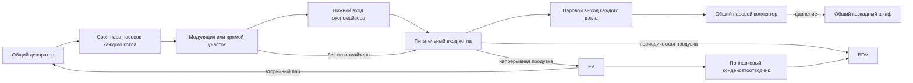
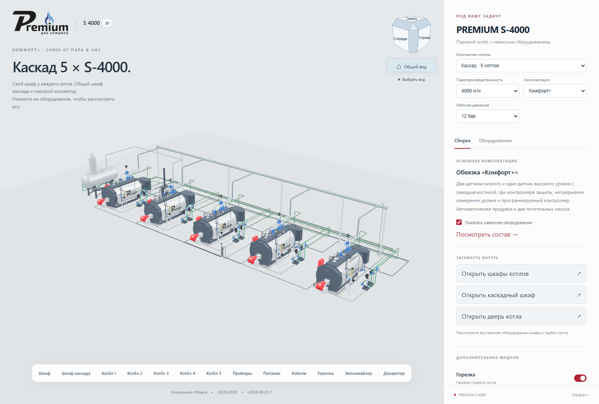
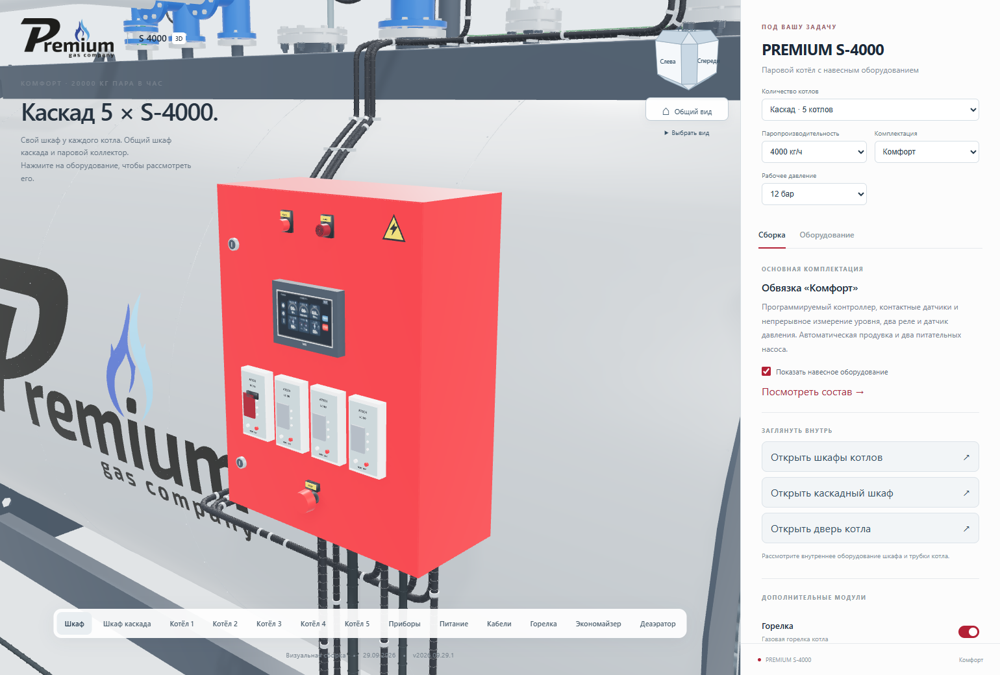
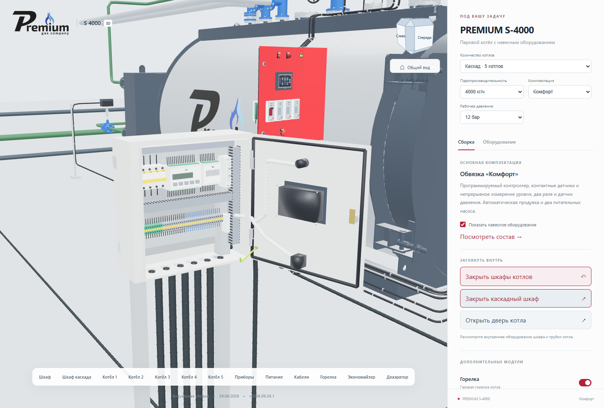

# Каскад 2–5 котлов и сверка обвязки

**Версия сайта 2026.09.29.1 · 29.09.2026 · Codex / GPT-6.**

Каскад доступен для S-500, 1000, 1500, 2000, 2500, 3000, 3500, 4000 и 5000.
Выбор количества: один котёл либо 2–5 одинаковых котлов выбранной мощности.
Количество сохраняется при смене мощности, комплектации и давления 8/12 бар.
Доступны все три комплектации. Ограничения отдельных опций остаются прежними:
экономайзер от S-1500, модуляция в «Комфорт»/«Комфорт+», ГПЗ обязателен от S-4000.

Красный шкаф «Комфорт» повторяет шкаф «Комфорт+» по фотографиям. Внешний
корпус 650 × 500 × 220 мм и размещение четырёх приборов одинаковы. HMI
уменьшен на 20% по ширине и высоте: рамка 162,4 × 116,8 вместо 203 × 146 мм.
Дверь и её внутреннее наполнение открываются на 105°. У каждого котла свой
шкаф, у каскада один общий серый шкаф. Изображения экранов статические.
Серый шкаф стоит в проходе между котлами, в том числе при нечётном количестве,
и не пересекается с горелкой среднего котла.

## Что проверено по документации

Источник: [папка пользователя](https://disk.yandex.ru/d/dl5RirewgbCltw).
Изучены тепловая схема и узлы обвязки раздела 02-2026-ТХ, а также относящиеся
к каскаду листы 02-2026-АК. Индекс 25 полученных PDF с SHA-256 находится
в [source-index.json](source-index.json). Исходные PDF в Git не копируются.

| Узел | Документ | Изменение в 3D |
|---|---|---|
| Питательная вода | 02-2026-ТХ, лист 3 | Общий подвод от ДА проходит **за экономайзерами**, по Y=6,6 м. У каждого котла остаются собственные два насоса. Линия не пересекает BDV/FV. |
| Модуляция | 02-2026-ТХ, лист 3, ветвь питания котла | Клапан, байпас и привод перенесены **перед нижним входом экономайзера**. При отключённом экономайзере работает прежний узел перед питательным входом котла. |
| Провод привода | Фото пользователя и новое положение клапана | Гофра доходит от нового ввода привода до существующего ввода шкафа. Добавлены стойка и крепления вертикального участка. |
| Общий паропровод | 02-2026-ТХ, лист 3 | Отдельные ветви от паровых выходов каждого котла соединены с общим коллектором большего диаметра. Координаты выходов взяты из зарегистрированной модели каждой мощности. |
| Непрерывная продувка | 02-2026-ТХ, лист 3 | Общий отдельный коллектор ведёт в FV. Без FV предусмотрена ветвь к BDV; без обоих баков показана граница внешней системы. |
| Периодическая продувка | 02-2026-ТХ, лист 3 | Свой общий коллектор ведёт к BDV. Он не объединён с питательной водой или паровым коллектором. |
| Вторичный пар FV | 02-2026-ТХ, лист 3 | Возврат от центрального верхнего DN50 FV к ДА. Предохранительный клапан FV сохранён на малом DN25. Без ДА остаётся внешний вывод вторичного пара. |
| Конденсат FV | 02-2026-ТХ, лист 3 | Сохранён проход через существующий поплавковый конденсатоотводчик к BDV; видимость ветви зависит от выбранных баков. |
| Автоматика каскада | 02-2026-АК, ШУ КПК 01, листы 2 и 8 (страницы PDF 31 и 37) | На общем паровом коллекторе добавлен датчик давления. Его гофра и отдельная связь со шкафом каждого котла приходят в серый шкаф каскада. |
| Малый ДА-3 | Заводской PR.3.01.044СБ | Возврат пара подходит к штуцеру Г DN65. Условный уровнемер перенесён на два штатных штуцера K DN20, освобождая паровой ввод. |

## Границы переноса проектной схемы

В проекте стоят четыре S-4000 и один S-5000 второй очереди, FV12 и другой
типоразмер конденсатоотводчика. В конфигураторе оставлены выбранные ранее
FV8, BDV60/5, A31 и деаэраторы. Перенесены связи существующего оборудования.
Водоподготовка, расширенное хозяйство конденсата и другие отсутствующие
модули объекта не добавлялись. Вентиляция BDV, охлаждение и внешние стоки
остаются обозначенными границами подключения, как в предыдущей сборке.

Коллектор с наружным диаметром 219 мм, шаг котлов 6300 мм и общие аппараты
показывают компоновку. Диаметры и производительность общих ДА/FV/BDV не
подбирались гидравлическим расчётом на суммарный расход 2–5 котлов. Ветви
состыкованы с существующими визуальными трубопроводами каждой мощности.
Пятый котёл — расширение визуализации по запросу пользователя; программа
ПЛК из проектного четырёхкотлового шкафа не переносилась и не испытывалась.

AutoCAD и Blender каскада остаются выпуском **2026.09.28.1**. Эта версия
обновляет интерактивную модель сайта; нативные DWG/BLEND не перезаписаны.

## Проверка

- TypeScript/Vite; 29 тестов. Матрица количества, мощности, комплектации,
  давления; точки подключения; переключение FV/BDV/ДА; зазор общей
  питательной линии от габаритов баков; положение модуляции и её гофры.
- Проверка размеров экрана на сжатых GLB: ширина и высота «Комфорт» — 80%
  от «Комфорт+». Корпус остаётся одного размера.
- Chrome: 1–5 котлов, все девять мощностей, три комплектации, открывание
  шкафов и дверей S-4000, выбор пятого котла, опции, ширина 390 px.
- Котлы используют общие mesh-данные. При добавлении экземпляров GLB котла
  повторно не загружается. Трубопроводы строятся по выбранному количеству.
- Проверка публикации привязана к SHA-256 манифеста; результаты локальной,
  промежуточной и основной страниц сохраняются отдельно. Соседние страницы
  контролируются по хешам, предыдущий выпуск сохраняется для возврата.

## Опубликованный выпуск

**PUBLISHED_VERIFIED — 29.09.2026.** [Открыть пять S-4000 «Комфорт»](https://prgz.ru/komplektacii4/?power=4000&trim=comfort&cascade=5&pressure=12&addons=burner%2Ceconomizer%2Cdeaerator%2Cmodulation%2Cgpz%2Cbdv%2Cfv).

На основном адресе пройден полный браузерный сценарий для девяти мощностей.
Все 118 публичных файлов совпали с локальным манифестом через HTTPS.
Соседние контрольные страницы не изменены. Обновление передало 1 308 042
байта; 110 неизменившихся файлов переиспользованы после проверки хешей.
Предыдущий выпуск сохранён для возврата.

- Код опубликованной версии: `c078a580e481cefbf31031dce36185ced94340d9`.
- Коммит сборки `dist`: `4624497`.
- SHA-256 манифеста: `e245906abfc02cce18defaf57927fb14f8bcd3bfcf584e9c8b66d7d429c88049`.
- Сводный отчёт: [verification.json](verification.json).
- Браузер: [локально](browser-local.json), [промежуточный адрес](browser-stage.json), [основной адрес](browser-live.json).
- HTTPS: [промежуточный адрес](http-stage.json), [основной адрес](http-live.json).

