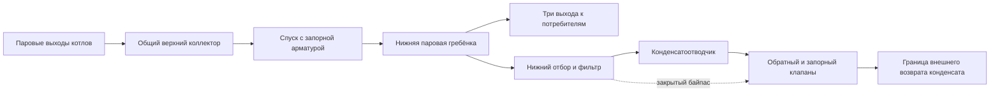
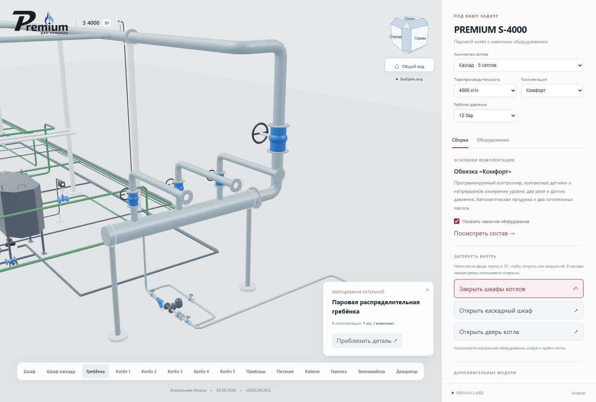
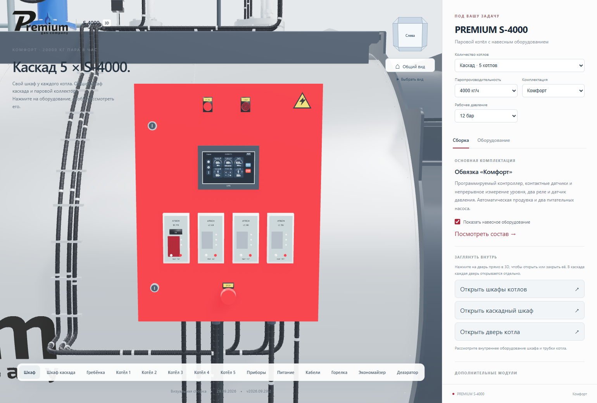
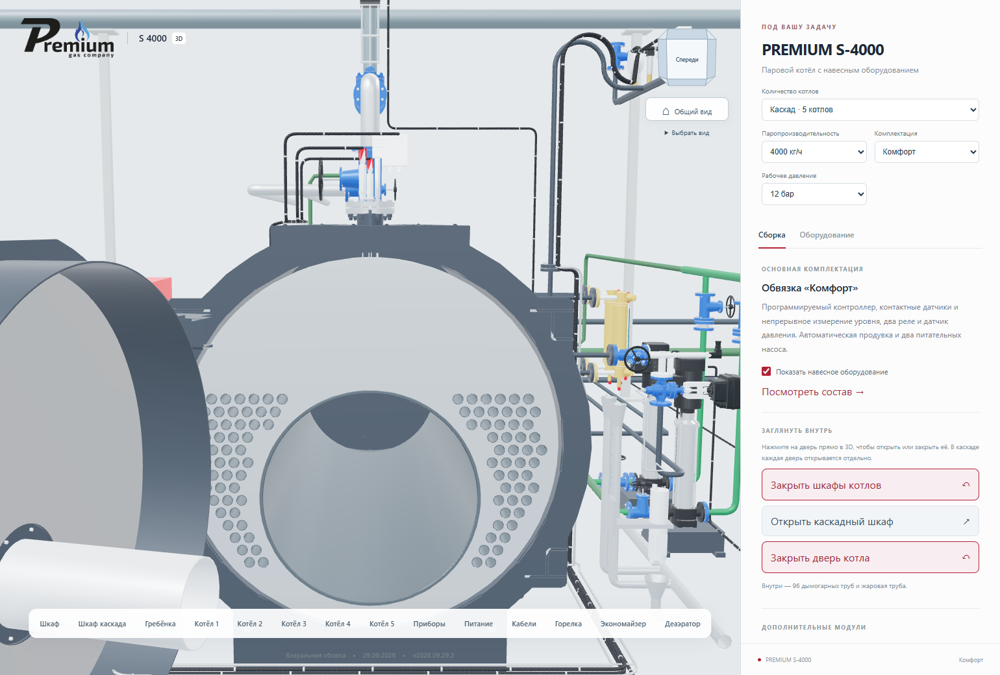
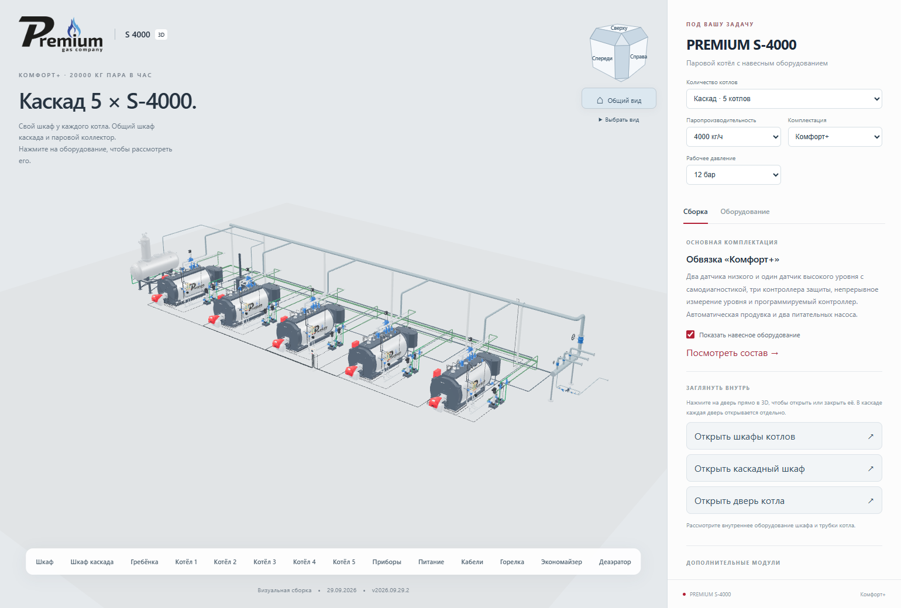

# Двери непосредственно в 3D и паровая распределительная гребёнка

**Версия 2026.09.29.2 · 29.09.2026 · Codex / GPT-6.**

Нажатие на дверь открывает или закрывает выбранный экземпляр. В каскаде
можно одновременно оставить открытыми, например, шкаф первого котла и
дверь третьего. Общий серый шкаф работает так же. Повторное нажатие
закрывает дверь, в том числе меняет направление незавершённого движения.
Перетаскивание для вращения камеры не переключает двери. Нажатие на
горелку сохраняет карточку оборудования с номером котла.

Красные шкафы «Комфорт»/«Комфорт+», серый каскадный и прежние шкафы
«Стандарт» поддерживают это действие на всех девяти мощностях. Котловая
дверь и трубная доска доступны у текущей модели S-4000. В остальных
заводских моделях линейки внутренний пучок не создавался в этом выпуске.
Существующие кнопки панели также сохранены: они открывают/закрывают все
двери соответствующего типа. Смена количества или мощности сбрасывает позы.

На BC970 пересекались лицевые поверхности красной панели и чёрного экрана.
Панель расположена ниже экрана; их глубины разделены. Обе детали остаются
на двери при открывании. Пересобраны веб-модели шкафов «Комфорт» и «Комфорт+».

## Паровая часть

Для каскада 2–5 котлов добавлена нижняя распределительная гребёнка после
общего верхнего коллектора. Привязка к его конечному фланцу пересчитывается
при смене количества котлов. Узел находится сбоку от последнего котла,
вне габаритов существующих баков и питающих линий.

У гребёнки есть манометр и две напольные опоры. На входе и выходах показана
запорная арматура. Нижний блок имеет два отсечных вентиля, фильтр,
конденсатоотводчик, обратный клапан и параллельный байпас с вентилем.
Для осмотра добавлена кнопка «Гребёнка». Узел присутствует в ведомости и
остаётся видимым при отключении FV или деаэратора. При одном котле общие
коллектор и гребёнка скрыты.

Статические болты, фланцы и корпуса объединены по материалам. Заводская
геометрия A31 переиспользована отдельным экземпляром, без загрузки ещё
одного файла. Конденсат гребёнки не соединён с линиями продувки к FV/BDV.

## Основания и принятые допущения

| Источник | Что установлено и перенесено |
|---|---|
| `VID_20260929_144444.mp4`, 00:56–01:05 | Нижняя распределительная часть, горизонтальные ветви, арматура, манометры и нижняя дренажная обвязка. Остальные кадры использованы для проверки расположения котлов, насосов и баков. |
| `2026-09-29_14-40-04.png` | Место дефекта на левом приборе красного шкафа. |
| 02-2026-ТХ, лист 3 | Связь гребёнок с блоками отвода конденсата и внешней системой возврата к деаэратору. |
| 02-2026-ТХ, лист 8 | Запорная арматура, фильтр, конденсатоотводчик, обратный клапан. В проекте два дренажных блока DN15. |

Проект получен из [папки пользователя](https://disk.yandex.ru/d/dl5RirewgbCltw);
[индекс проектных PDF](../cascade-v2026.09.29.1/source-index.json) относится к
предыдущему изучению. Хеши новых файлов — в [source-index.json](source-index.json).
Оригинальные видео, снимки и проектные PDF не добавлены в Git.

- **Три выхода приняты предварительно.** Часть гребёнки на видео перекрыта;
  владельцу задан вопрос о количестве. Это число не выдано за установленный факт.
- Показан доступный ранее A31 DN25. Он представляет внешний вид узла;
  в ведомости проекта указан другой конденсатоотводчик DN15. Типоразмер
  не подбирался расчётом и не объявляется точным соответствием проекту.
- Конденсатный вывод заканчивается внешним фланцем. Подключение к
  неподтверждённому штуцеру ДА не изображено. Граница указана в карточке узла.
- Диаметры гребёнки и ветвей задают визуальную компоновку. Это не выпуск
  рабочего проекта и не подбор на суммарный расход каскада.
- Дополнительные системы газоснабжения, вентиляции, электромонтаж в стадии
  строительства и посторонние аппараты из видео не переносились.
- Этот выпуск меняет сайт. Последние выданные DWG и BLEND не перезаписывались.

## Проверка и публикация

TypeScript/Vite и 32 модульных проверки пройдены. Отдельный сценарий Chrome
нажимает мышью на реальные поверхности: шкафы первого и пятого котлов,
дверь третьего S-4000, общий шкаф и шкаф «Стандарт». Проверены обратное
закрывание, независимость экземпляров, защита от ложного клика после
вращения, наличие гребёнки/конденсатоотводчика при отключении FV и ДА.
Второй сценарий проверяет все девять мощностей, 1–5 котлов, три комплектации,
опции, положение арматуры и ширину 390 px.

**PUBLISHED_VERIFIED — 29.09.2026.**

[Открыть пять S-4000 «Комфорт»](https://prgz.ru/komplektacii4/?power=4000&trim=comfort&cascade=5&pressure=12&addons=burner%2Ceconomizer%2Cdeaerator%2Cmodulation%2Cgpz%2Cbdv%2Cfv&v=2026.09.29.2).

Оба браузерных сценария пройдены локально, на промежуточном и основном
адресах. Ошибок JavaScript нет. Все 118 публичных файлов совпали по SHA-256
через HTTPS. Всего в публикации 120 файлов: 10 переданы, 110 переиспользованы
после проверки. Размер передачи — 1 299 151 байт. Соседние контрольные
страницы не изменены. Предыдущий выпуск сохранён для возврата.

Первый запуск дополнительной проверки основного адреса остановился до
кликов: ошибочно применялось стандартное ожидание загрузки 30 секунд.
В проверочном сценарии исправлена передача параметра 180 секунд; повторный
запуск прошёл все шесть проверок. Проверки геометрии и поведения не ослаблены.
Код сайта при этом не менялся.

- Исходный код сайта: `150926467e1aa95d5bf8f44d0ceaaf5ded6556fb`.
- Коммит сборки: `7d3fdf0b720e19da44ba2b6e2c4c492fcdce4f00`.
- Исправление ожидания в проверке: `236d23b`.
- Манифест: `36a518467776ad0d7cd471518e9b805e5e761088c99b239d859fdadd333d234b`.
- [Сводный отчёт](verification.json), [32 теста](unit-tests.log).
- Матрица конфигураций: [локально](browser-matrix-local.json),
  [промежуточный адрес](browser-matrix-stage.json), [основной адрес](browser-matrix-live.json).
- Клики по дверям и гребёнка: [локально](browser-doors-local.json),
  [промежуточный адрес](browser-doors-stage.json), [основной адрес](browser-doors-live.json).
- HTTPS: [промежуточный адрес](http-stage.json), [основной адрес](http-live.json).

