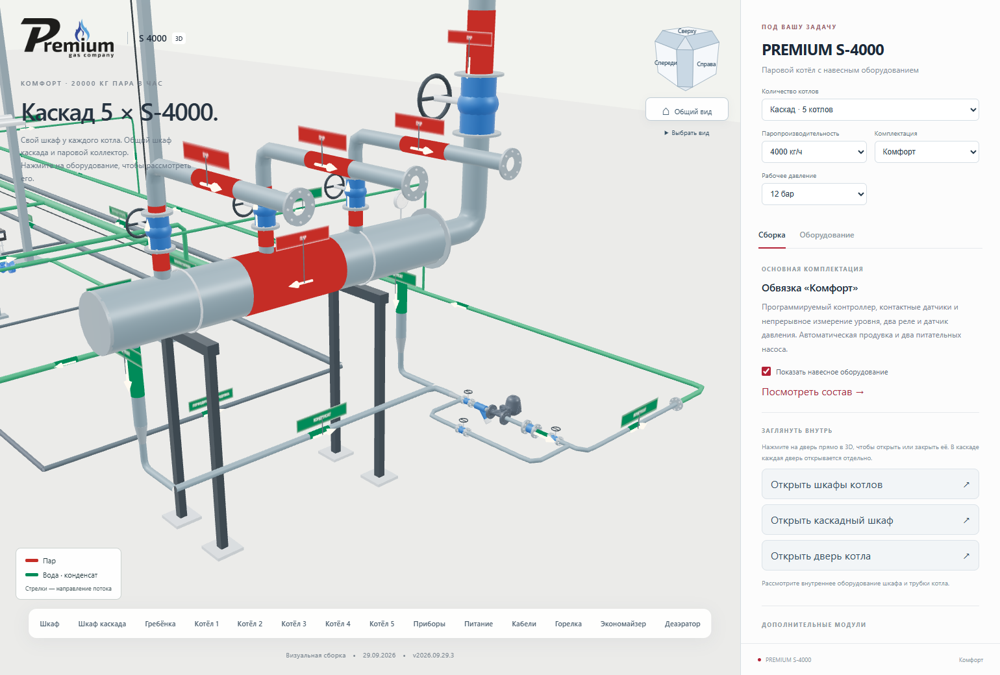
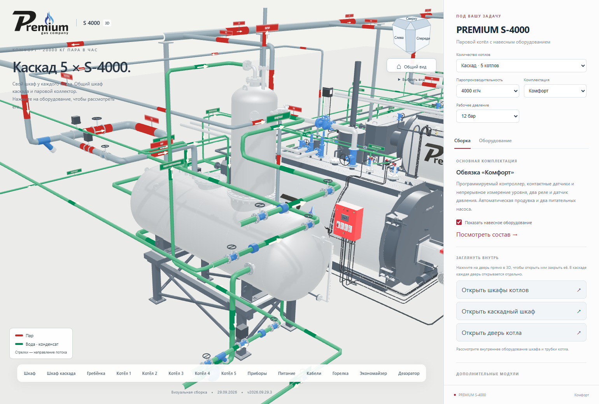
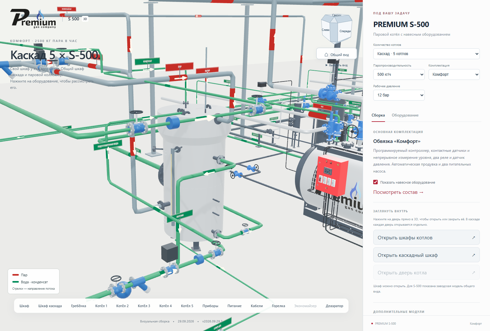
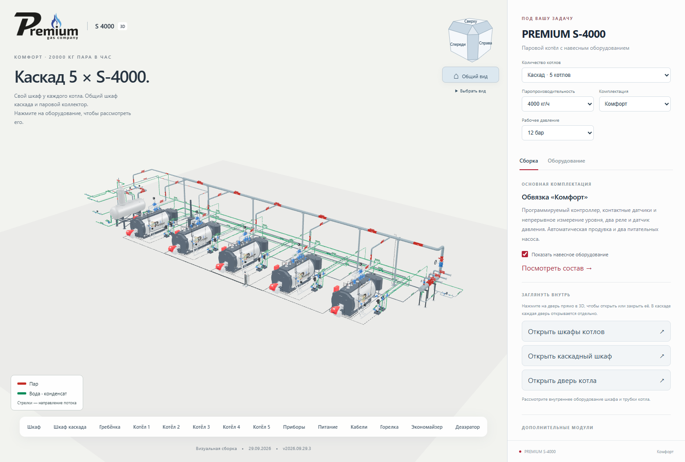

# Гребёнка Ø426, маркировка труб и обвязка деаэратора

**Версия 2026.09.29.3 · 29.09.2026 · Codex / GPT-6.**

**PUBLISHED_VERIFIED — опубликовано и проверено 29.09.2026.**

[Открыть обновлённый каскад из пяти S-4000 «Комфорт»](https://prgz.ru/komplektacii4/?power=4000&trim=comfort&cascade=5&pressure=12&addons=burner%2Ceconomizer%2Cdeaerator%2Cmodulation%2Cgpz%2Cbdv%2Cfv&v=2026.09.29.3).

## Гребёнка и конденсат

Наружный диаметр нижней паровой гребёнки — **426 мм**. Обозначение Ø426
относится к наружному диаметру, а не к условному проходу DN426.
Сохранены три выхода к потребителям, манометр, входная арматура и две опоры.

По фотографии `2026-09-29_16-33-42.png` сделаны два нижних конденсатных
кармана Ø89 мм у концов гребёнки. После каждого — переход Ø89 → Ø48,3
(условно DN40). Малые участки вынесены перед стойками, чтобы были видны
врезки и редукционные переходы. Общая линия проходит перед опорами,
далее переходит к существующей геометрии конденсатоотводчика DN25.

Последовательность: отсечной вентиль → фильтр → конденсатоотводчик →
обратный клапан → отсечной вентиль. Параллельный байпас показан закрытым.
При включённом деаэраторе конденсат возвращается к нему по отдельной линии.
Без ДА остаётся внешний конец возврата. Этот контур не соединён с продувкой
FV/BDV. Кнопка «Гребёнка» приближает весь узел.

## Цвета, надписи и направления

Проверен [действующий ГОСТ Р 71918-2024 в реестре Росстандарта](https://protect.gost.ru/gost/details/c31a94b2-d2ae-4ee0-bf3a-559dff0c9bb4).
Дата введения — 01.03.2025. [Текст стандарта с поправкой ИУС 11-2025](https://files.stroyinf.ru/Data/843/84353.pdf).

Применены опознавательные цвета: пар — красный, вода и конденсат — зелёные.
Выбрана окраска участками, разрешённая п. 5.4. Ширина участка: 4D до
Ø300 включительно, 2D выше Ø300; повторение на длинных участках — не реже
6 м. Белые стрелки следуют заданному направлению потока; таблички различают
воду, конденсат, выпар, перелив, рециркуляцию и оба вида продувки.

Фон осветлён, основные поверхности труб металлические. Цвет выделяет
назначение трасс, сохраняя оборудование главным элементом общего вида.
Использованы экранные приближения RAL 3020/6024. Это реализация
опознавательных цветов и направлений; полный комплект производственных
предупреждающих знаков и колец по параметрам каждой линии не выпускался.

## Деаэратор

Схема 02-2026-ТХ, лист 3, и ведомости листов 6–8 повторно сопоставлены с
заводскими чертежами ДА-15/4 и ДА-3. Проект взят из
[папки пользователя](https://disk.yandex.ru/d/dl5RirewgbCltw).
Его ДА имеет другую ёмкость, поэтому соединения перенесены по назначению
на штатные патрубки именно тех сосудов, которые находятся в 3D-сборке.

| Контур | ДА-15/4 | ДА-3 |
|---|---|---|
| Питательная вода к насосам | Нижний Д DN100 | Л DN50 |
| Подготовленная вода | У DN50 колонки | В DN32 |
| Конденсат с производства | Р DN50 колонки, отдельный внешний ввод | Общий возврат Т DN20 |
| Горячий конденсат гребёнки | Н DN50 бака | Т DN20 |
| Рециркуляция насосов | М DN25 | Тройник общего возврата перед Т |
| Основной греющий пар | В DN150 бака | Г DN65 |
| Вторичный пар FV | Л DN32 бака | Тройник перед Г, единый конечный стояк |
| Дополнительная паровая ветвь | Ж DN100, барботаж | Ж DN65, пар на гидрозатвор |
| Перелив и слив | Е DN80 и Г DN50, разные линии | Е DN50 и М DN15, разные линии |

Исправлены прежние неверные соединения: питание ДА-15 больше не выходит
через перелив Е; пар FV не занимает штуцер горячего конденсата Н.
На используемых патрубках удаляются только транспортные заглушки.
Добавлены запорные и регулирующие клапаны, фильтр подготовленной воды,
обратные клапаны, фильтр греющего пара и поплавковое устройство перелива.
От напорной линии каждого котла идёт ветвь рециркуляции с арматурой.
Выпар, перелив и слив остаются отдельными отводами.

При отключении ДА скрываются его новые линии и арматура, включая рециркуляцию.
Подвод к насосам остаётся внешней границей со стороны деаэратора, как ранее.
Возврат конденсата гребёнки переключается на внешний фланец.

## Проверка и границы модели

- TypeScript/Vite и **37 модульных тестов** пройдены: 0 ошибок.
- Chrome: все девять мощностей, 1–5 котлов, три комплектации, отдельные
  экономайзер/ДА/FV/BDV, мобильная ширина 390 px.
- Сохранены реальные клики по дверям шкафов и котла S-4000, независимость
  экземпляров и защита от открывания после вращения камеры.
- Отдельная проверка подтверждает Ø426, нижний питательный DN100 ДА-15,
  собственные штуцеры ДА-3 и видимость/скрытие всей новой обвязки.
- Осмотрены общий вид, гребёнка, ДА-15 и ДА-3. Исправлено пересечение
  граней цветной маркировки с поверхностью большой трубы.

Диаметры Ø426/Ø89/DN40 заданы по указанию владельца и фотографии. Три выхода
гребёнки и имеющийся внешний вид конденсатоотводчика сохранены из 29.2;
типоразмеры на суммарный расход каскада не рассчитывались. Присоединение
рециркуляции ДА-3 тройником к Т — адаптация к отсутствию отдельного штуцера,
а не копирование ДА другого проекта. Проектные ХВО, охладитель выпара,
теплообменники и полный комплект КИП за границами имеющегося оборудования
в эту модель не перенесены. Геометрия новой арматуры упрощённая.

Исходные фото, PDF и STEP не публикуются в Git. Их хеши и назначения
сохранены в [source-index.json](source-index.json). Выпуск обновляет сайт;
DWG/BLEND сохраняют собственные ранее выданные версии.

## Подтверждение публикации

Три сценария Chrome пройдены локально, на промежуточном и основном
адресах. Ошибок JavaScript нет. Проверка HTTPS подтвердила SHA-256 всех
118 публичных файлов на двух серверных адресах. Всего в публикации
120 файлов; переданы 8 изменённых, 112 переиспользованы после проверки.
Размер передачи — 427 828 байт. Соседние контрольные страницы не изменены.
Предыдущий выпуск сохранён для возврата; переключение каталогов атомарное.

- Исходный коммит: `f79a0e5283e0c3196d2378e97d89e43718e21bab`.
- Коммит сборки: `7e97133`.
- Манифест SHA-256: `ac8b6b0e70d4b6eef9248c194b91bd30fb8bac96371d98db8a11b11a717e51a0`.
- [Сводный протокол](verification.json), [37 модульных тестов](unit-tests.log).
- Матрица конфигураций: [локально](browser-matrix-local.json),
  [промежуточный адрес](browser-matrix-stage.json), [основной адрес](browser-matrix-live.json).
- Клики по дверям: [локально](browser-doors-local.json),
  [промежуточный адрес](browser-doors-stage.json), [основной адрес](browser-doors-live.json).
- Гребёнка и деаэраторы: [локально](browser-manifold-local.json),
  [промежуточный адрес](browser-manifold-stage.json), [основной адрес](browser-manifold-live.json).
- HTTPS: [промежуточный адрес](http-stage.json), [основной адрес](http-live.json).

