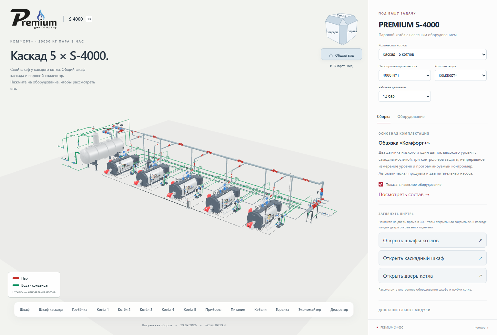
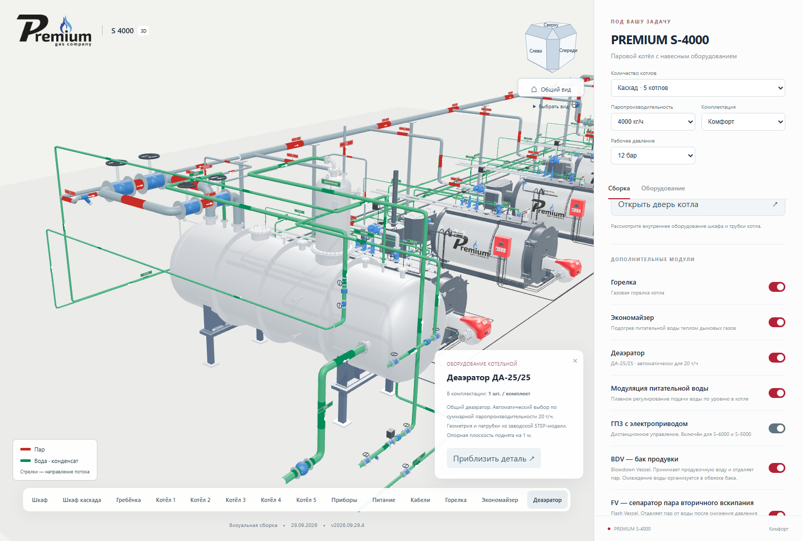
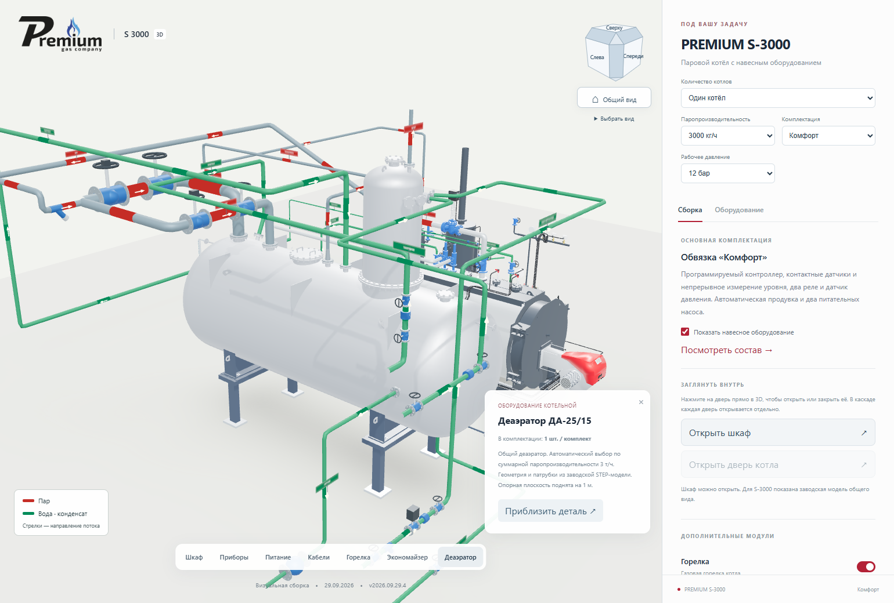
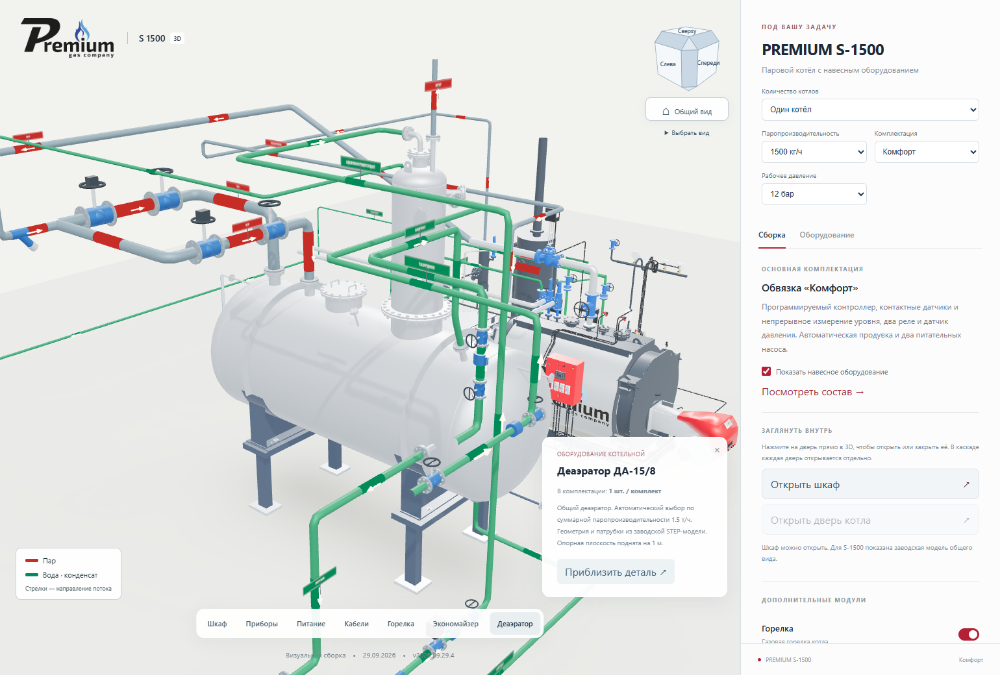
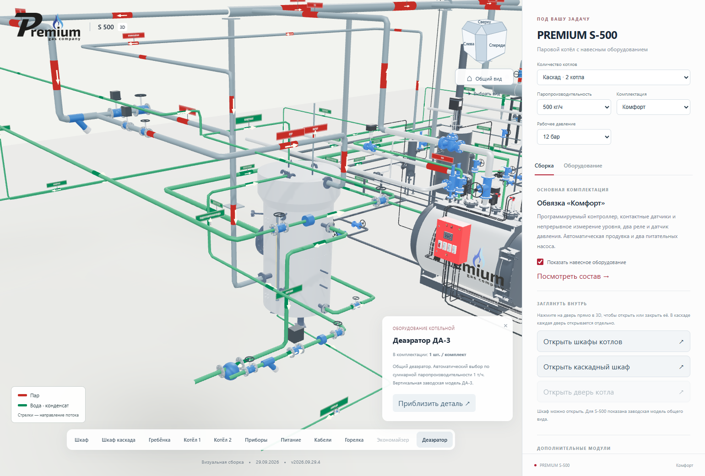

# Автоматический выбор деаэратора по суммарной мощности

**Версия 2026.09.29.4 · 29.09.2026 · Codex / GPT-6.**

Статус: **PUBLISHED_VERIFIED**. Версия 2026.09.29.4 опубликована и проверена
на [основном адресе](https://prgz.ru/komplektacii4/?power=4000&trim=comfort&cascade=5&pressure=12&addons=burner%2Ceconomizer%2Cdeaerator%2Cmodulation%2Cgpz%2Cbdv%2Cfv&v=2026.09.29.4).
Предыдущая версия 2026.09.29.3 сохранена для отката.

## Правило владельца

Мощность одного котла умножается на количество котлов. Тип деаэратора
одинаково определяется для всех девяти мощностей, трёх комплектаций,
исполнений 8/12 бар и количества 1–5. В сборке один общий деаэратор.

| Суммарная паропроизводительность | Деаэратор |
|---|---|
| Меньше 1,5 т/ч | ДА-3 |
| 1,5–2,5 т/ч включительно | ДА-15/8 |
| Больше 2,5, меньше 4 т/ч | ДА-25/15 |
| 4–5 т/ч включительно | ДА-25/25 |
| Больше 5, до 10 т/ч включительно | ДА-25/15 |
| Больше 10 т/ч | ДА-25/25 |

Диапазон 4–5 т/ч намеренно выбирает ДА-25/25, а больше 5–10 т/ч —
ДА-25/15. Это подтверждённое владельцем правило визуального конфигуратора,
а не результат гидравлического расчёта. Например: один S-4000 — ДА-25/25;
два S-4000 — ДА-25/15; три S-4000 — ДА-25/25; два S-5000 — ДА-25/15.

## Геометрия и обвязка

Использованы три предоставленные STEP-модели:

- `PR.15.01.161СБ Деаэратор ДА-15-8.stp` → ДА-15/8.
- `PR.25.01.269СБ Деаэратор ДА-25_15.stp` → ДА-25/15.
- `PR.25.01.268СБ Деаэратор ДА-25-25-1.stp` → ДА-25/25.

Габариты сохраняются. Преобразование — поворот, перенос и перевод мм в м.
Опорная плоскость горизонтальных баков расположена на отметке +1 м;
под заводскими седловыми опорами добавлены стойки до пола. Указатель
уровня соединён с двумя торцевыми штуцерами. ДА-3 сохранён из прежней модели.

Назначения патрубков сверены с соседними заводскими PDF общего вида,
бака и колонки. Координаты и нормали фланцев измерены в STEP.
Реестр в `src/assets/deaerators/catalog.json` хранит исходный индекс тела,
буквенное обозначение, DN, координаты и трансформацию.

| Соединение | ДА-15/8 | ДА-25/15 | ДА-25/25 |
|---|---|---|---|
| Выход воды к насосам | Д DN100 | Д DN150 | Д DN200 |
| Основной греющий пар | В DN150 | В DN200 | В DN250 |
| Пар на барботаж | Ц DN125 | П DN150 | М DN200 |
| Возврат пара FV | С DN50 | К DN80 | Тройник греющего пара перед В |
| Горячий конденсат | У DN65 | М DN65 | К DN80 |
| Рециркуляция насосов | Т DN32 | Л DN80 | И DN50 |
| Перелив | Е DN80 | Е DN50 | Е DN150 |
| Слив | Г DN50 | Г DN50 | Г DN50 |

Подготовленная вода и производственный конденсат идут на собственные
патрубки колонки. У ДА-25/15 два соседних косых патрубка обойдены с разных
сторон. Обратные, запорные и регулирующие устройства остаются отдельными
по контурам. На выходе к сохранённому всасывающему коллектору показан
переход. У ДА-25/25 нет отдельного назначенного патрубка FV: его пар
приходит тройником в паровую ветвь. Эта адаптация отражена в реестре.

Удалены только транспортные заглушки использованных фланцев и скрытые
внутренние тела веб-производной. Исходные STEP не изменены. Арматура и
новые опоры показаны упрощённо; нативные AutoCAD/Blender не перевыпускались.

## Загрузка и интерфейс

Три новых GLB занимают 1,50 / 1,83 / 1,75 МБ. Браузер запрашивает только
выбранный деаэратор. Повторяющиеся котлы делят геометрию. Прежние встроенные
деаэраторы удалены из девяти наборов, уменьшив их суммарно на 40 730 052 байта.
Границы и имена оставшихся деталей проверены до и после преобразования.

Название ДА обновляется у опции, в карточке и списке оборудования, количество
остаётся 1. При отключении опции бак и его обвязка скрываются; подвод воды
к насосам и внешний возврат конденсата сохраняют прежнюю логику.

## Проверка

- TypeScript: успешно. 42 модульных теста: все прошли.
- Независимая таблица для всех 45 сочетаний, точные границы диапазонов.
- Проверка привязок к заводским патрубкам и отсутствия пересечения двух
  подводов к соседним патрубкам колонки.
- Локальный Chrome: 10 комбинаций, все 4 модели, опоры, количество ДА,
  реальные координаты, отключение опции, название и ведомость. Ошибок JS нет.
- Промежуточная публикация: все 9 мощностей, 1–5 котлов, три комплектации,
  отключение оборудования, мобильная ширина 390 px; 6 сценариев дверей.
- Основной адрес: повторно проверены S-500, S-4000, S-5000, все 10 сцен
  выбора ДА и 6 сценариев открывания дверей. Ошибок JavaScript нет.
- Локальная, промежуточная и основная проверки относятся к одному манифесту.

Исходные документы и их SHA-256: [source-index.json](source-index.json).
Преобразования и сохранность других деталей: [derivative-report.json](derivative-report.json).
Состав сохранённых и исключённых тел: [mesh-report.json](mesh-report.json).

## Проверенная публикация

Исходный коммит: `908bf87c0e71ea5e7980578fa7777f003d66804c`.
Коммит сборки: `2191efcf7039723787b39cf461961d733a528b06`.
SHA-256 манифеста:
`b33b5ff4709fa890f456f28857b9a0e568ab8c7ca0f90e14a599d7b4134b9700`.

На сервере проверены 124 файла; 122 публичных файла независимо загружены
по HTTPS и сверены по SHA-256 на промежуточном и основном адресах.
Переданы 32 изменённых файла, 92 переиспользованы; сжатая передача —
54 369 317 байт. Перед переключением повторно проверены исходная страница
и соседние разделы. Переключение атомарное; соседние разделы не изменились.
Предыдущий выпуск сохранён по адресу
[резервной версии](https://prgz.ru/komplektacii4-before-cascade-v2026.09.29.4/).

[Сводный протокол](verification.json), [HTTPS](http-live.json),
[матрица семейства на сервере](browser-matrix-stage.json),
[10 сцен с деаэраторами на основном адресе](browser-deaerator-live.json),
[открывание дверей](browser-doors-live.json), [42 теста](unit-tests.log).

## Изображения с основного адреса

