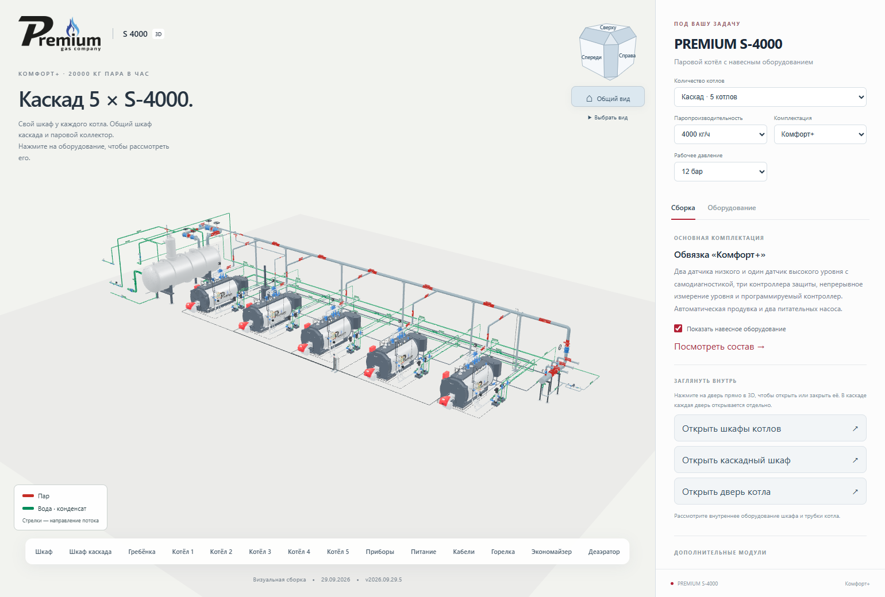
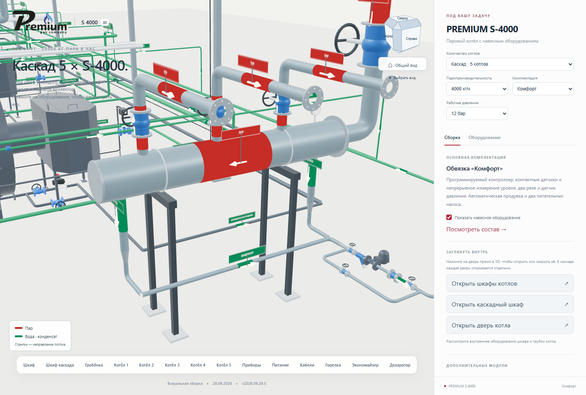
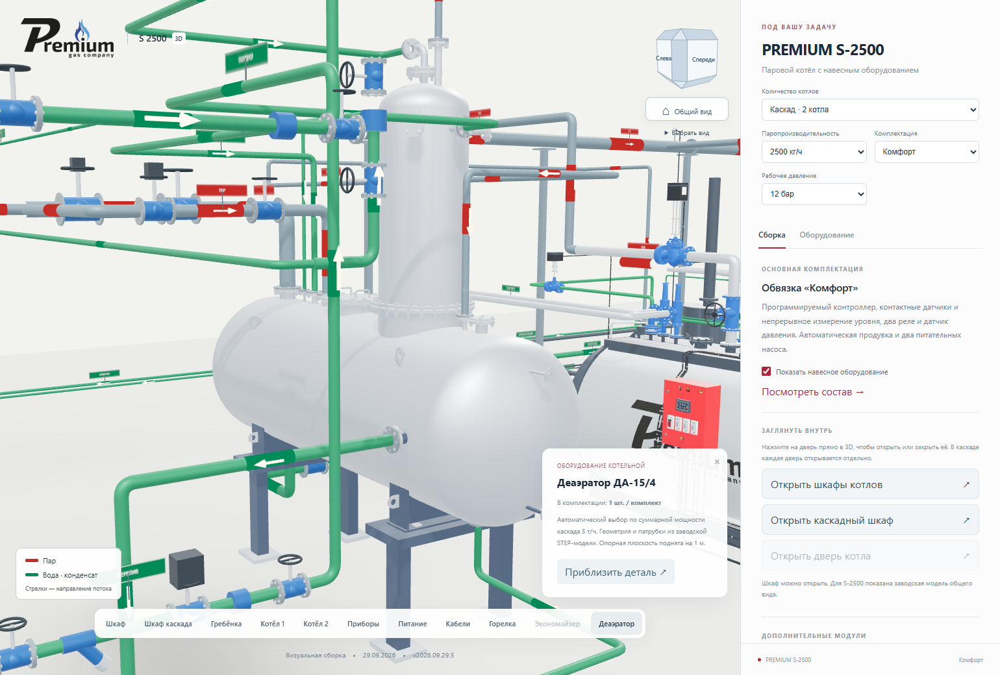

# Деаэраторы, исправленная обвязка и облегчённая 3D-сборка

**Версия 2026.09.29.5 · 29.09.2026 · Codex / GPT-6.**

Статус: **PUBLISHED_VERIFIED**. Промежуточный и основной адреса проверены
по одному манифесту. [Открыть актуальную сборку](https://prgz.ru/komplektacii4/?power=4000&trim=comfort&cascade=5&pressure=12&addons=burner%2Ceconomizer%2Cdeaerator%2Cmodulation%2Cgpz%2Cbdv%2Cfv&v=2026.09.29.5).

## Подтверждённая таблица владельца

Для одного котла учитывается его мощность. Для каскада из 2–5 котлов
учитывается суммарная паропроизводительность. Комплектация и давление
8/12 бар не меняют эту таблицу.

| Один котёл, т/ч | Деаэратор |
|---|---|
| Менее 1,5 | ДА-3 |
| От 1,5 до 2,5 включительно | ДА-15/4 |
| Более 2,5 до 3,5 включительно | ДА-15/8 |
| 4 и 5 — остальные доступные мощности | ДА-25/15 |

| Каскад, сумма т/ч | Деаэратор |
|---|---|
| До 2,5 включительно | ДА-3 |
| Более 2,5 до 5 включительно | ДА-15/4 |
| Более 5 до 6 включительно | ДА-15/8 |
| Более 6 до 10 включительно | ДА-25/15 |
| Более 10 | ДА-25/25 |

Примеры: S-2000 — ДА-15/4, 2 × S-1000 — ДА-3; S-3000 — ДА-15/8;
2 × S-2500 — ДА-15/4; 4 × S-1500 — ДА-15/8; 2 × S-5000 — ДА-25/15.
Границы 2,5 / 3,5 / 5 / 6 / 10 проверены отдельно от функции выбора.

## Что изменено

- Добавлена заводская STEP-модель `PR.15.01.033СБ Деаэратор ДА-15_4.stp`.
  Её исходная система координат отличается от трёх других баков; применён
  отдельный жёсткий поворот с сохранением размеров. Выход Д DN100 привязан
  к измеренному торцу фланца. Седловые опоры — на отметке +1 м.
- Подвод от нижнего патрубка горизонтального деаэратора идёт вниз,
  затем прямоугольной трассой к запорной арматуре и переходу на всасывание.
  Убран прежний короткий S-образный обход.
- Греющий пар одиночного котла поднимается вертикально. Трасса проходит
  горизонтальными и вертикальными участками с отводами 90°.
- Гребёнка Ø426 сдвинута влево на 950 мм. Спуск от общего парового
  коллектора проходит в одной плоскости, без дополнительного обхода.
  Вместе с ней перемещены опоры, отводы, карманы и конденсатоотводчик.
- Вход охлаждения BDV выполнен прямым по оси существующего косого штуцера F.
  Английская табличка заменена на «ОХЛАЖДАЮЩАЯ ВОДА».
- Паровой фильтр заменён заводской геометрией **АДЛ IS16 DN100**.
  Ось корпуса горизонтальна, крышка направлена вбок. Размер между фланцами
  350 мм проверен по геометрии. В [библиотеке АДЛ](https://adl.ru/cad-library/)
  найдены SAT и КОМПАС; исходный STEP не найден. Использован SAT, полученная
  веб-модель занимает 59 816 байт. Ориентация соответствует
  [документу производителя](https://adl.ru/files/b107ec05-f648-11e5-879d-001f296a5bc2/is16_2.pdf).

## Сверка ДА-3

Изучены документы из [первой](https://disk.yandex.ru/d/OlUBVm1KnnNypw) и
[второй](https://disk.yandex.ru/d/1N2Rk1fNbHPZGQ) приложенных папок.
В них разные объекты: вертикальный ДА-3 и горизонтальный деаэратор.
Назначения отверстий для ДА-3 взяты из его собственного заводского
чертежа PR.3.01.044, а состав контуров — из схемы именно с ДА-3.

Сохранены отдельные линии подготовленной воды, конденсата, греющего пара,
рециркуляции, перелива и слива. Добавлены запорный вентиль выпара и группа
приборов по документу «Группа безопасности ДА-3»: манометр, прерыватель
вакуума, преобразователь давления с вентилем и резервная заглушка.
Сифон соединён с существующим штуцером **О DN20**, координата измерена
по телу 40 STEP. Снята его транспортная заглушка 63. Гидрозатвор и
существующие назначения штуцеров Г/Ж сохранены по заводскому чертежу.

Сверка относится к показанным контурам и присоединениям визуальной сборки.
Геометрия части арматуры остаётся упрощённой; это не расчёт пропускной
способности или уставок. Исходные AutoCAD/Blender и STEP не изменены.

## Оптимизация

Все девять наборов котлов, пять деаэраторов и шкафы обработаны с сохранением
имён деталей, текстур, иерархии и шарниров. Корпуса горизонтальных ДА
сохраняют подготовленную по отдельным телам сетку и гладкие заводские нормали,
чтобы близкие оболочки не пересекались. У остальных деталей сокращена сетка, восстановлены
нормали с резкими кромками, применено сжатие Meshopt. По каждой части
проверены границы до/после; максимальное допустимое смещение — 3 мм.

| Метрика | До | После |
|---|---:|---:|
| Обработанные GLB, суммарно | 341 359 376 байт | 169 854 492 байта |
| Треугольники в обработанных GLB | 41 640 329 | 14 301 725 |
| Восемь файлов одного S-4000 | 38 018 588 байт | 18 174 496 байт |
| Треугольники этих файлов S-4000 | 4 429 197 | 1 422 253 |

Это размеры геометрии, а не обещанное время загрузки. Новый ДА-15/4 входит
в сравнение со своей исходной веб-сеткой. Отдельный новый фильтр АДЛ
не входит в общую строку. Горизонтальные ДА занимают 1,48–1,81 МБ каждый;
браузер получает только выбранный тип. В каскаде экземпляры котлов делят
геометрию. Прямым трубам достаточно двух поперечных колец, на каждом
отводе сохранено восемь сегментов; раньше детализация зависела от длины
трубы и давала сотни лишних колец на прямых участках.

[Полный отчёт оптимизации](optimization.json),
[фильтр АДЛ](adl-is16.json), [реестр источников](source-index.json).

### Контрольный замер браузера

Один последовательный замер каждого выпуска на одном компьютере:
Chrome 154, 1540 × 1040, новый контекст без сохранённого браузерного кеша,
пять S-4000 «Комфорт+», все опции. Готовность означает появление пяти
котлов и первого основного кадра. Вращение длится шесть секунд, первый
прогревочный интервал в статистику кадров не входит.

| Наблюдаемая величина | 2026.09.29.4 | 2026.09.29.5 |
|---|---:|---:|
| Передача GLB по сети | 27 742 521 байт | 15 813 901 байт |
| GLB после декодирования HTTP | 41 013 716 байт | 21 022 380 байт |
| Готовая сцена | 7,758 с | 4,550 с |
| Средний интервал кадров | 37,20 мс | 20,05 мс |
| Медиана интервала кадров | 40,0 мс | 26,5 мс |
| 95-й процентиль интервала кадров | 40,1 мс | 26,8 мс |
| Треугольники в наблюдаемом кадре | 16 926 812 | 6 512 142 |

Это наблюдения на данной машине и сети, не гарантия времени на другом
устройстве. Замер старого выпуска выполнен до переключения сайта,
нового — на промежуточном адресе с тем же манифестом, который опубликован.
[Исходный результат](performance-before.json), [новый результат](performance-after.json).
Повторяемый инструмент — `tools/cascade/measure_browser.mjs`.

## Воспроизведение и проверка

1. `prepare_deaerators.py`, `register_deaerators.py`, Blender
   `build_deaerators.py -- da15_4`, `compose_deaerators.mjs` создают новую
   веб-производную из STEP; каталоги содержат измеренные координаты.
2. Официальный SAT-архив с проверяемым SHA-256 помещается в
   `artifacts/revision-20260929-5/adl_filter_is16_sat.zip`.
   `convert_adl_sat.py` использует отдельный AutoCAD Core, затем Blender
   `build_adl_strainer.py` строит GLB. Пользовательские чертежи не открываются.
3. `optimize_web_models.mjs --apply` запускается **один раз на исходных
   производных**, не повторно на уже оптимизированных моделях. Для нового
   фильтра используется `--filter=cascade/adl_is16 --apply`.
4. TypeScript, 46 модульных тестов; браузерная матрица всех 9 мощностей,
   1–5 котлов, трёх комплектаций, независимых опций и мобильной ширины.
5. Отдельно проверяются 13 конфигураций выбора ДА, 6 сценариев дверей,
   прямые участки, гребёнка Ø426 и крепление группы ДА-3 к штуцеру О.

## Публикация и результаты

- Исходный коммит: `3eb1999166367687e56cb26efb89a20e6f808e1d`.
- Коммит сборки: `c4ea2c3ce969dbcd657b1126bda5316df5e1140b`.
- SHA-256 манифеста: `6ebce148987c804b82f7776d2b0b6e08777c456257835c69a88f6e0d8814485c`.
- 126 файлов проверены на сервере; 124 публичных файла — по HTTPS
  на промежуточном и основном адресах. Два `.htaccess` проверены по SSH.
- Переданы 88 изменённых файлов, переиспользованы 38. Сжатая передача
  составила 132 836 961 байт. Это весь выпуск, не загрузка одной страницы.
- Перед переключением повторно сверены прежняя публикация и соседние
  разделы. Соседние разделы не изменены. [Предыдущий выпуск 2026.09.29.4
  сохранён для отката](https://prgz.ru/komplektacii4-before-cascade-v2026.09.29.5/).
- TypeScript/Vite и [46 модульных тестов](unit-tests.log) прошли.
- На промежуточном адресе проверены все девять мощностей, 1–5 котлов,
  три комплектации, независимые опции, ведомость и ширина 390 px.
- На основном адресе повторена матрица S-500 / S-4000 / S-5000.
  На обоих адресах прошли 13 сцен выбора ДА и шесть сценариев реальных
  кликов по дверям. Ошибок JavaScript нет.

[Сводный протокол](verification.json),
[HTTPS промежуточного адреса](http-stage.json), [HTTPS основного адреса](http-live.json),
[матрица основного адреса](browser-matrix-live.json),
[двери](browser-doors-live.json), [деаэраторы и обвязка](browser-deaerator-live.json).

## Виды с основного сайта

[ДА-3 и его подключения](da3.png), [паровой фильтр АДЛ крышкой вбок](adl-filter.png),
[прямой вход охлаждения BDV с русской подписью](bdv-cooling.png).
