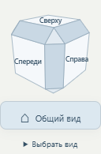
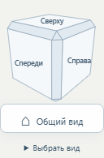
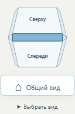

# Куб видов: активные рёбра и тонкие скосы

**Версия 2026.09.29.6 · 29.09.2026 · Codex / GPT-6.**

Статус: **PUBLISHED_VERIFIED**.
[Открыть обновлённую сборку](https://prgz.ru/komplektacii4/?power=4000&trim=comfort&cascade=5&pressure=12&addons=burner%2Ceconomizer%2Cdeaerator%2Cmodulation%2Cgpz%2Cbdv%2Cfv&v=2026.09.29.6).

В прежнем кубике 12 рёбер были декоративными: у них не было направления
камеры, а CSS отключал события указателя. Теперь нажатие на ребро включает
промежуточный вид между двумя соседними гранями. Кубик поддерживает
26 направлений: 6 граней, 12 рёбер и 8 углов.

Ширина скосов уменьшена вдвое: `1 − 0,65 = 0,35` заменено на
`1 − 0,825 = 0,175`. Размер виджета сохранён: 128 × 128 px на компьютере,
108 × 108 px на мобильной ширине. Рёбра светлее, контур выделения тоньше.
Есть подсветка при наведении, русские подсказки, Enter/пробел и те же
промежуточные направления в меню «Выбрать вид».

Ориентир по взаимодействию — [ViewCube Autodesk](https://help.autodesk.com/view/ACDLTM/2026/ENU/?caas=caas%2Fdocumentation%2FACD%2F2014%2FENU%2Ffiles%2FGUID-E6D3896C-AF39-4F5C-A57C-CACE2A1117F9-htm.html):
активные грани, рёбра и углы, выделение при наведении. Это адаптация
кубика существующего конфигуратора, не копирование всех функций AutoCAD.

Проверка `tools/cascade/check_viewcube.mjs` использует реальные клики по
SVG-полигонам, включая узкие рёбра и углы. Для S-500, S-3000 и каскада
5 × S-4000 проверяются все 26 направлений, вписывание в экран,
Enter/пробел, вращение и возврат Home. Отдельно — ширина 390 px.

Выпуск меняет навигацию. Перед публикацией проверяется точное совпадение
имён и SHA-256 всех GLB с предыдущей версией 2026.09.29.5.
Состав оборудования, таблица ДА и 3D-модели остаются из этого выпуска.

## Проверка и публикация

TypeScript/Vite и браузерная проверка прошли. На промежуточном и основном
адресах выполнены 78 кликов по полигонам: по 26 в трёх сборках. Проверены
направления камеры, отсутствие обрезания модели, Enter/пробел, подсветка,
вращение, Home и нажатие на ребро при мобильной ширине 390 px.
Ошибок JavaScript нет.

- Исходный коммит: `499e67e24f2132bd894a82e4dc23b5de02dcd783`.
- Коммит сборки: `4cc45874748741c1e2ddcdae7e13b7a0470e90b2`.
- SHA-256 манифеста: `2348aa6e6531d9ed5a02643241f79f13458616a6a76095a542bdc4073c6e1db3`.
- 126 файлов проверены на сервере, 124 публичных файла — по HTTPS
  на промежуточном и основном адресах. Два `.htaccess` проверены по SSH.
- На сервер переданы 8 файлов, переиспользованы 118; сжатая передача
  433 978 байт. Все 99 GLB совпадают с предыдущей публикацией по SHA-256.
- Перед атомарным переключением повторно сверены публикация и соседние
  разделы. Соседние разделы не изменены. [Версия 2026.09.29.5 сохранена
  для отката](https://prgz.ru/komplektacii4-before-cascade-v2026.09.29.6/).

[Сводный протокол](verification.json), [браузер на промежуточном адресе](browser-stage.json),
[браузер на основном адресе](browser-live.json), [HTTPS основного адреса](http-live.json).

## Вид кубика

| До | После | Активное ребро |
|---|---|---|
|  |  |  |
