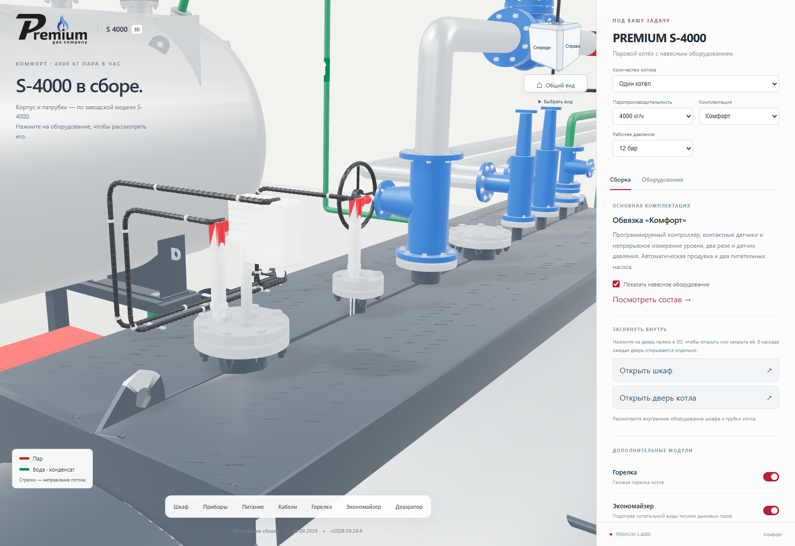
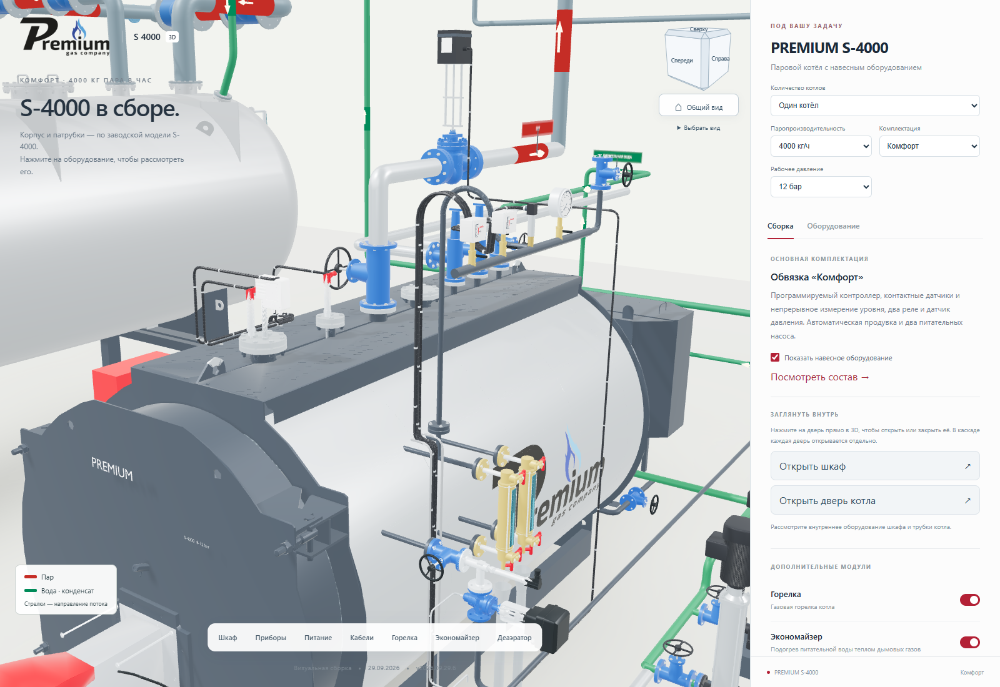
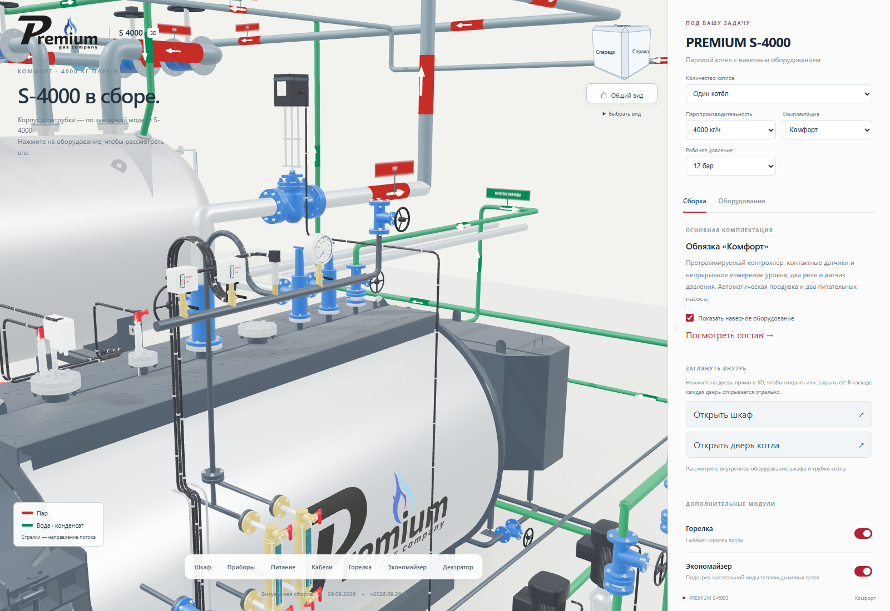

# Контрастные датчики котла

**Версия 2026.10.01.1 · 01.10.2026 · Codex / GPT-6.**

Статус: **PUBLISHED_VERIFIED**.
[Открыть актуальную сборку](https://prgz.ru/komplektacii4/?power=4000&trim=comfort&cascade=5&pressure=12&addons=burner%2Ceconomizer%2Cdeaerator%2Cmodulation%2Cgpz%2Cbdv%2Cfv&v=2026.10.01.1).

Ориентиры владельца: снимок `2026-10-01_14-01-58.png` с отмеченными
датчиками и фотография котла `P1270830.jpg`.

На светлом фоне металлические стержни LP200/LP400 и LCS600 выглядели
белыми. Теперь сталь темнее и имеет отдельный материал; красные головки
отделены от стержней. Белые корпуса LCS600 и реле давления матовые,
с меньшим вкладом отражений, чтобы их грани лучше читались.

В прежнем импорте CAD цвет назначался целому треугольнику по высоте его
центра. Длинные треугольники давали белые полосы на стержнях и красных
головках. В веб-визуализации граница материалов теперь определяется
в каждой точке поверхности: верхние 40 мм головок LP и верхние 185 мм
корпуса LCS. Сетка и размеры исходной детали не меняются.

Материалы назначаются только датчикам котла после клонирования сцены.
Общее освещение, состав комплектаций, проводка и геометрия сохранены.
Для каскада применяется та же обработка каждого экземпляра.
Новые текстуры, полигоны и дополнительные запросы моделей не нужны.
Нативные AutoCAD/Blender/STEP сохраняют свои версии.

Проверка `tools/cascade/check_sensor_contrast.mjs` охватывает девять
мощностей × три комплектации, каскады 2 и 5 × S-4000, выбор датчика
нажатием в 3D и снятие выделения, мобильную ширину 390 px и ошибки
компиляции шейдеров. Перед переключением сайта сравниваются SHA-256
всех GLB с предыдущим выпуском.

## Подтверждённая проверка

TypeScript/Vite собраны. На промежуточном и основном адресах пройдены
29 сценариев на каждом: девять мощностей × три комплектации, каскады
2 и 5 × S-4000. Выделение датчика нажатием и снятие выделения работают.
Проверен экран 390 × 844 px. Ошибок JavaScript и шейдеров нет.
Отдельный необязательный запрос `/favicon.ico` возвращает 404; он
отмечен в отчётах и не относится к загрузке приложения или моделей.

- Исходники: `943e989b6e39c55e1741cf4650cc1a48d30f80a0`.
- Коммит сборки: `8c7358ae7a3c021a1e491ccc86f66e85e63342e3`.
- SHA-256 манифеста: `cdbdccad3e8c65114eaa3faede60ab1b10300142020ae0cd9bc06497a9127bd0`.
- Все 99 GLB побайтно совпадают с предыдущим выпуском.
- JavaScript: +2 206 байт, gzip: +785 байт. Новых текстур и полигонов нет.
- Проверены 126 файлов на сервере и 124 публичных файла по HTTPS на
  обоих адресах. Два `.htaccess` сверены по SSH.
- Переданы 7 файлов, 119 переиспользованы; сжатая передача 428 296 байт.
- Атомарное переключение: `CUTOVER_OK`. Соседние разделы не изменены.
- [Предыдущая версия сохранена для отката](https://prgz.ru/komplektacii4-before-cascade-v2026.10.01.1/).

[Сводный протокол](verification.json), [браузер на промежуточном адресе](browser-stage.json),
[браузер на основном адресе](browser-live.json), [HTTPS основного адреса](http-live.json).

## Одинаковые ракурсы до и после

| До — 2026.09.29.6 | После — 2026.10.01.1 |
|---|---|
|  |  |
|  |  |
|  |  |

[Пятый котёл каскада](fifth-boiler.png), [общий вид каскада](cascade.png),
[мобильный экран](mobile.png).
