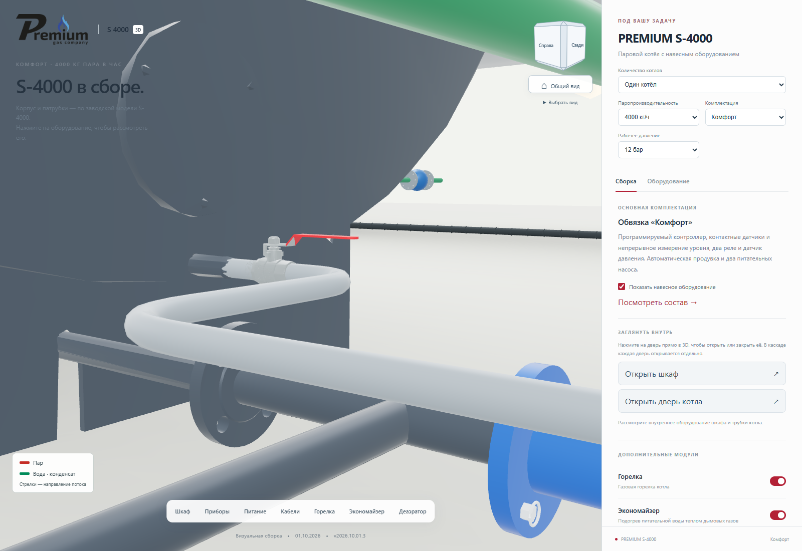
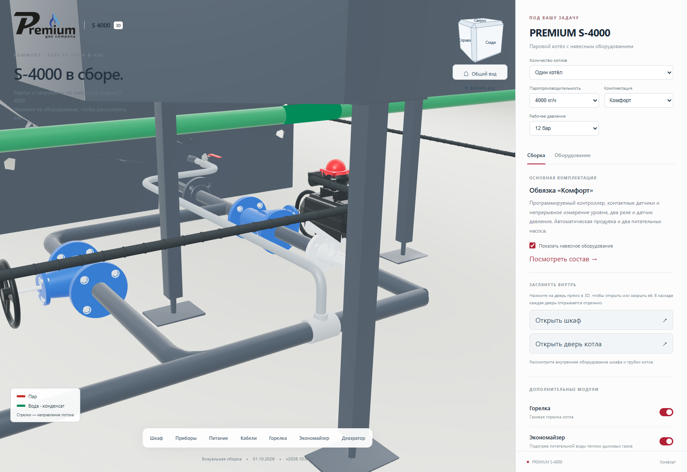
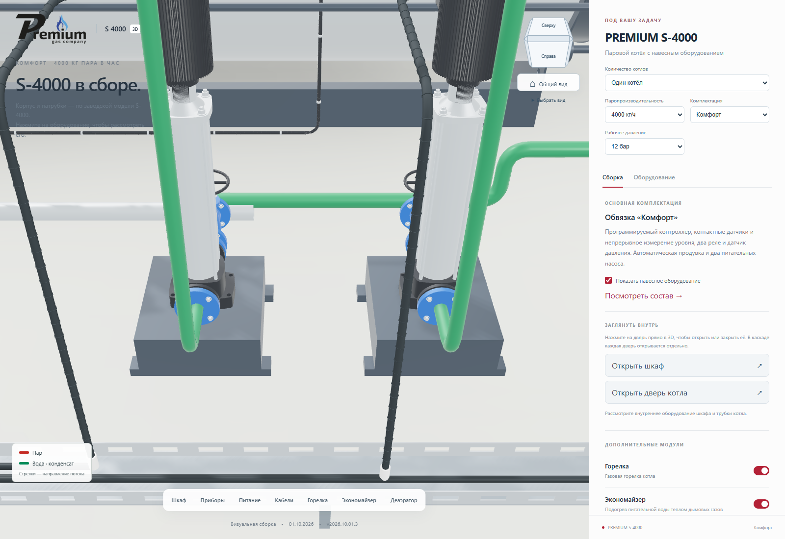
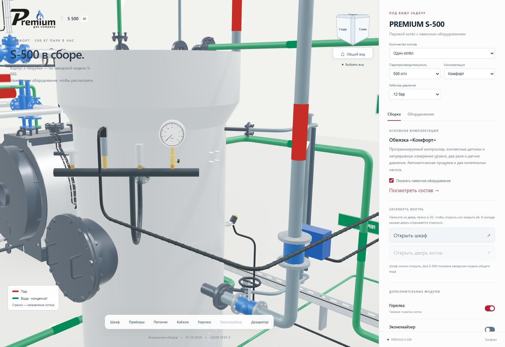
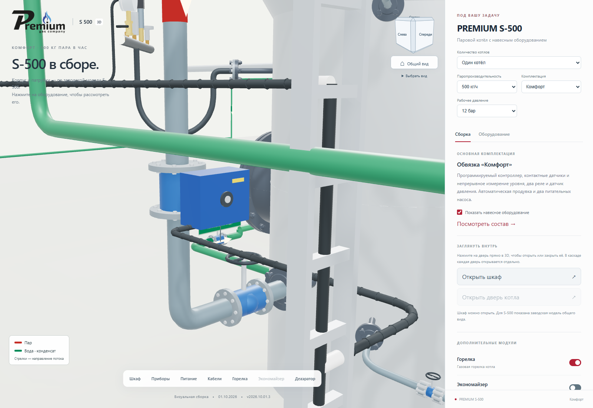
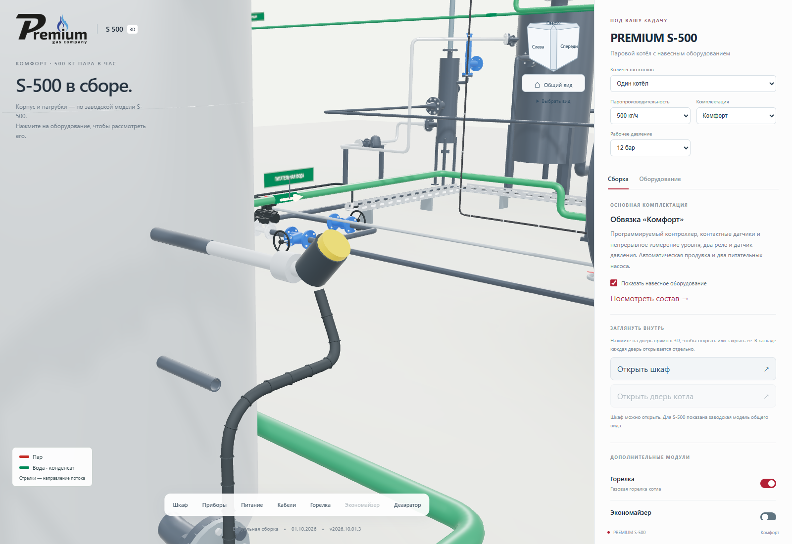

# Слив конденсата, зазор лотка и приборы ДА-3

**Версия 2026.10.01.3 · 01.10.2026 · Codex / GPT-6.**

Статус: **PUBLISHED_VERIFIED**.
[Открыть актуальную сборку](https://prgz.ru/komplektacii4/?power=4000&trim=comfort&cascade=5&pressure=12&addons=burner%2Ceconomizer%2Cdeaerator%2Cmodulation%2Cgpz%2Cbdv%2Cfv&v=2026.10.01.3).

Исправлены шесть замечаний владельца к выпуску 2026.10.01.2:

- Слив конденсата начинается на отдельном заводском патрубке под
  крышкой дымовой камеры. Прежняя точка на крышке удалена. Врезка
  перенесена в общий участок после автоматического клапана и ручного
  байпаса продувки. Трубка проходит сбоку от привода. У S-5000 учтён
  собственный смещённый участок нижней линии.
- Вместо примитива крана установлена модель **VALTEC VT.215.N.04 DN15**
  из официальной STEP-библиотеки. Название карточки — «Слив конденсата».
- Ось напольного лотка вынесена с X=2,28 на X=2,80 м. Подводы насосов
  обходят стояки питательной воды; кабели внутри лотка перестроены.
- Группа безопасности ДА-3 перенесена к штатному штуцеру О DN20.
  Короткий U-образный сифон заменяет длинный обход вокруг бака.
- Манометр и преобразователь давления ДА-3 используют точные копии
  уже загруженных моделей котла, с сохранением размеров, шкалы и
  материалов. Копии разделяют сетки с исходными приборами.
- Регулирующий клапан основного греющего пара расположен на
  вертикальной трубе у бокового ввода ДА-3. Синий электропривод,
  фланцы, соседний ручной вентиль и гофра выполнены по фотографии.
  Кабель бокового датчика уровня теперь чёрный, как остальная гофра.

## Источники и размеры

Основание — снимки `2026-10-01_16-33-38.png`, `16-42-44.png`,
`16-52-36.png`, `16-51-11.png`, `16-49-13.png`, `16-55-01.png`.
Координаты малых сливных патрубков получены из цилиндров Ø25 мм
заводских STEP каждой мощности, с тем же преобразованием координат,
что и корпуса. Экспорт: `tools/cascade/export_connections.py`.

[Официальная модель крана VALTEC](https://valtec.ru/catalog/truboprovodnaya_armatura/sharovye_krany_dlya_vody_base/kran_sharovoj_valtec_base_vt215n.html).
Использован размер 1/2 дюйма, без масштабирования. Это геометрия крана
слива конденсата дымовой камеры; спецификация напорной продувочной
арматуры не изменяется. Размеры электропривода ДА-3 восстановлены
по фото; его изготовитель и точная модель не установлены.

## Объём и проверка

Новый GLB крана занимает **101 516 байт**: 6 612 треугольников,
два материала, без текстур. После оптимизации отклонение габарита
составило 0,0012 мм. Приборы ДА-3 дополнительных GLB не требуют.
Нативные DWG, STEP и Blender-сборки этим веб-выпуском не меняются.

Локально пройдены 14 браузерных сценариев и 12 проверок правил и
маршрутов, включая 45 сочетаний мощности и количества котлов.
Проверяются заводские точки слива, врезка после арматуры, зазор лотка
до насосов вместе с основаниями и наружными фланцами, повторное
использование сеток приборов, чёрная гофра, клапан ДА-3, выбор детали,
переключение оборудования и экран шириной 390 px.

На промежуточном и основном адресах пройдены **14 сценариев на каждом**.
Ошибок JavaScript и шейдеров нет. Минимальный проверенный зазор от
наружной стенки лотка до габарита насосной арматуры — **73 мм**.
Проверка включает корпуса насосов, основания, трубы и наружные вентили.

- Исходники: `135e49bc319391c96a0fa7d4f5d2ccc5433a082d`.
- Коммит сборки: `6d654ab728171a6d1e8c8397c7809f9a77ec0999`.
- SHA-256 манифеста: `c3c2baafbc2eac9eb37a4c88db1c4cb11c6bd334b189e9e402e2579c1ee45b06`.
- Все 99 прежних GLB сохранены по именам и хешам. Добавлен один GLB
  крана размером 101 516 байт. JavaScript: +3030 байт,
  gzip: +845 байт.
- Проверены 127 файлов на сервере и 125 публичных файлов по HTTPS
  на каждом адресе. Два `.htaccess` проверены по SSH.
- Передано 8 файлов, переиспользовано 119; сжатая передача — 517 467 байт.
- Переключение: `CUTOVER_OK`. Соседние разделы сохранены.
- [Предыдущая публикация для отката](https://prgz.ru/komplektacii4-before-cascade-v2026.10.01.3/).

[Сводный протокол](verification.json), [источники и заводские координаты](source-index.json),
[браузер на промежуточном адресе](browser-stage.json),
[браузер на основном адресе](browser-live.json), [HTTPS](http-live.json).

## Снимки опубликованной модели

| Слив конденсата и кран | Врезка после арматуры |
|---|---|
|  |  |

| Лоток снаружи насосов | Приборы рядом со штуцером О |
|---|---|
|  |  |

| Электропривод у бокового ввода | Чёрная гофра датчика |
|---|---|
|  |  |

[Каскад из пяти котлов](cascade.png), [мобильный экран](mobile.png).
