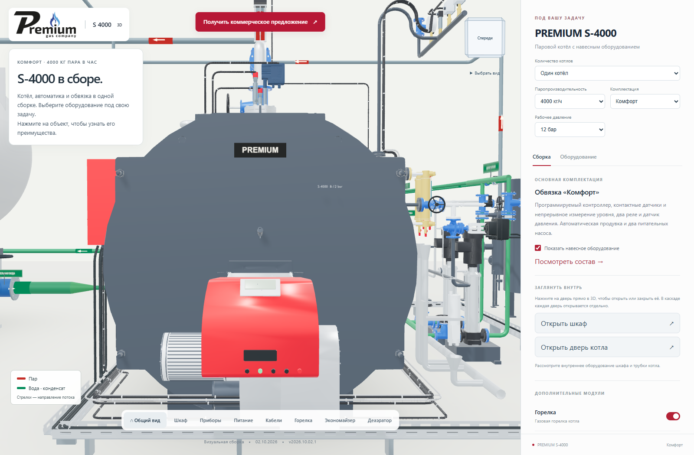
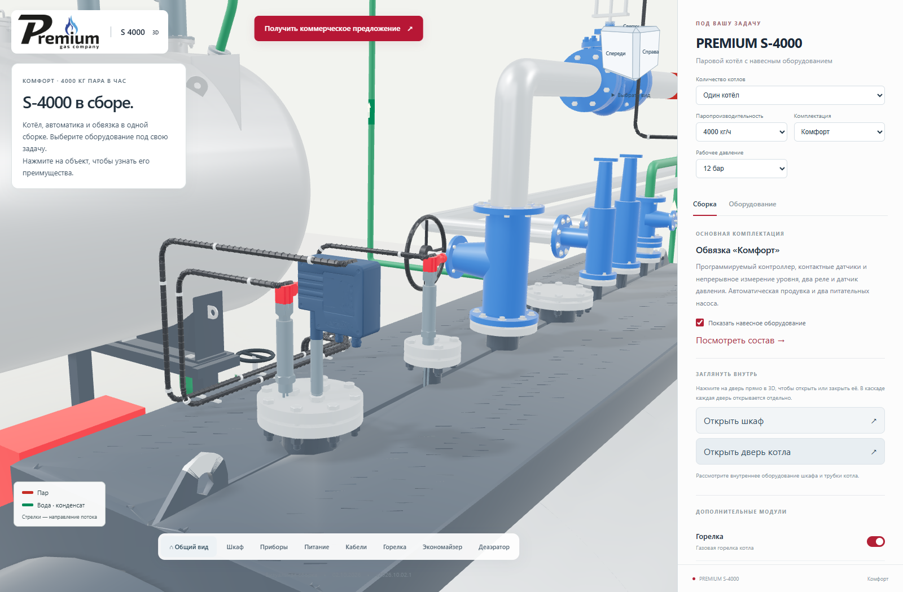
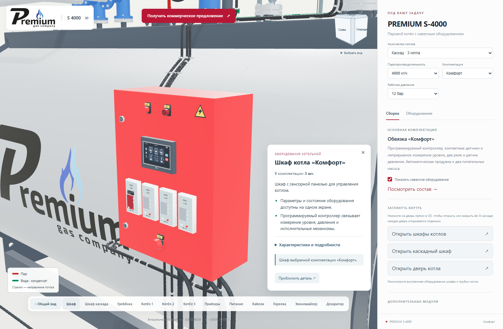
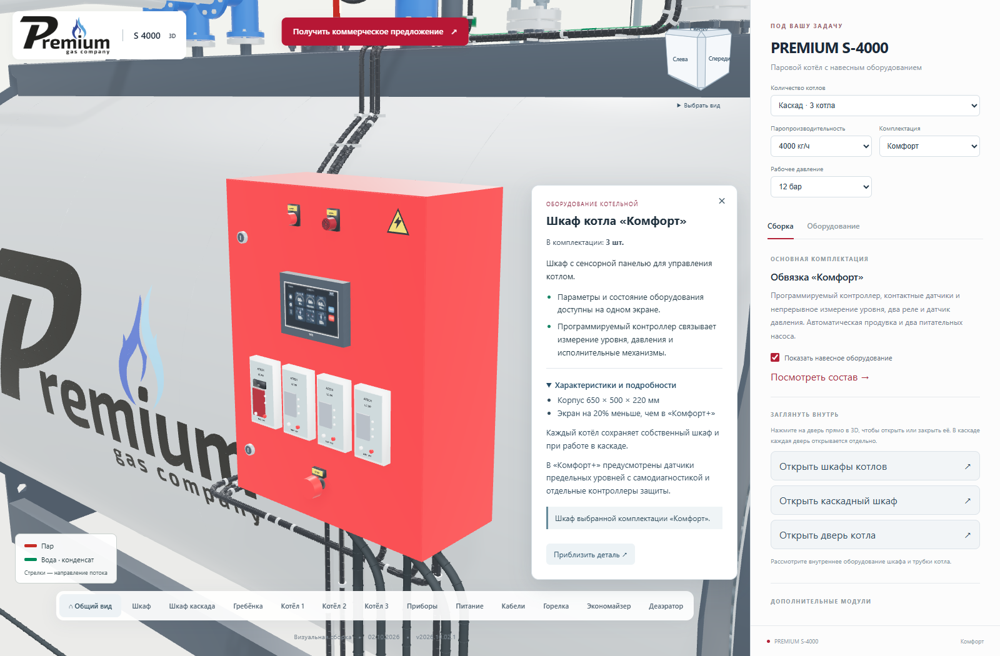
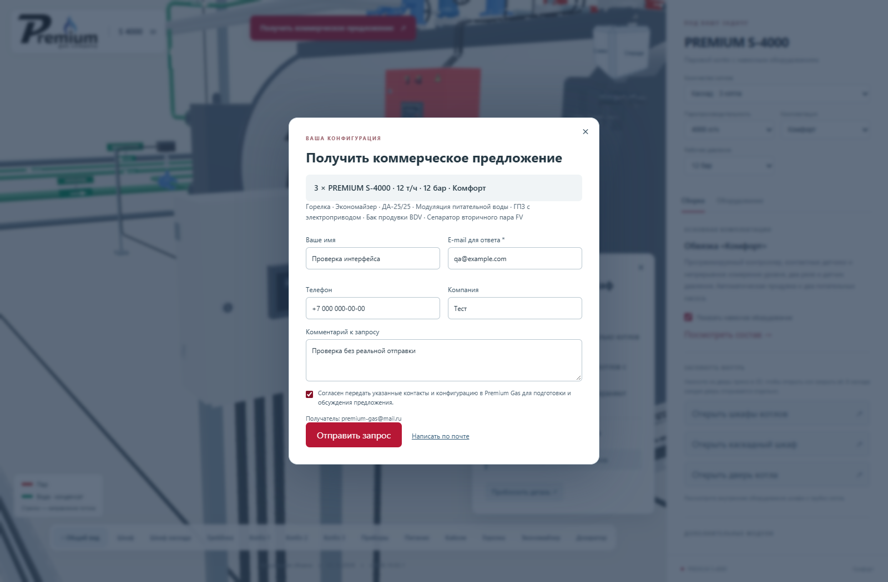

# Карточки оборудования, запрос КП и оформление PREMIUM

**Версия 2026.10.02.1 · 02.10.2026 · Codex / GPT-6.**

Статус: **PUBLISHED_VERIFIED**.
[Открыть актуальную сборку](https://prgz.ru/komplektacii4/?power=4000&trim=comfort&cascade=5&pressure=12&addons=burner%2Ceconomizer%2Cdeaerator%2Cmodulation%2Cgpz%2Cbdv%2Cfv&v=2026.10.02.1).

При выборе объекта посетитель видит его назначение и практическую пользу.
Характеристики и подробное объяснение находятся в раскрываемом блоке.
Принадлежность к комплектации или дополнительному оборудованию выводится
в конце карточки, отдельно от скрытого текста. Внутренние монтажные заметки
и имена исходных файлов больше не подменяют описание для покупателя.

Верхняя кнопка «Получить коммерческое предложение» открывает форму с
текущей мощностью, количеством котлов, общей производительностью,
давлением, комплектацией и дополнениями, включая выбранный деаэратор.
Получатель подтверждён владельцем: **premium-gas@mail.ru**. Обязательны
e-mail и согласие на передачу контактов для подготовки предложения.
Поля имени, компании, телефона и комментария необязательны.

Сервер проверяет параметры, формирует письмо и фиксирует успешный ответ
только после принятия письма почтовым транспортом. Повтор одинакового
запроса не создаёт второе письмо в течение 15 минут. При отказе форма
сохраняет введённые данные; доступен обычный почтовый клиент.
Получатель и заголовки письма не управляются входящим JSON.
Проверки используют подменённый транспорт: **реальные письма не отправлялись**.
Получение сообщения в почтовом ящике не проверено.

## Правки по изображениям

- «Общий вид» находится первым в нижней панели, кнопка под кубиком удалена.
  Грани, рёбра, углы кубика и клавиша Home сохранены.
- Карточки оборудования и вводный текст получили непрозрачную белую
  подложку и тёмный текст. Длинные карточки прокручиваются.
- Нажатие на дверь одновременно открывает её и показывает описание.
- Табличка PREMIUM центрирована в верхней части двери: тёмная основа,
  белые прямые жирные буквы, как на фотографии. Табличка движется с дверью.
- Надписи Riello и RS 410 скрыты на кожухе горелки. Геометрия горелки сохранена.
- Электронная головка LCS600 окрашена в тёмно-синий; металлический стержень,
  красные крышки соседних датчиков и подсветка выбора сохранены.

Основание: скриншоты `2026-10-02_18-48-12.png`, `18-52-19.png`,
`18-51-03.png`, `18-54-21.png`; фотография `Premium S - 4000.3.jpg`
из папки `Premium S - 4000 18_11_2025`. Использовано оформление таблички
с фотографии; точный исходный шрифтовой файл не предоставлен.

## Проверки и объём

- Проверка покрытия описаниями всех объектов в 135 сочетаниях мощности,
  комплектации и количества котлов. Нет объектов с запасным общим текстом.
- Проверены 45 сочетаний выбора деаэратора и ранее принятые маршруты труб.
- Браузер: девять мощностей, три комплектации, каскады из 2, 3 и 5 котлов,
  раскрытие текста, принадлежность к комплектации, открывание двери,
  табличка и материалы датчиков; мобильный экран 390 px.
- Форма: обязательные поля, сохранение ввода при отказе, повтор, успешный
  ответ, состав заявки, Escape и возврат фокуса. Все допустимые POST в
  браузерных тестах перехвачены и не достигают почтового транспорта.
- PHP: проверка входных данных, запрет подмены получателя и внедрения
  заголовков, нормализация недоступных опций, границы выбора деаэратора,
  успешный и неуспешный подменённые транспорты.
- 100 GLB и нативные CAD-файлы сохраняются побайтно. Одна плоская табличка
  требует двух треугольников на котёл. Текстура 512 × 144 создаётся локально;
  каскад разделяет её и геометрию между экземплярами.

Источник семантики результата транспорта:
[документация PHP mail](https://www.php.net/manual/en/function.mail.php).
Принятие письма транспортом не является проверкой доставки в ящик.

## Воспроизводимость

`tools/cascade/customer-information.test.mjs` — покрытие описаниями.
`tools/cascade/check_customer_experience.mjs` — браузерные сценарии.
`tools/cascade/check_quote_endpoint.py` и `quote-endpoint.test.php` — тест
на PHP хостинга без реальной отправки.
`tools/cascade/publish.py` — резервная копия, промежуточная публикация,
проверка хешей, переключение с проверкой изменений и откат.

PHP-файл проверяется по SHA-256 на сервере через SSH. По HTTPS проверяются
исполнение обработчика, JSON, `no-store` и отказы 405/400/403 до отправки.
Статические файлы проверяются по полному манифесту.

## Проверенная публикация

- Исходники: `3a57798b65ce242f5e658c2bae4722f55af07bcf`.
- Сборка: `eba0050d75134f88a03bcd7b7a156d68d1a3c9bc`.
- SHA-256 манифеста: `f40fb9daf3648c55f0b2da0ad9bcbf7df25a92479fdad076a344b6b562f06c0a`.
- На промежуточном и основном адресах прошло по **14 браузерных сценариев**.
  Отдельные действия формы и карточек проверены на каскаде из трёх котлов.
  Ошибок JavaScript и шейдеров не обнаружено.
- На сервере проверены 128 файлов. По HTTPS — 125 статических файлов,
  исполнение PHP и отказы API 405/400/403. Допустимые заявки в тестах
  перехвачены: реальная доставка письма не проверялась.
- Все 100 GLB совпадают с предыдущей публикацией по именам и хешам.
  Добавка к коду семейства — 40 754 байта, gzip — 11 027 байт.
- На сервер переданы 9 файлов, переиспользованы 119. Сжатая передача —
  454 370 байт. Соседние разделы сайта сохранены.
- [Предыдущая версия для отката](https://prgz.ru/komplektacii4-before-cascade-v2026.10.02.1/).

[Сводный протокол](verification.json), [источники изображений](source-index.json),
[браузер на промежуточном адресе](browser-stage.json),
[браузер на основном адресе](browser-live.json), [HTTPS](http-live.json),
[PHP с подменённым транспортом](quote-endpoint.json).

## Результат в браузере

| Табличка PREMIUM и горелка | Контрастная головка датчика |
|---|---|
|  |  |

| Назначение и преимущества | Характеристики раскрываются отдельно |
|---|---|
|  |  |

[Общий вид](overview.png), [карточка на телефоне](mobile-card.png),
[форма на телефоне](mobile-quote.png).
