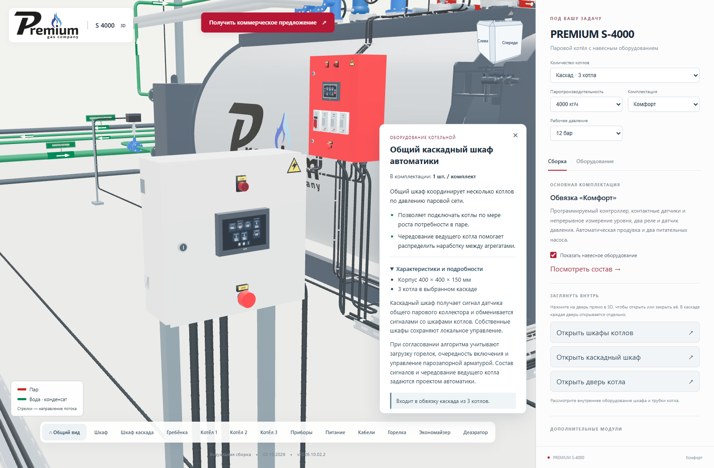
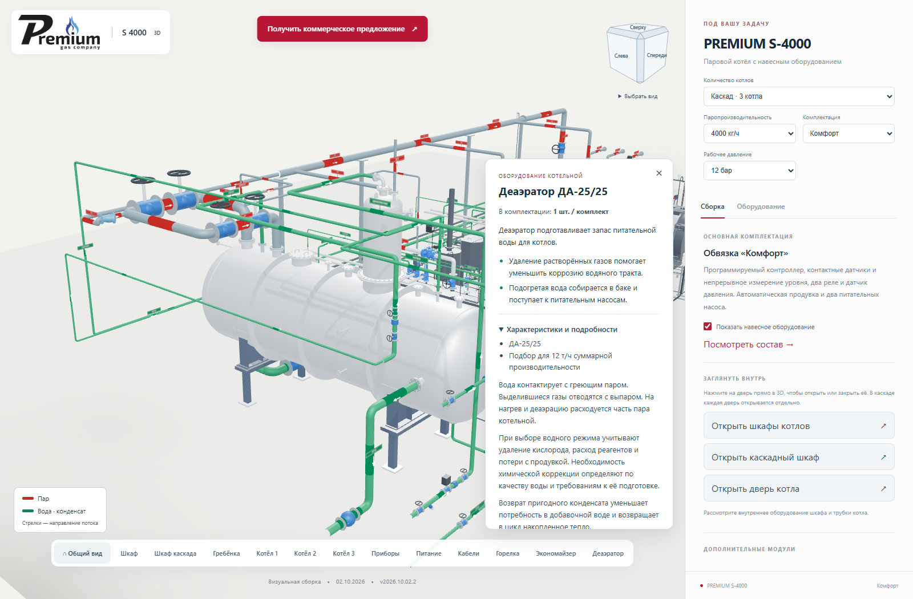
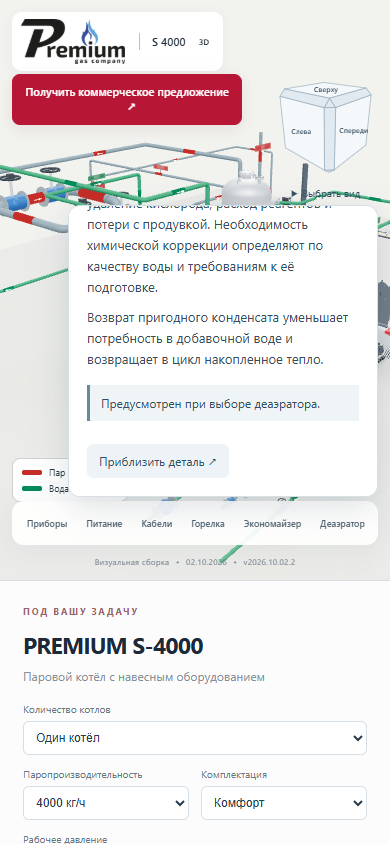

# Пояснения оборудования по техническим разговорам

**Версия 2026.10.02.2 · 02.10.2026 · Codex / GPT-6.**

Статус: **PUBLISHED_VERIFIED**.

[Открыть актуальную сборку](https://prgz.ru/komplektacii4/?power=4000&trim=comfort&cascade=5&pressure=12&addons=burner%2Ceconomizer%2Cdeaerator%2Cmodulation%2Cgpz%2Cbdv%2Cfv&v=2026.10.02.2).

Карточки 12 групп оборудования дополнены по техническим диалогам из
предоставленного владельцем локального архива. Добавлены практические
пояснения о распределении наработки котлов в каскаде, продувке по таймеру
и проводимости, возврате конденсата, согласовании насоса и клапана,
управлении греющим паром и связях автоматики деаэратора.

Длинные объяснения находятся в раскрываемом блоке. Краткая польза и
принадлежность к комплектации остаются доступными без раскрытия.

[Проверенные фрагменты, границы анализа и контрольные суммы источников](source-review.md).

Модели, обвязка, таблица подбора деаэраторов и набор доступных опций сохранены.
Изменены тексты карточек и номер версии. Расшифровки и исходные аудио
не входят в веб-сборку.

## Проверки

- TypeScript и производственная сборка прошли.
- 14 автоматических проверок: описания для 135 сочетаний мощности,
  комплектации и числа котлов; таблица деаэраторов для 45 сочетаний;
  сохранение ранее проверенных маршрутов обвязки.
- По 14 браузерных сценариев на промежуточном и основном адресах:
  все девять мощностей, три комплектации, одиночные котлы и каскады.
- Дополнительно проверены новые пояснения каскада и деаэратора,
  закрытый по умолчанию блок подробностей и доступность конца длинной
  карточки на мобильном экране 390 px. Ошибок JavaScript и шейдеров нет.
- По HTTPS совпали контрольные суммы 125 статических файлов.
  На сервере проверены все 128 файлов публикации, включая PHP и служебные файлы.
- Обработчик запроса КП проверен с подменённым транспортом. Реальные
  письма не отправлялись, доставка в ящик не проверялась.
- Все **100 GLB** побайтно прежние. Добавка к JavaScript относительно
  v2026.10.02.1 — **4 843 байта**, в gzip — **1 171 байт**.
- На сервер переданы 8 изменённых файлов, переиспользованы 120.
  Сжатая передача — 447 701 байт. Соседние разделы сайта не изменены.

## Версия и воспроизводимость

- Исходники: `a620174337ad4a135e96e4eb53c02ce1c56ffc00`.
- Сборка: `b6c134d2eaba27008d790a9f1c26302c2d68f5db`.
- SHA-256 манифеста:
  `83737965991ba3972a8a58d57e3bc23ad3c7f5a6e7e1a353c1aea8fa8d65909e`.
- [Сводный протокол](verification.json), [проверка основного адреса](browser-live.json),
  [HTTP-проверка](http-live.json), [сверка источников](source-verification.json).
- [Предыдущая публикация для отката](https://prgz.ru/komplektacii4-before-cascade-v2026.10.02.2/).

## Вид опубликованных карточек

