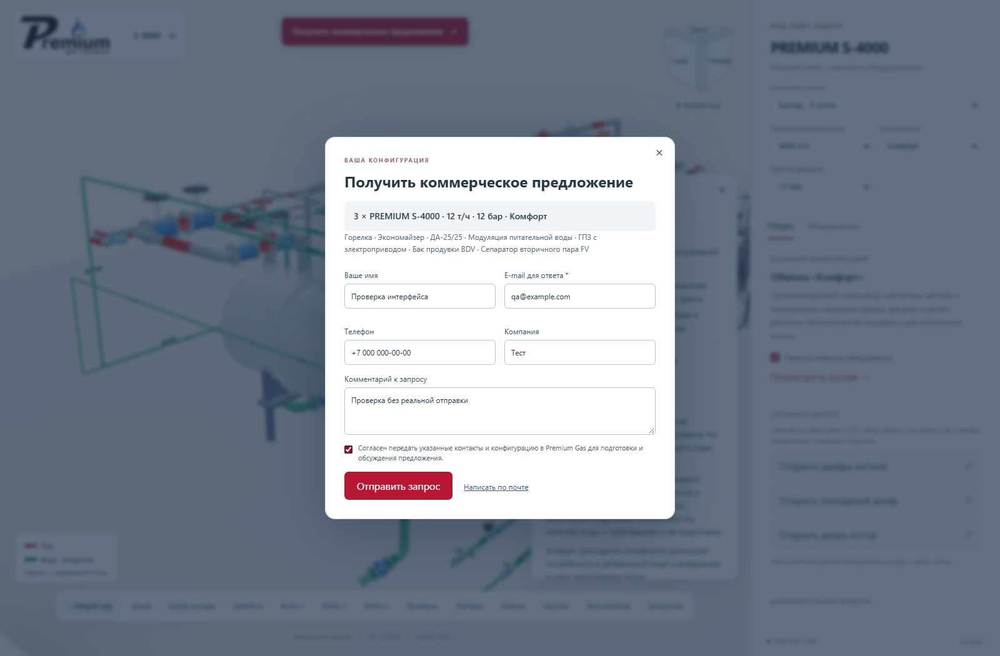
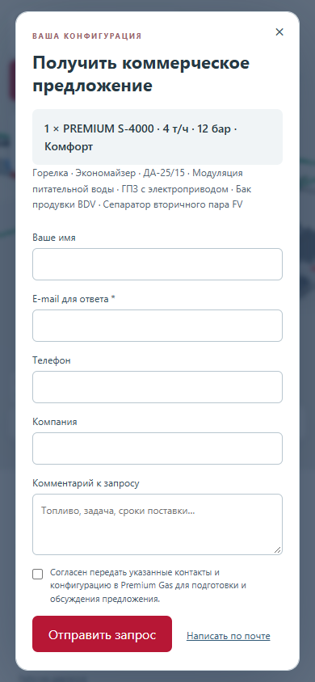

# Форма запроса коммерческого предложения

**Версия 2026.10.05.1 · 05.10.2026 · Codex / GPT-6.**

Статус: **PUBLISHED_VERIFIED**.

[Открыть опубликованную версию](https://prgz.ru/komplektacii4/?power=4000&trim=comfort&cascade=5&pressure=12&addons=burner%2Ceconomizer%2Cdeaerator%2Cmodulation%2Cgpz%2Cbdv%2Cfv&v=2026.10.05.1).

По просьбе владельца из формы удалена строка «Получатель: premium-gas@mail.ru».
Удалён относящийся к ней CSS. Существующая браузерная проверка теперь
проверяет отсутствие строки. Номер версии синхронизирован с письмом о конфигурации.

Получатель в серверном обработчике, отправка формы и резервная ссылка mailto
сохранены. Новых моделей, текстур и зависимостей нет.

## Проверки и публикация

- TypeScript и производственная сборка прошли.
- По 14 браузерных сценариев на промежуточном и основном адресах.
  Проверены отсутствие строки, валидация формы, сохранение данных при ошибке,
  повтор запроса и отображение на мобильном экране 390 px.
- Внешний вид формы просмотрен на компьютере и телефоне. Ошибок JavaScript
  и шейдеров нет.
- Совпали контрольные суммы 125 файлов по HTTPS и всех 128 файлов на сервере.
- Обработчик КП проверен с подменённым транспортом. Реальные письма
  не отправлялись; доставка в почтовый ящик не проверялась.
- Все 100 GLB побайтно прежние. Переданы 9 файлов, переиспользованы 119.
  Сжатая передача — 455 913 байт. Соседние разделы сайта не изменены.

Исходники: `1767e1e77da4d11a94741464523b52962b908863`.
Сборка: `043ed126022a52deb0cee719c14568f705253bad`.
SHA-256 манифеста: `4c8e178aeaa26191ec61fc0b960e31ccf195334602e38543efff2c548e66096f`.

[Сводный протокол](verification.json), [браузерная проверка](browser-live.json),
[HTTP-проверка](http-live.json), [проверка обработчика](quote-endpoint.json).

[Предыдущая публикация для отката](https://prgz.ru/komplektacii4-before-cascade-v2026.10.05.1/).

