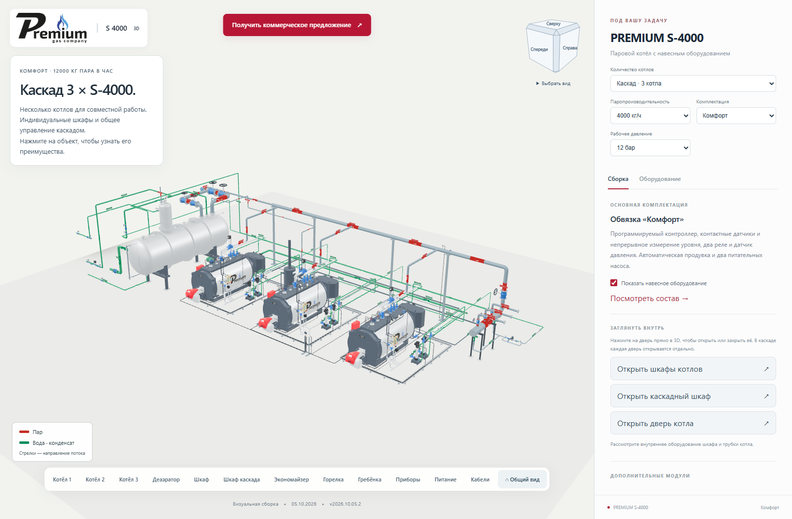
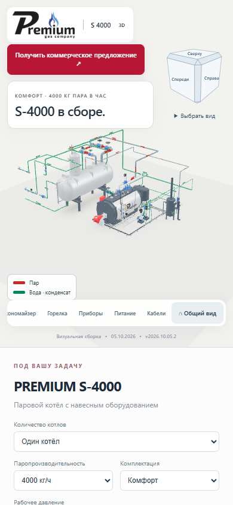

# Порядок нижней панели оборудования

**Версия 2026.10.05.2 · 05.10.2026 · Codex / GPT-6.**

Статус: **PUBLISHED_VERIFIED**.

[Открыть опубликованную версию](https://prgz.ru/komplektacii4/?power=4000&trim=comfort_plus&cascade=5&pressure=12&addons=burner%2Ceconomizer%2Cdeaerator%2Cmodulation%2Cgpz%2Cbdv%2Cfv&v=2026.10.05.2).

Кнопки идут в порядке, заданном владельцем: котёл → деаэратор → шкаф →
шкаф каскада → экономайзер → горелка. В каскаде сначала отображаются
все котлы по номерам. Одиночная сборка получила кнопку «Котёл».

Затем следуют гребёнка (в каскаде), приборы, питание, кабели и «Общий вид».
Кнопки отсутствующих опций остаются неактивными; шкаф каскада и гребёнка
появляются при выборе нескольких котлов.

Изменение относится к основному конфигуратору всей линейки S-500…S-5000.
Геометрия моделей и функции выбора оборудования сохранены.

## Проверки и публикация

- TypeScript и производственная сборка прошли.
- По 14 браузерных сценариев на промежуточном и основном адресах:
  девять мощностей, три комплектации, одиночные котлы и каскады до пяти котлов.
  Фактический порядок кнопок сохранён в протоколах каждого сценария.
- Проверены карточки, форма КП, открытие двери и экран шириной 390 px.
  Мобильная панель прокручивается по горизонтали. Ошибок JavaScript и шейдеров нет.
- Внешний вид опубликованной панели просмотрен по снимкам браузера.
- Совпали контрольные суммы всех 128 серверных файлов и 125 файлов по HTTPS.
- Все 100 GLB побайтно прежние. Переданы 8 файлов, переиспользованы 120.
  Сжатая передача — 448 000 байт. Соседние разделы сайта не изменены.
- Обработчик КП проверен с подменённым транспортом. Реальные письма
  не отправлялись; доставка в ящик не проверялась.

Исходники: `19b3d40`. Сборка: `0e1a213`.
SHA-256 манифеста: `ebf48ad21f3275fb28badb39422b67823e85a96bd1c7ba43d1217db499a6984d`.

[Сводный протокол и примеры порядка кнопок](verification.json),
[браузерная проверка](browser-live.json), [HTTP-проверка](http-live.json).

[Предыдущая публикация для отката](https://prgz.ru/komplektacii4-before-cascade-v2026.10.05.2/).

