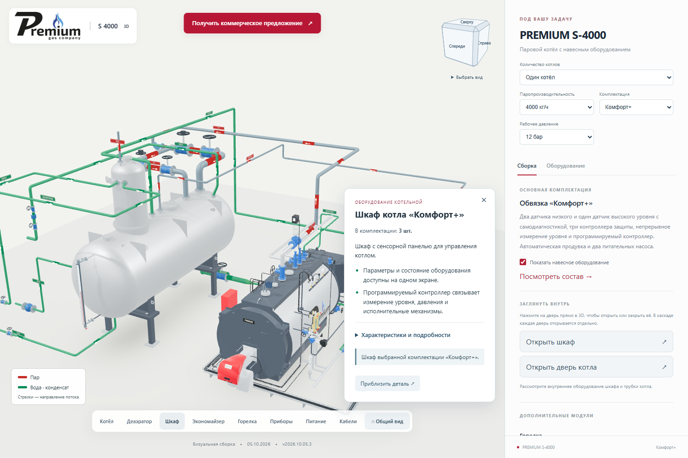
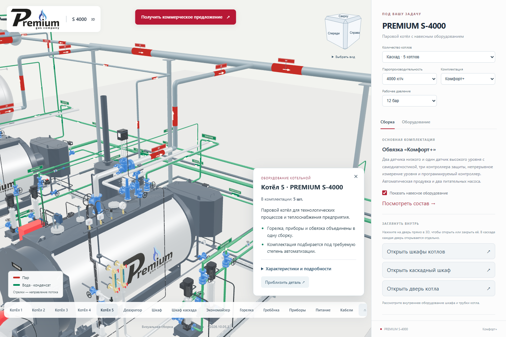
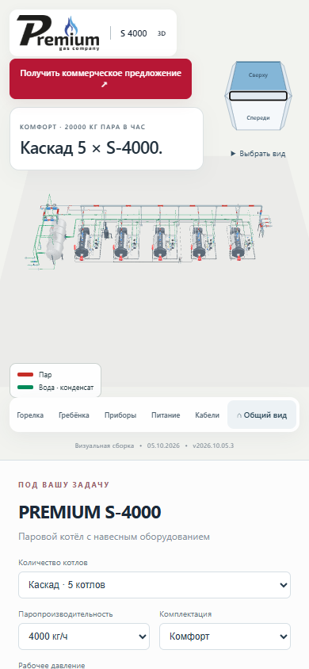

# Плавная смена ракурсов и подлёты к шкафам

**Версия 2026.10.05.3 · 05.10.2026 · Codex / GPT-6.**

Статус: **PUBLISHED_VERIFIED**.

[Открыть опубликованную версию](https://prgz.ru/komplektacii4/?power=4000&trim=comfort_plus&cascade=5&pressure=12&addons=burner%2Ceconomizer%2Cdeaerator%2Cmodulation%2Cgpz%2Cbdv%2Cfv&v=2026.10.05.3).

Номинальная длительность перехода — 0,8–1,8 секунды с мягким разгоном и
торможением. Камера огибает точку обзора по короткой дуге; дальний перенос
между объектами слегка приподнимает траекторию.

Переход применяется к нижней панели, граням, рёбрам и углам кубика, меню видов,
«Общему виду», клавише Home, приближению детали и кнопкам открытия шкафов.
Клик на двери шкафа в 3D подводит камеру к выбранному шкафу, включая отдельные
шкафы котлов в каскаде и общий шкаф каскада.

Повторный выбор меняет маршрут из текущего положения. Вращение мышью,
масштабирование колесом и потеря активного жеста отменяют перелёт.
Первичная загрузка сразу вписывает сборку в кадр. При системной настройке
уменьшения движения ракурс меняется без перелёта. После остановки используется
прежний рендеринг по требованию.

Модели и существующая анимация дверей сохранены.

## Проверки и публикация

- TypeScript и производственная сборка прошли. Четыре теста траектории проверяют
  точные конечные позиции, плавные начало и конец, обход точки обзора,
  короткий переход через границу 180° и смену маршрута из промежуточной точки.
- По 12 сценариев движения камеры на промежуточном и основном адресах.
  Записывались реальные позиции камеры по кадрам, а не только флаг анимации.
  Проверены переход между противоположными видами, перелёт от первого котла
  к пятому, открытие и закрытие шкафов, прямые клики по шкафу пятого котла
  и общему шкафу каскада, а также комплектация «Стандарт».
- Сохраняется один экземпляр OrbitControls. Проверены смена цели на лету,
  прерывание мышью и колесом, восстановление после потери жеста и системная
  настройка уменьшения движения. После завершения камера не смещается;
  за контрольный интервал простоя новых кадров не было.
- На промежуточном адресе проверены все 26 направлений кубика: 6 граней,
  12 рёбер, 8 углов. Сборка из пяти котлов вписывается в кадр во всех ракурсах.
  Проверены клавиши Enter, Space и Home, вращение мышью и экран 390 px.
- Там же прошли 14 сценариев для девяти мощностей, трёх комплектаций,
  одиночных котлов и каскадов. Проверены карточки, форма КП и дверь котла.
  Ошибок JavaScript и шейдеров нет.
- Совпали контрольные суммы 128 серверных файлов и 125 файлов по HTTPS.
  Все 100 GLB побайтно прежние. Переданы 8 файлов, переиспользованы 120;
  сжатая передача — 448 604 байта. Соседние разделы сайта не изменены.
- Обработчик КП проверен с подменённым транспортом. Реальные письма
  не отправлялись; доставка в ящик не проверялась.

Исходники: `e16a30d`. Сборка: `73c737e`.
SHA-256 манифеста: `469ec549d4595b08544bb21dc4cde8fa0a2842dbec9b6daed1552a92f39bcaa5`.

[Сводный протокол](verification.json), [перелёты на основном сайте](motion-live.json),
[перелёты на промежуточном сайте](motion-stage.json), [26 направлений кубика](viewcube-stage.json),
[14 конфигураций](browser-stage.json), [HTTP-проверка](http-live.json).

Воспроизведение проверок:

```text
node --test tools/cascade/camera-flight.test.mjs
node tools/cascade/check_camera_motion.mjs <base-url/> <output-directory>
node tools/cascade/check_viewcube.mjs <base-url/> <output-directory> cascade
```

Для браузерных сценариев переменная `S3000_BROWSER_RUNTIME` указывает на
окружение с Playwright. Проверки публикации требуют манифест текущей сборки.

[Предыдущая публикация для отката](https://prgz.ru/komplektacii4-before-cascade-v2026.10.05.3/).






