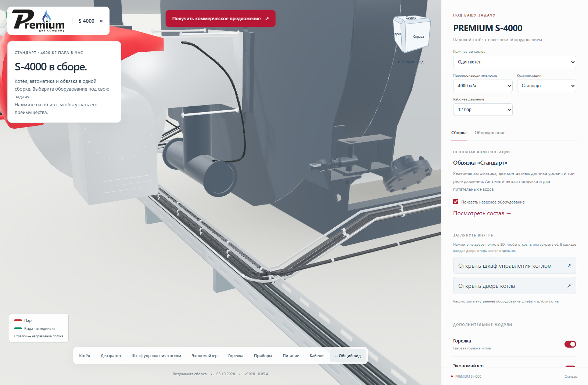
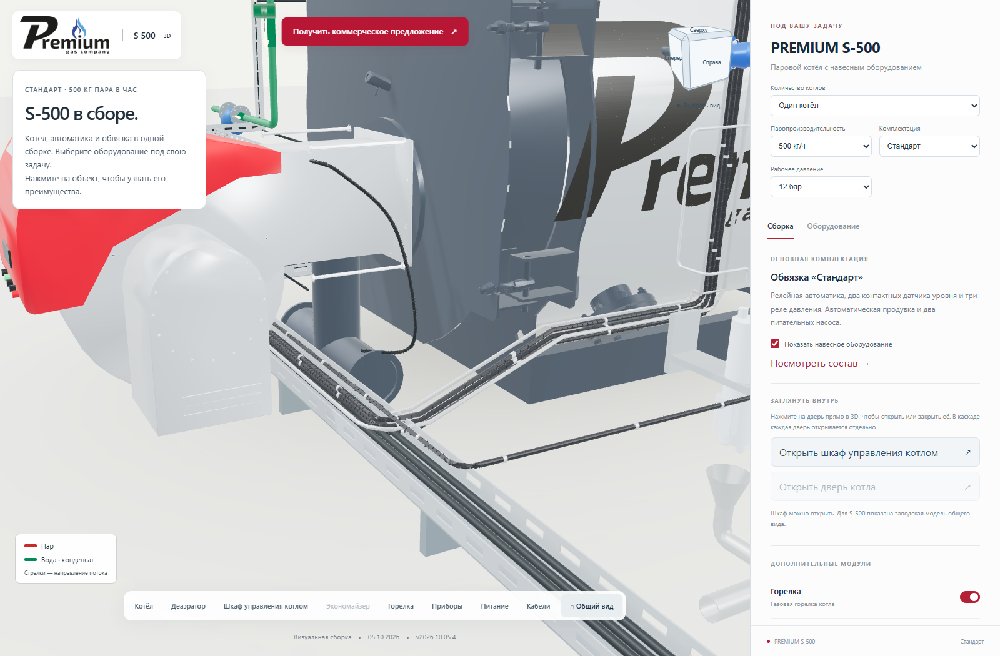
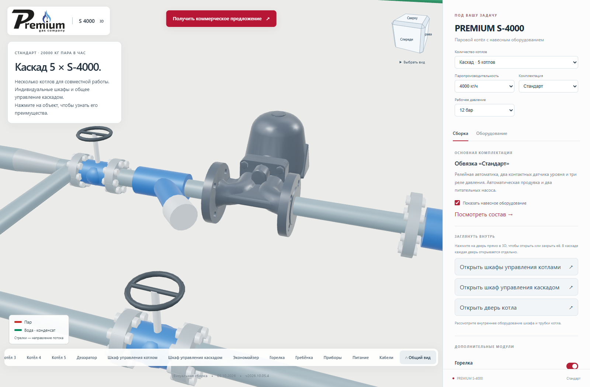
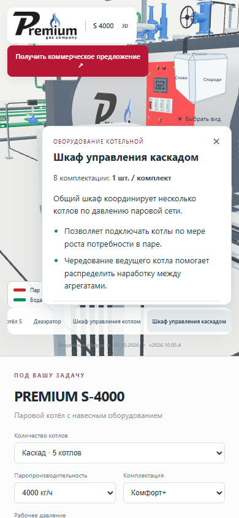

# Названия шкафов, фильтр и передний кабельный лоток

**Версия 2026.10.05.4 · 05.10.2026 · Codex / GPT-6.**

Статус: **PUBLISHED_VERIFIED**.

- «Шкаф» переименован в «Шкаф управления котлом», «Шкаф каскада» —
  в «Шкаф управления каскадом». Обновлены нижняя панель, карточки,
  кнопки открытия и закрытия, состав оборудования и подпись сигнального кабеля.
- У фильтра перед конденсатоотводчиком паровой гребёнки отстойник с крышкой
  повёрнут вбок, в горизонтальную плоскость. Основная линия и байпас сохранены.
- Передний участок приборного кабельного лотка перенесён на 120 мм вперёд
  и на 170 мм ниже, к напольному лотку. Кабели следуют за ним. Такое положение
  освобождает трубу возле горелки и оставляет зазор у малых котлов.
  Напольный лоток перенесён вперёд на 120 мм. Подключения к приборам и шкафу
  остаются на своих местах.
- Изменение выполняется на копии геометрии. Сжатые координаты GLB сначала
  декодируются в Float32, чтобы перенос за исходные границы не искажал сетку.
  Длинные грани разделены только на границах переноса, поэтому гофра,
  крепления и кабель следуют одной траектории без отделившихся фрагментов.
  Исходные CAD/GLB сохранены. Новых моделей для загрузки не требуется.

Локально прошли TypeScript, пять автоматических тестов и 12 браузерных
сценариев: девять мощностей, три комплектации и каскады. Крупным планом
проверены лоток и фильтр. Полные названия доступны на экране шириной 390 px.

Проверки текущего изменения:

```text
node --test tools/cascade/front-cable-clearance.test.mjs tools/cascade/customer-information.test.mjs
node tools/cascade/check_front_service_clearance.mjs <base-url/> <output-directory>
```

Браузерные сценарии требуют `S3000_BROWSER_RUNTIME` с Playwright.
Для Vite без манифеста используется дополнительный аргумент `dev`.


## Проверки и публикация

- По 12 сценариев геометрии и названий на промежуточном и основном адресах:
  все девять мощностей, три комплектации, одиночные котлы и каскады.
- Передний участок проводки и лотков проверен на пересечение с треугольниками
  модели горелки. Проверяемые объёмы расширены на 5 мм; пересечений нет.
  Крупные планы S-500 и S-4000 проверены визуально.
- На промежуточном адресе прошли 14 сценариев интерфейса, 12 сценариев
  движения камеры и все 26 направлений кубика. Проверены открытие шкафов,
  подписи, карточки, экран 390 px и форма КП. Ошибок JavaScript и шейдеров нет.
- Пять автоматических тестов, TypeScript и производственная сборка прошли.
  Проверены сжатые координаты, неподвижные вводы, согласованный перенос
  длинных граней и гофры, а также описания всей матрицы оборудования.
- Совпали контрольные суммы 128 серверных файлов и 125 файлов по HTTPS.
  Все 100 GLB прежние. Переданы 8 файлов, переиспользованы 120;
  сжатая передача — 450 059 байт.
- Реальные письма не отправлялись. Обработчик КП проверен с подменённым
  транспортом. Доставка письма в ящик не проверялась.
- Перед переключением проверено отсутствие изменений основной публикации
  и соседних страниц. Предыдущая версия сохранена для отката.

Исходники: `206bede`. Сборка: `c43eb4d`.
SHA-256 манифеста: `7f49942b7e48ec79978e564c28a004df2f922142aba1ec30bb1aa1afa259c012`.

[Открыть опубликованную версию](https://prgz.ru/komplektacii4/?power=4000&trim=standard&cascade=5&pressure=12&addons=burner%2Ceconomizer%2Cdeaerator%2Cgpz%2Cbdv%2Cfv&v=2026.10.05.4).

[Сводный протокол](verification.json), [геометрия на основном сайте](clearance-live.json),
[геометрия промежуточной версии](clearance-stage.json), [14 конфигураций](browser-stage.json),
[движение камеры](motion-stage.json), [кубик видов](viewcube-stage.json),
[HTTP-проверка](http-live.json).

[Предыдущая публикация для отката](https://prgz.ru/komplektacii4-before-cascade-v2026.10.05.4/).








