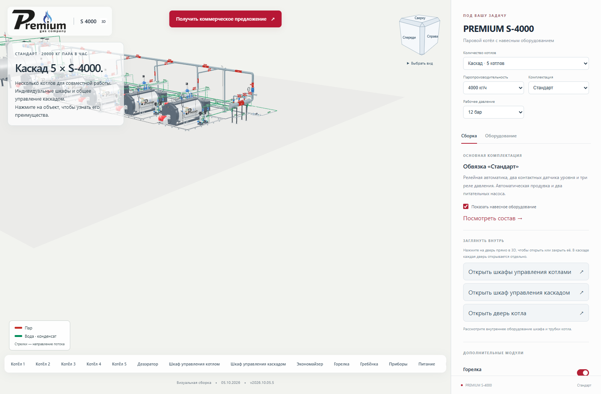
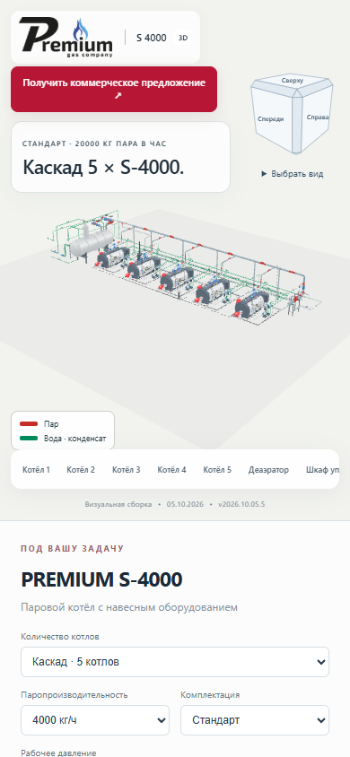

# Полупрозрачная подложка в левом верхнем углу

**Версия 2026.10.05.5 · 05.10.2026 · Codex / GPT-6.**

Статус: **PUBLISHED_VERIFIED**.

Белые подложки логотипа и блока с названием сборки пропускают 28% фона.
Текст и логотип остаются непрозрачными; мелкие подписи затемнены, чтобы
читать их поверх модели. Одинаковый фон используется на компьютере и телефоне.

Изменены только стили и сведения о версии. Геометрия, камера и модели прежние.

## Проверка

- TypeScript и производственная сборка прошли.
- Подложки проверены на ширине 1600 и 390 px на промежуточном и основном сайте:
  белый фон с alpha 0.72, непрозрачный текст, отсутствие горизонтального переполнения.
- Проверен вид модели за подложками. Ошибок JavaScript и шейдеров нет.
- 128 серверных файлов и 125 файлов по HTTPS совпали с манифестом.
- Все 100 GLB побайтно прежние. Письма при проверках не отправлялись.
- Предыдущая публикация сохранена, соседние страницы не изменены.

[Основной сайт](https://prgz.ru/komplektacii4/?power=4000&trim=standard&cascade=5&pressure=12&addons=burner%2Ceconomizer%2Cdeaerator%2Cgpz%2Cbdv%2Cfv&v=2026.10.05.5).

[Сводный протокол](verification.json), [браузер](browser-live.json),
[проверка HTTPS](http-live.json).

