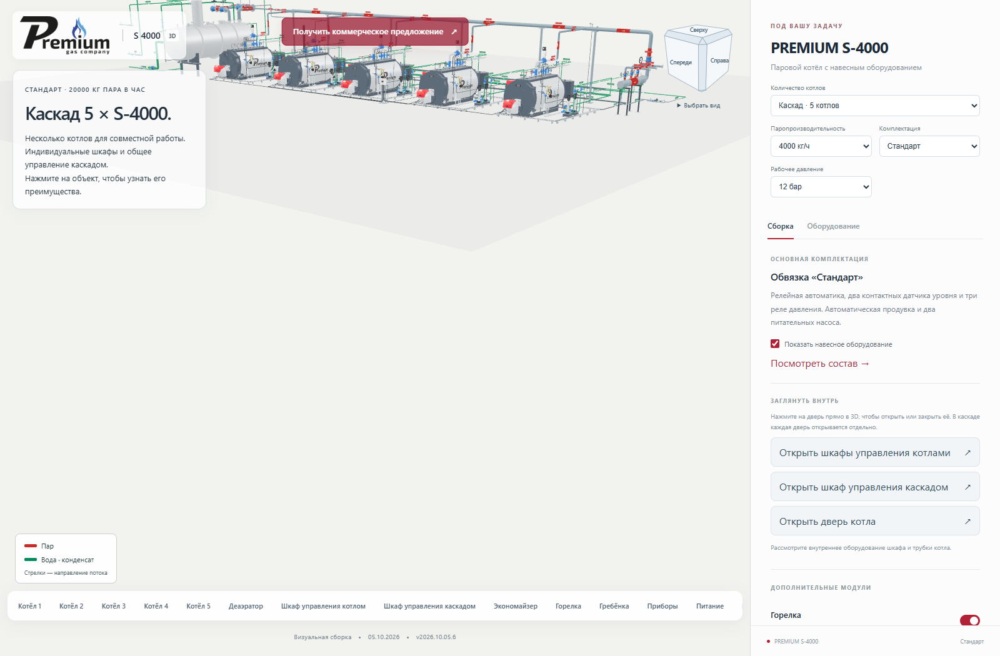
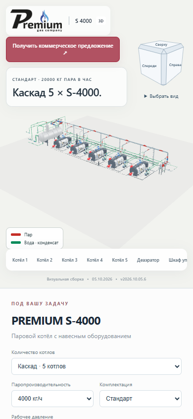

# Полупрозрачная кнопка коммерческого предложения

**Версия 2026.10.05.6 · 05.10.2026 · Codex / GPT-6.**

Статус: **PUBLISHED_VERIFIED**.

Красный фон кнопки «Получить коммерческое предложение» пропускает 28% фона.
Белая надпись и стрелка остаются непрозрачными. Оттенок красного немного
затемнён, чтобы белый текст читался и на светлом фоне.
При наведении и фокусе с клавиатуры прозрачность фона уменьшается до 14%.
Кнопка открывает существующую форму с выбранной конфигурацией.

Изменены только стили и сведения о версии. Геометрия и модели прежние.

## Проверка

TypeScript и производственная сборка прошли. На промежуточном и основном
сайте проверены экраны 1600 и 390 px: обычный фон (alpha 0.72), наведение
и клавиатурный фокус (alpha 0.86), белый непрозрачный текст, открытие формы
клавишей Enter и закрытие. Ошибок JavaScript/шейдеров и переполнения нет.
Форма при проверках не отправлялась.

128 серверных файлов и 125 файлов по HTTPS совпали с манифестом.
Все 100 GLB прежние. Предыдущая публикация сохранена для отката;
соседние страницы не изменены.

[Открыть опубликованную версию](https://prgz.ru/komplektacii4/?power=4000&trim=standard&cascade=5&pressure=12&addons=burner%2Ceconomizer%2Cdeaerator%2Cgpz%2Cbdv%2Cfv&v=2026.10.05.6).

[Сводный протокол](verification.json), [браузер](browser-live.json), [HTTPS](http-live.json).

