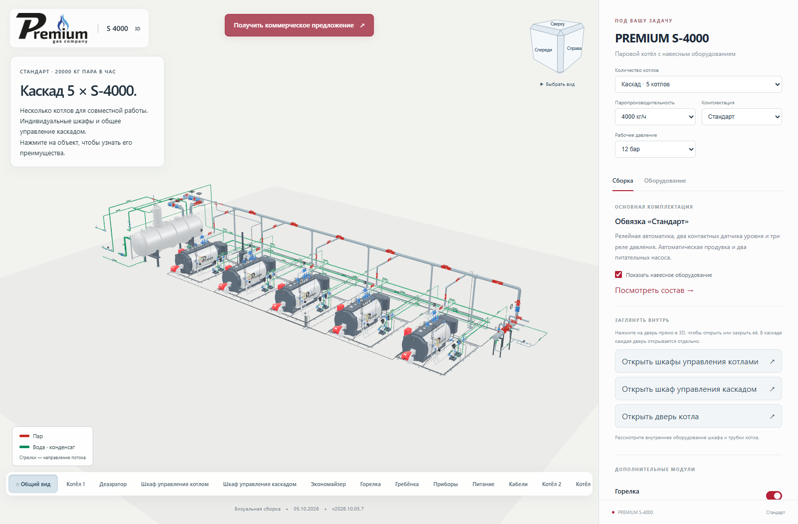
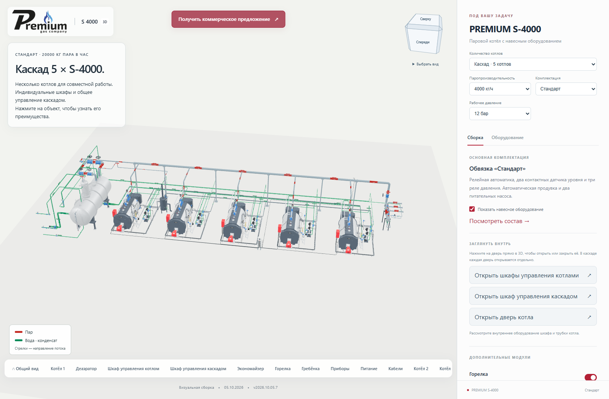
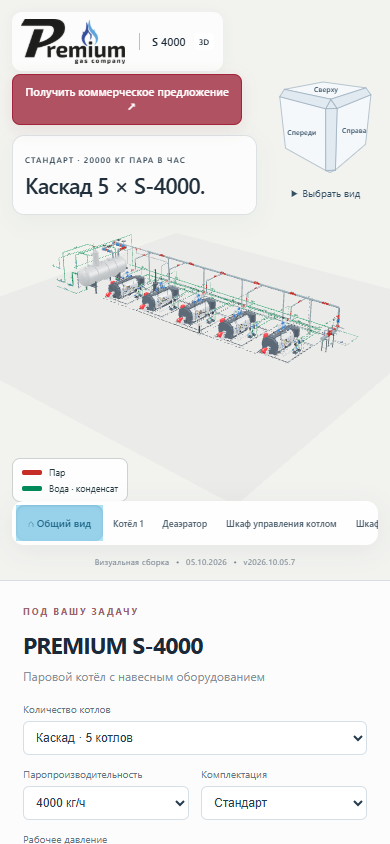
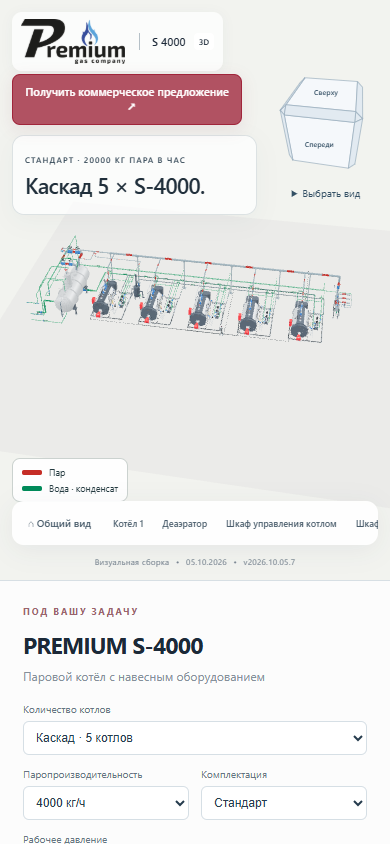

# Порядок ракурсов и состояние кнопки «Общий вид»

**Версия 2026.10.05.7 · 05.10.2026 · Codex / GPT-6.**

Статус: **PUBLISHED_VERIFIED**.

Нижняя панель начинается с «Общего вида», затем идут первый котёл,
деаэратор, шкафы управления, экономайзер, горелка и остальное оборудование.
Дополнительные котлы 2–5 находятся в конце, по возрастанию номера.

Постоянная подсветка «Общего вида» заменена состоянием `aria-pressed`.
При загрузке кнопка нейтральная. Нажатие кнопки или Home включает подсветку
и возвращает общий ракурс. Вращение, панорамирование, приближение камеры,
выбор другого ракурса или подлёт к объекту снимают подсветку.

## Проверка

TypeScript и производственная сборка прошли. Локально, на промежуточном
и основном сайтах проверены сборки с 1, 2 и 5 котлами. Проверены порядок
кнопок, нейтральное начальное состояние, включение подсветки по нажатию
и Home, её сброс при вращении, панорамировании, приближении, выборе другого
ракурса или открытии шкафа. Проверены прерывание перелёта и уменьшение движения.

На телефоне 390 px кнопка общего вида видна первой. Касание включает её,
поворот модели пальцем снимает подсветку. Горизонтального переполнения страницы
и ошибок JavaScript нет. Проверки сравнивают реальное положение камеры,
а не только цвет кнопки.

128 серверных файлов и 125 файлов по HTTPS совпали с манифестом.
Все 100 GLB прежние. Письма не отправлялись. Предыдущая версия сохранена,
соседние страницы не изменены.

Браузерная проверка: `node tools/cascade/check_home_navigation.mjs <base-url/> <output-directory>`.
Требуется `S3000_BROWSER_RUNTIME` с Playwright.

[Открыть опубликованную версию](https://prgz.ru/komplektacii4/?power=4000&trim=standard&cascade=5&pressure=12&addons=burner%2Ceconomizer%2Cdeaerator%2Cgpz%2Cbdv%2Cfv&v=2026.10.05.7).

[Сводный протокол](verification.json), [браузер](browser-live.json), [HTTPS](http-live.json).

