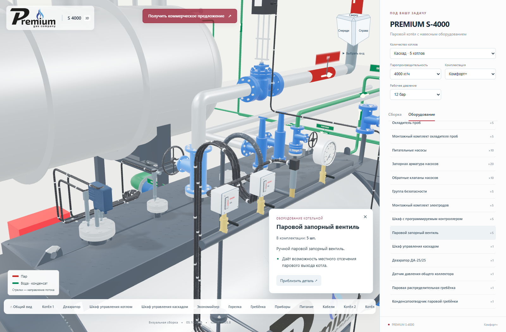
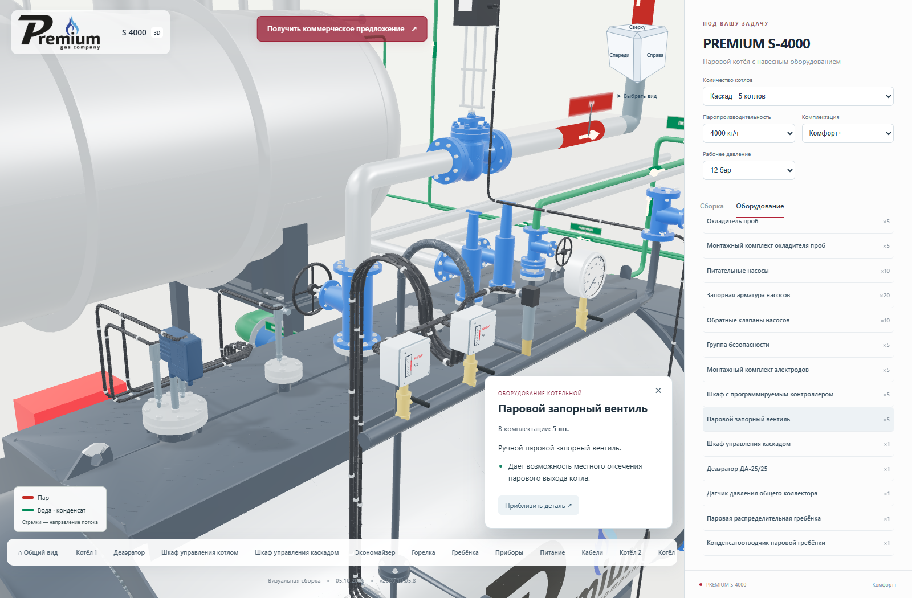

# Подсветка выбранного оборудования в исходных цветах

**Версия 2026.10.05.8 · 05.10.2026 · Codex / GPT-6.**

Статус: **PUBLISHED_VERIFIED**.

При выборе оборудования из списка, нижней панели, карточки или кликом по модели
деталь трижды плавно меняет яркость за 3,6 секунды анимации. Синий вентиль остаётся
синим, красная горелка — красной. Текстуры, окраска отдельных элементов и отделка
металла сохраняются. Эффект виден во время подлёта камеры и после его завершения.

Повторное нажатие запускает эффект заново. Выбор другого объекта, закрытие
карточки или общий вид возвращают прежнюю яркость. В каскаде выделяется только
нужная деталь конкретного котла. Общие шкаф и гребёнка также поддерживают эффект.
Наведение мыши его не запускает. При уменьшении движения используется одно
неподвижное выделение без мигания.

Подсветка меняет яркость готовой поверхности в существующем шейдере. Новых моделей,
геометрии и дополнительных проходов отрисовки нет. После завершения эффекта
сцена снова ожидает действий пользователя, без постоянной анимации.

## Проверка

TypeScript, производственная сборка и восемь модульных проверок прошли.
В браузере локально, на промежуточном и основном сайтах проверены один котёл
«Стандарт» и каскад из пяти котлов «Комфорт+». Замерены три светлых и три тёмных
фазы. Подтверждены подлёт камеры, сохранение исходных материалов, отсутствие
подсветки соседних котлов и запуска при наведении.

Проверены повторное нажатие, клик по самой модели, смена объекта, закрытие
карточки, общий вид, пятый котёл, общая гребёнка и датчик с собственной окраской
в шейдере. После завершения эффекта число отрисованных кадров перестаёт расти.
При уменьшении движения — одно неподвижное выделение. Касание на телефоне
390 px работает, горизонтального переполнения страницы нет.

Ошибок JavaScript и шейдеров не выявлено. 128 серверных файлов и 125 файлов
по HTTPS совпали с манифестом. Все 100 GLB прежние. Письма не отправлялись.
Предыдущая версия сохранена, соседние страницы не изменены.

Модульные проверки: `node --test tools/cascade/selection-pulse.test.mjs tools/cascade/camera-flight.test.mjs`.

Браузерная проверка: `node tools/cascade/check_selection_pulse.mjs <base-url/> <output-directory>`.
Требуется `S3000_BROWSER_RUNTIME` с Playwright.

[Открыть опубликованную версию](https://prgz.ru/komplektacii4/?power=4000&trim=standard&cascade=5&pressure=12&addons=burner%2Ceconomizer%2Cdeaerator%2Cgpz%2Cbdv%2Cfv&v=2026.10.05.8).

[Сводный протокол](verification.json), [браузер](browser-live.json), [HTTPS](http-live.json).

