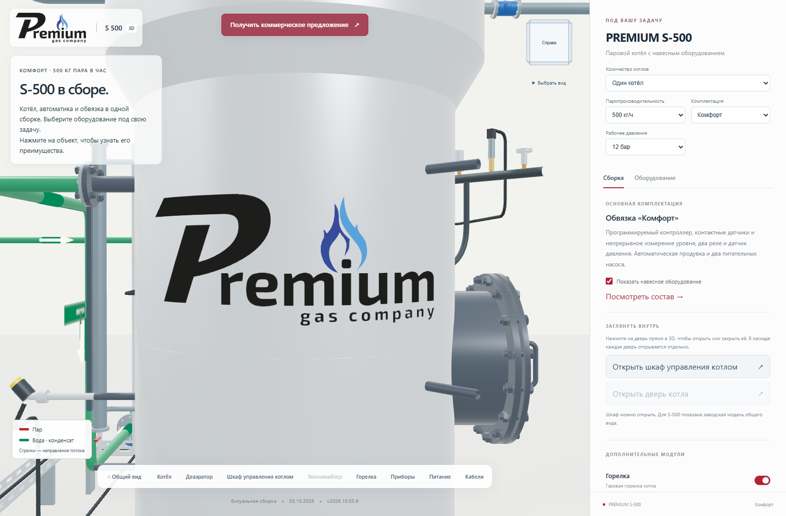
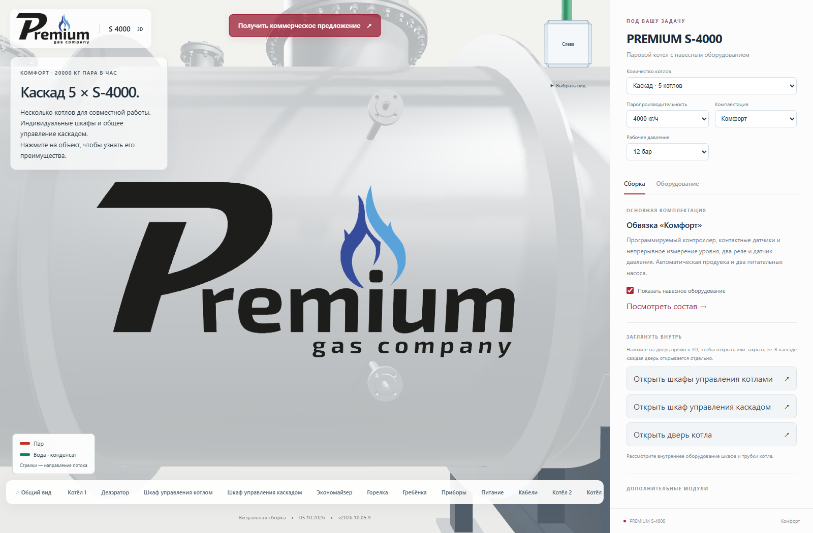

# Логотип Premium с двух сторон деаэраторов

**Версия 2026.10.05.9 · 05.10.2026 · Codex / GPT-6.**

Статус: **PUBLISHED_VERIFIED**.

На ДА‑3, ДА‑15/4, ДА‑15/8, ДА‑25/15 и ДА‑25/25 добавлен фирменный
логотип Premium с двух противоположных сторон. Он повторяет кривизну
наружной обшивки и читается с обеих сторон без зеркального отражения.
Для ДА‑25/25 выбрано свободное поле между кольцами жёсткости.

Оба изображения используют существующий прозрачный PNG логотипа.
На видимый бак добавлено 48 треугольников и два объекта отрисовки.
Дополнительные файлы изображений и модели не загружаются. Размеры,
геометрия и содержимое всех 100 GLB остаются прежними.

Логотипы появляются вместе с выбранным деаэратором и скрываются при
отключении дополнения. Выделение деаэратора при выборе работает и
для логотипов. Материалы и геометрия освобождаются при смене сцены;
общая текстура сохраняется в кэше.

## Проверка

TypeScript и производственная сборка прошли. Локально, на промежуточном
и основном сайтах проверены обе стороны всех пяти деаэраторов: десять
ракурсов на каждом сайте. Проверены количество логотипов, общая текстура,
прозрачность фона, отсутствие зеркального отражения и размещение снаружи
обшивки. На ДА‑25/25 надпись находится между кольцами жёсткости.

Выключение дополнения скрывает оба логотипа, включение возвращает их.
При выборе деаэратора работает прежний эффект выделения с восстановлением
исходной яркости. Ошибок JavaScript и шейдеров не выявлено.

128 серверных файлов и 125 файлов по HTTPS совпали с манифестом. Все
100 GLB прежние. Предыдущая публикация сохранена, соседние страницы
не изменены. Проверка формы ограничена отклоняемыми запросами без писем.

Браузерная проверка: `node tools/cascade/check_deaerator_branding.mjs <base-url/> <output-directory>`.
Требуется `S3000_BROWSER_RUNTIME` с Playwright.

| Деаэратор | Левая сторона | Правая сторона |
|---|---|---|
| ДА‑3 | [Изображение](da3-left.png) | [Изображение](da3-right.png) |
| ДА‑15/4 | [Изображение](da15_4-left.png) | [Изображение](da15_4-right.png) |
| ДА‑15/8 | [Изображение](da15_8-left.png) | [Изображение](da15_8-right.png) |
| ДА‑25/15 | [Изображение](da25_15-left.png) | [Изображение](da25_15-right.png) |
| ДА‑25/25 | [Изображение](da25_25-left.png) | [Изображение](da25_25-right.png) |

[Открыть опубликованную версию](https://prgz.ru/komplektacii4/?power=4000&trim=comfort&pressure=12&addons=burner%2Ceconomizer%2Cdeaerator%2Cmodulation%2Cgpz%2Cbdv%2Cfv&v=2026.10.05.9).

[Сводный протокол](verification.json), [браузер](browser-live.json), [HTTPS](http-live.json).

