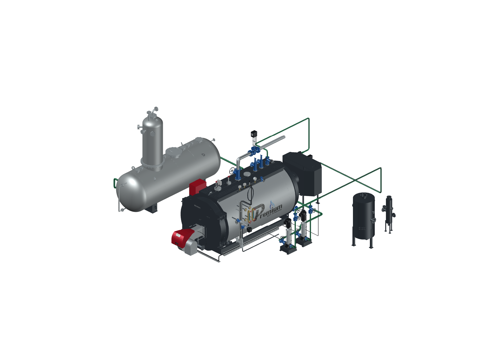
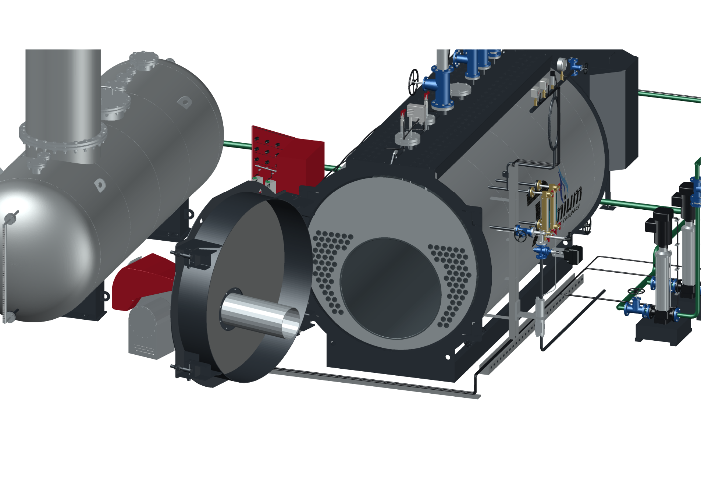
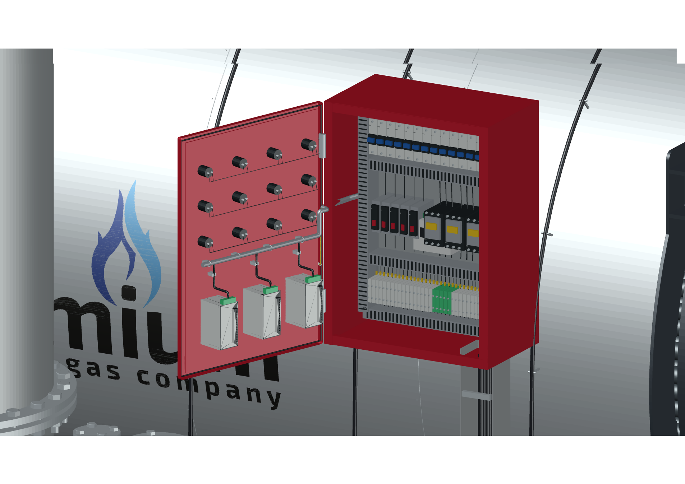

# PREMIUM S-4000 — подробная сборка AutoCAD

**Версия 2026.09.10.4 · 10.09.2026 · Codex / GPT-6 Astra.**

В AutoCAD перенесена последняя сборка S-4000 «Комфорт», котлы **8–12 бар**, из Blender `2026.09.10.3`. Сохранены открывание дверей, разворот деаэратора ДА-15 на 180° и все опции оборудования. Внешняя геометрия и трубки переданы без упрощения.

## Что находится в DWG

- **78 блоков**, **978 MESH-объектов**, **6 598 419 треугольников**. Единицы — миллиметры. Формат — **AutoCAD 2018 / AC1032**.
- Деаэратор развёрнут вместе с колонкой, обшивкой, патрубками, опорами и указателем уровня. Труба от нового положения выхода доведена до прежнего насосного коллектора.
- Дверь котла открывается на **105°** вместе с горелкой. Дверь шкафа — на **110°** вместе с приборами. Оси независимы. Корпус и монтажная панель остаются на месте.
- Из полного STEP S-4000 показаны **96 дымогарных труб и одна жаровая труба**. Остальные 571 деталь не добавлены.
- Сохранены экономайзер, проставка дымового тракта **500 мм**, насосы V4-19, модуляция питания, ГПЗ и два сепаратора. Последние представлены отдельными объектами без обвязки.
- Питательная вода приходит в штатный задний **DN32**. Выбор экономайзера и модуляции изменяет трассу. Без деаэратора остаётся подвод воды со стороны его расположения.

## Открытие и управление

Локальный комплект содержит два DWG: с закрытыми и уже открытыми дверями. Второй файл открывается как обычный чертёж и сразу показывает внутренности.

Прилагаемый запуск «Открыть в AutoCAD.cmd» открывает основной файл и подключает управление на этом компьютере. На другом компьютере откройте DWG, загрузите `S4000-controls.lsp` командой **APPLOAD**, затем введите **S4000PANEL**. Два `.dcl` должны лежать рядом с чертежом. Настройки автозагрузки и безопасности AutoCAD не изменяются.

Команды **S4000OPEN / S4000CLOSE** управляют обеими дверями, **S4000OPTIONS** открывает выбор оборудования. Имеются независимые команды каждой двери и семь сохранённых видов. Подробности — в [инструкции](../../s4000-autocad-opening-guide-20260910.md).

## Проверка

- Реальное сохранение в DWG и повторное открытие в новых процессах **AutoCAD 2027 Core Console**.
- **AUDIT: 0 ошибок**. Проверка всех координат с шагом сравнения **0,001 мм**, полного состава граней, цветов, единиц, блоков и сохранённых состояний слоёв после обратного экспорта.
- Переключение **64 состояний** на проверочной модели и **20 состояний** полной сборки. Значения опций и видимость слоёв согласованы, запись состояния не накапливает дубликаты.
- Для дверей проверены **девять состояний** на проверочной и полной моделях. Контролируются трансформации всех 78 блоков, повторное открывание, закрывание и сохранение положения дверей при смене комплектации.
- Отдельный DWG с открытыми дверями сохранён и заново открыт. Оба угла и положение остальных блоков сверены после чтения.
- Проверены **64 графа трасс**; разрыв между объявленными точками подключения — **0**.
- Просмотрены **шесть изображений непосредственно из AutoCAD**: общий вид, прямое питание, открытый шкаф, открытый котёл, обе двери и деаэратор.
- Исходный Blender `2026.09.10.3` и прежний DWG `2026.09.10.1` проверены по контрольным суммам. Оба сохранены.
- После упаковки проверены CRC и SHA-256 каждого файла архива. Числа и хеши находятся в `verification.json` и `package.json`.
- Итоговый файл открыт в оконном AutoCAD. Сценарий запуска подтвердил наличие подвижных блоков и успешное чтение обоих диалогов DCL. Контрольная сумма DWG после открытия не изменилась. Отдельный отчёт этой проверки — `desktop-review.json`.

Нажатия кнопок графического диалога отдельно не проверялись; его команды испытаны в AutoCAD. Нативная твердотельная история деталей не восстанавливается: это подробная сборка из сеток в именованных блоках. Точная компоновка шкафа «Комфорт», длина LCS и временные модели сохраняются в перечне уточнений.

## Состав публикации

Локально переданы два DWG, управление, ведомость без цен, перечень временных моделей, изображения и отчёты. В публичном GitHub — код, документация, изображения и контрольные суммы. Чертежи, исходные STEP/Blender, приватные кеши и цены в репозиторий не включаются. Публикация сайта не входит в эту CAD-редакцию.

Предыдущие CAD- и Blender-выпуски остаются доступными. Для воспроизведения см. [инструкцию сборки](../../../tools/s4000/README.md).
