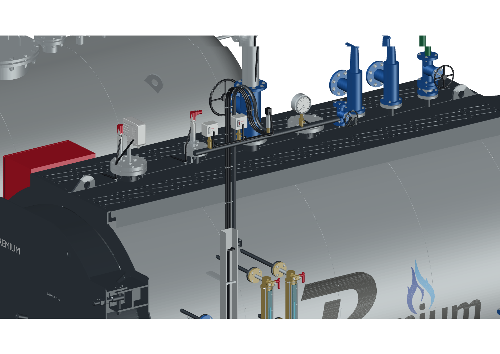
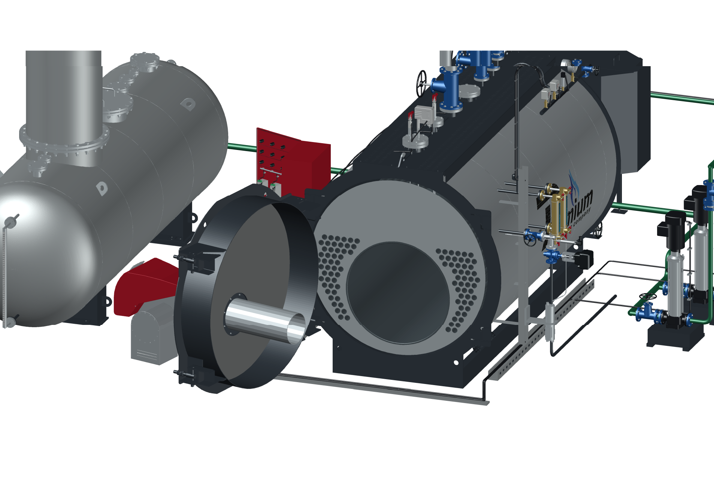

# PREMIUM S-4000 — исправленная группа давления в AutoCAD

**Версия 2026.09.10.5 · 10.09.2026 · Codex / GPT-6 Astra.**

В сборке S-4000 «Комфорт», котлы **8–12 бар**, замкнутая O-образная петля отвода приборного коллектора заменена открытым гнутым отводом с плавным верхним изгибом. Форма выполнена по образцу предоставленного чертежа ДА-15-8. Сохранены два реле, преобразователь давления, манометр и концевой вентиль котла, включая их прежние положения. Это соответствует уточнению владельца: **«Изменить форму, сохранить приборы котла»**.

Три кабеля приборов уложены вдоль нового отвода с креплениями. Далее они входят в прежний кабель-канал и приходят к шкафу. Вся остальная кабельная сетка сохранена. Из чертежа деаэратора заимствована форма изгиба; его абсолютные установочные размеры, DN32 и состав приборов на котёл не переносились. [Исходные материалы и границы исправления](../../s4000-pressure-gooseneck-20260910.md).

## Файлы и управление

Подготовлены отдельные **DWG с закрытыми и открытыми дверями**. Источник — новая подробная сцена Blender **2026.09.10.5**. Формат DWG — **AutoCAD 2018 / AC1032**, единицы — **миллиметры**. В сборке **78 блоков, 985 MESH-объектов и 7 015 959 треугольников**. Упрощение сеток при передаче не выполнялось.

Команда **S4000PRESSUREVIEW** показывает исправленный узел крупно. Остальные команды сохраняются: **S4000PANEL**, **S4000OPEN / S4000CLOSE**, **S4000OPTIONS** и независимое управление каждой дверью. Восемь сохранённых видов позволяют рассмотреть сборку и отдельные узлы.

Локальный комплект содержит «Открыть в AutoCAD.cmd» для установленного AutoCAD 2027. Для ручного подключения команд используйте **APPLOAD → S4000-controls.lsp**, затем **S4000PANEL**. Оба `.dcl` должны лежать рядом с DWG. [Подробная инструкция](../../s4000-autocad-opening-guide-20260910.md).

## Сохранённая сборка

- Дверь котла открывается вместе с горелкой на **105°**, дверь шкафа с приборами — на **110°**. Повторное открывание не накапливает угол.
- Из полного STEP S-4000 показаны **96 дымогарных труб и одна жаровая труба**. Остальные 571 деталь не импортируются.
- Деаэратор ДА-15 сохраняет разворот 180° вместе с колонкой, оцинковкой, опорами, соединениями и указателем уровня.
- Сохраняются экономайзер, дымовая проставка **500 мм**, насосы, модуляция питательной воды, ГПЗ и два отдельных сепаратора.
- Питание приходит в штатный задний **DN32**. При включении экономайзера и модуляции выбираются соответствующие трубы. Без деаэратора остаётся подвод со стороны его расположения.

## Проверено в этой редакции

- Сохранение и повторное открытие обоих DWG в новых процессах **AutoCAD 2027 Core Console**. **AUDIT — 0 ошибок**.
- После обратного экспорта закрытого DWG проверены все координаты при шаге сравнения **0,001 мм**, полный состав граней, цвета, блоки, единицы и слои. У 10 сеток AutoCAD обратил обход всех граней целиком; подтверждена полная эквивалентность топологии.
- Пройдены **64 сочетания оборудования** на проверочной модели и **20 состояний** полной сборки. Видимость согласована с опциями, в постоянной записи один актуальный набор значений.
- Проверены **9 состояний дверей** на проверочной и полной моделях. В каждом состоянии сверены все 78 блоков. Максимальная ошибка положения — **1e-12 мм**. После переключения комплектации открытые двери сохраняют положение.
- Отдельный DWG с открытыми дверями повторно прочитан; оба угла и положения остальных блоков сохранены.
- Проверены **64 графа трасс**, разрыв между объявленными точками подключения — **0**.
- Просмотрены **7 актуальных изображений AutoCAD**, в том числе новый крупный вид группы давления.
- Итоговый DWG открыт в оконном AutoCAD на виде исправленной группы. Сценарий подтвердил подвижные блоки, сохранённый вид и успешное чтение обоих диалогов; исходный файл после открытия не изменился. [Отчёт открытия](desktop-review.json).
- Сцена Blender проверена после повторного открытия: **193 кадра**, неизменность приборов, осей дверей и остальных узлов. Просмотрены общий вид и крупный план исправления.
- Контрольные суммы предыдущей сцены Blender `.3` и обоих DWG `.4` совпадают с прежними выпусками. Все эти файлы сохранены.
- Архив проверен по CRC и SHA-256 каждого включённого файла. Числа и хеши — в [verification.json](verification.json) и [package.json](package.json).

Подробная сборка состоит из штатных сеток AutoCAD в именованных блоках. История построения твердотельных деталей не восстанавливается. Точная компоновка шкафа «Комфорт»/ПР200, длина LCS и прежние временные модели остаются в перечне уточнений. Нажатия графических кнопок и полная проверка монтажных зазоров отдельно не выполнялись; команды проверены на полной модели.

Локально находятся DWG, Blender, управление, ведомость без цен, перечень моделей для замены и отчёты. В GitHub публикуются код, документация, изображения и контрольные суммы. Предыдущие выпуски сохранены. [Воспроизведение](../../../tools/s4000/README.md).
