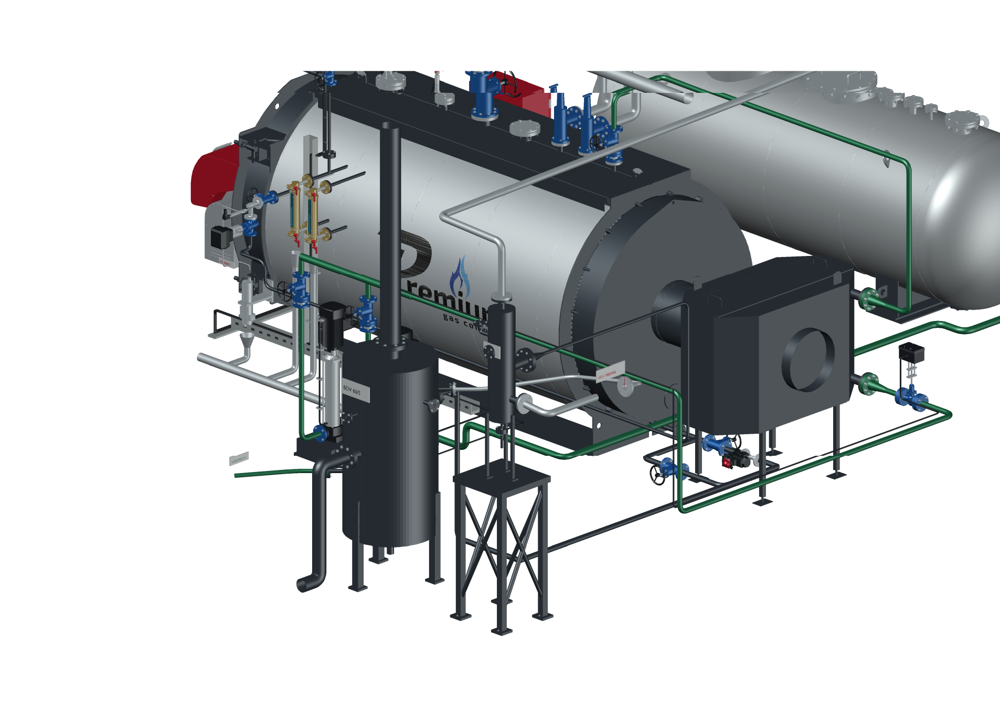
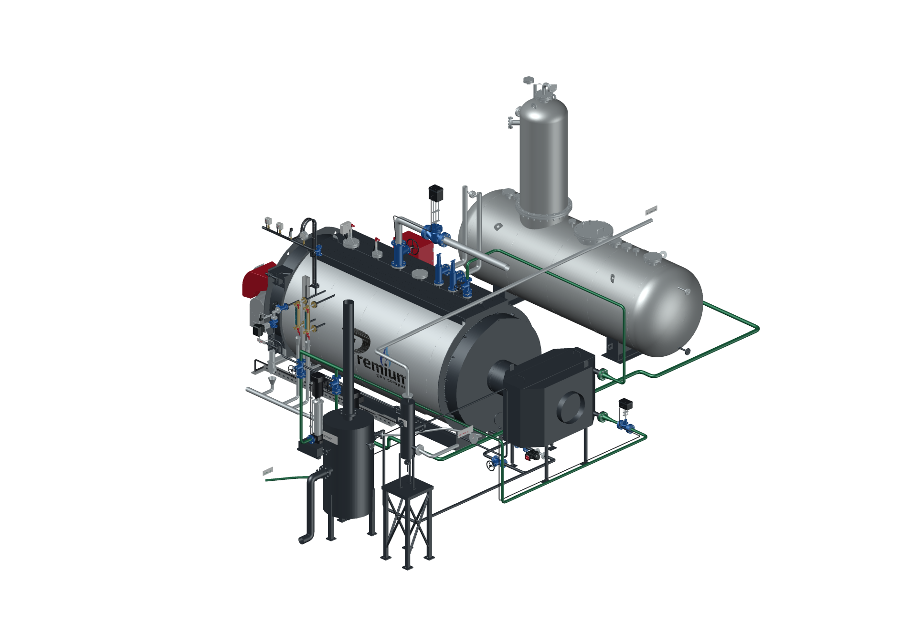

# PREMIUM S-4000 — AutoCAD с обвязкой FV8 и BDV

**Версия 2026.09.10.6 · 10.09.2026 · Codex / GPT-6 Astra.**

Последняя редакция S-4000 «Комфорт», котлы **8–12 бар**. Существующие сепараторы включены в обвязку по предоставленной тепловой схеме другого объекта. Геометрия передана из новой сцены Blender `.6` в штатные MESH-объекты AutoCAD без упрощения. [Сопоставление всех участков](../../s4000-piping-audit-20260910.md).

## Что подключено

- Непрерывная продувка от BCV925 — в N FV8; без FV8 — отдельной линией в D BDV при его выборе.
- Периодическая продувка — в C BDV через основную ветвь с ручным вентилем/BCV7432 или ручной обход. Использованы три имевшихся клапана; обход и оси соединений исправлены.
- От O FV8 построен возврат пара к стороне деаэратора. Вход конкретного DN50 ДА-15 ещё не подтверждён; линия заканчивается обозначенной границей.
- От P FV8 построены участки конденсата с понижением к BDV. Между ними разрыв **320 мм**, обозначающий отсутствующий конденсатоотводчик. Прямой обход отсутствующего аппарата не создан.
- Добавлены вентиляция/слив BDV, подвод к его узлу охлаждения, воронки местных сливов и независимые отводы двух предохранительных клапанов.
- FV8 поднят на компоновочную опору 1200 мм. Собственные отметки патрубков исправлены по его размерному чертежу: S = 400 мм над основанием аппарата.

Устройства из более богатой «Комфорт+» не добавлены. Ведомость прямо отмечает пропущенные конденсатоотводчик, регулирование охлаждения BDV, арматуру и приборы сепараторов, неподтверждённые подключения ДА-15 и SC9. Это версия для согласования компоновки с явными интерфейсными разрывами.

## Открыть и управлять

Распакуйте локальный архив **S4000_AutoCAD_OPENING_v2026.09.10.6.zip**. Запустите **«Открыть в AutoCAD.cmd»** либо откройте один из двух DWG:

- **S4000_COMFORT_8-12bar_v2026.09.10.6.dwg** — двери закрыты.
- **S4000_COMFORT_8-12bar_OPEN_v2026.09.10.6.dwg** — обе двери открыты.

**S4000PANEL** — панель дверей. **S4000OPTIONS** — оборудование. **S4000BLOWDOWNVIEW** — сепараторы крупно. **S4000ROUTINGVIEW** — общий вид труб. Для ручного открытия без запуска подключите **S4000-controls.lsp** командой APPLOAD; оба DCL должны лежать рядом с DWG. [Полная инструкция](../../s4000-autocad-opening-guide-20260910.md).

Сохраняются дверь котла с горелкой на 105°, дверь шкафа с приборами на 110°, 96 дымогарных труб и одна жаровая труба, разворот ДА-15 на 180°, исправленный открытый отвод приборного коллектора, дымовая проставка 500 мм, насосы и два варианта питания через экономайзер или напрямую в штатный задний DN32.

## Локальные проверки

- **105 блоков, 1029 MESH-объектов, 7 495 395 треугольников**. Миллиметры, AutoCAD 2018 / AC1032.
- AutoCAD 2027 сохранил и повторно прочитал полный DWG. AUDIT: **0 ошибок**. Обратный экспорт подтвердил все координаты при шаге сравнения **0,001 мм**, грани, цвета, блоки и слои; 10 обращений обхода целой сетки проверены отдельно.
- **64** состояния слоёв и постоянной записи на проверочной модели, **20** состояний на полной сборке. Отдельно проверены все **64 графа** питания/продувок с учётом интерфейсных разрывов и отсутствующих устройств.
- **9 состояний дверей** на проверочной и полной моделях; проверены все 105 блоков. Ошибка положения не больше **1e-12 мм**. Опции не сдвигают открытые двери. Открытый DWG сохранён и вновь проверен в свежем процессе.
- Просмотрены **9 актуальных видов AutoCAD**, включая сепараторы, общую обвязку, двери, ДА-15 и приборный коллектор. Blender отдельно проверен на всех 193 кадрах.
- Контрольные суммы предыдущего Blender `.5`, обоих DWG `.5` и четырёх предоставленных чертежей совпали. Предыдущие версии сохранены.
- В архиве **33 файла**. Проверены CRC и SHA-256 каждого файла. Нажатия графических кнопок отдельно не проверялись; их команды испытаны на полной модели. Запуск CI не заявляется.
- Новый DWG открыт в оконном AutoCAD на виде **S4000_ROUTING**. Сценарий подтвердил готовность дверных блоков, наличие двух новых видов и чтение обоих DCL. Контрольная сумма DWG после открытия не изменилась. Отдельный [протокол открытия](desktop-opening.json) записан после упаковки и находится рядом с архивным комплектом.

## Файлы выпуска

| Файл | Размер, байт | SHA-256 |
|---|---:|---|
| DWG, двери закрыты | 412836482 | `5212154743df171ca1e92475ca0f2edd9e8aea98dc1d6af44de43d81fbbec77f` |
| DWG, двери открыты | 412961154 | `16c6797d47b1bdec4bbd900f32ca35b5cc6e1377b9460276a48acf426d5a2304` |
| ZIP | 499143447 | `338777e16fe9f7c4893ea2f04450c522704091423115658568ed47abb836e21a` |
| Blender | 146539915 | `492752e73892372ce0acae9ef85559af36a80771b56c021daad0290de41cc66e` |

Подробный Blender передаётся [отдельным локальным файлом](../s4000-blender-v2026.09.10.6/README.md). Архив AutoCAD содержит оба DWG, управление, инструкции, ведомость без цен, проверку обвязки, список заменителей, изображения и отчёты. В публичном Git находятся код, документация, изображения и контрольные суммы. Исходные схемы, STEP, подробные CAD/Blender-файлы, фотографии и цены не публикуются. Сайт этой редакцией не обновляется.
