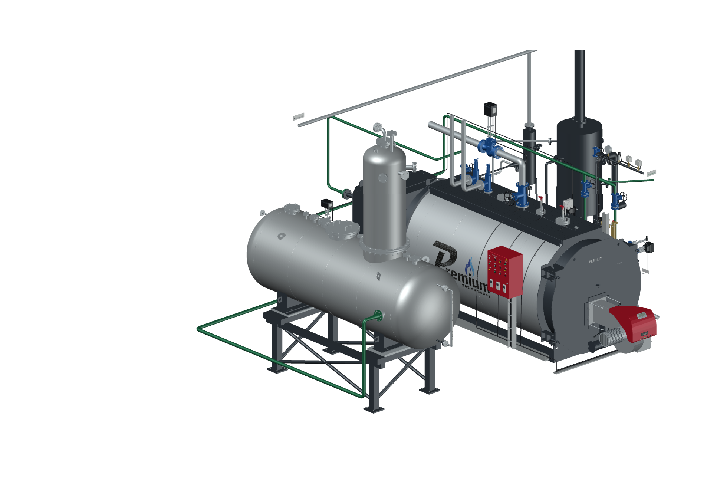
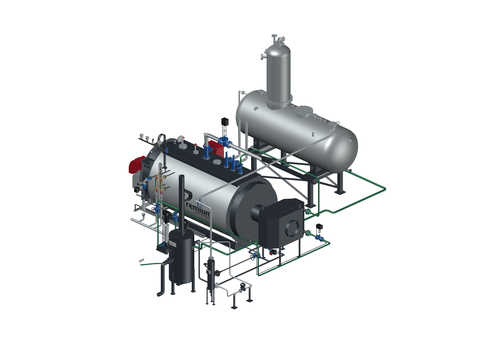

# PREMIUM S-4000 — AutoCAD, FV на полу и ДА +1 м

**Версия 2026.09.11.1 · 11.09.2026 · Codex / GPT-6 Astra.** Комплектация «Комфорт», котлы **8–12 бар**, текущая ведомость на 12 бар.

FV8 установлен штатными опорами на Z=0. ДА-15 целиком поднят на 1000 мм. Под обеими сёдлами добавлена рама с подкладками по несущим плоскостям исходной модели. Приборы и указатель уровня подняты вместе с аппаратом. Выход ДА заново соединён с прежним всасывающим коллектором насосов. Согласованный поворот на 180° сохранён.

В линию FV8 → BDV установлен **Стимакс А31 DN25 Ф/Ф** из предоставленного DWG. В Excel «Комфорт» и «Комфорт+» точной позиции не найдено. Серия выбрана для компоновки непрерывного отвода конденсата. Заводская поверхность извлечена в полном объёме: 41 681 вершина, 83 390 треугольников. Фланцы совмещены, расстояние между их плоскостями 160 мм.

После А31 показан один **напорный подъём 1125 мм** к входу D BDV. Расход, рабочий перепад и исполнение отверстия не рассчитаны. Фильтр перед А31 и обратный клапан после него перечислены как отсутствующие позиции. Назначение DN50 деаэратора для вторичного пара и подключение SC9 остаются на уточнении. [Подбор, источники, отметки и ограничения](../../s4000-floor-layout-20260911.md).

## Использование

Архив **S4000_AutoCAD_OPENING_v2026.09.11.1.zip** содержит закрытый и открытый DWG, команды, диалоги, запуск, ведомость без цен, изображения и отчёты. Откройте весь комплект через **«Открыть в AutoCAD.cmd»**. [Инструкция](../../s4000-autocad-opening-guide-20260910.md).

- `S4000PANEL` — открывание дверей. Котёл с горелкой — 105°, шкаф с приборами — 110°.
- `S4000OPTIONS` — экономайзер, ДА, модуляция воды, ГПЗ, BDV и FV.
- `S4000DAVIEW` — ДА с опорой; `S4000BLOWDOWNVIEW` — сепараторы; `S4000TRAPVIEW` — А31.
- `S4000CABINETVIEW` — исправленный ракурс шкафа, учитывающий поднятый ДА. Меняется только направление вида, состав оборудования сохраняется.

## Проверка

- AutoCAD 2027: **106 блоков, 1029 MESH, 7 603 777 треугольников**, миллиметры, DWG 2018. Геометрия не упрощалась.
- Сохранение, повторное чтение и обратный экспорт подтвердили координаты при шаге сравнения 0,001 мм, топологию, цвета, единицы, слои и блоки. AUDIT — 0 ошибок.
- Проверены 64 графа питания/продувок, 64 состояния проверочной модели и 20 состояний полной сборки.
- Проверены девять состояний дверей в проверочной и полной сборках. Открытый DWG проверен после сохранения в новом процессе.
- Исправленная команда вида шкафа испытана отдельно в AutoCAD. Все 106 положений блоков и исходный DWG сохранились.
- Просмотрены десять актуальных видов. Архив содержит **35 файлов**; CRC и SHA-256 каждого файла проверены.
- Все результаты локальные. Нажатия кнопок оконного интерфейса этой редакции отдельно не проверялись. CI не запускался. Сайт не обновлялся.

| Файл | Байт | SHA-256 |
|---|---:|---|
| Закрытый DWG | 418617806 | `99a453790c5ae5df3807ad5e1749bd12593da3be54e12ac3072d379bf481969b` |
| Открытый DWG | 418714694 | `f8ce4adcffc4329f06256b5a7cfafbe7c57415bd3db9187b4982c098434a5d11` |
| ZIP AutoCAD | 505732489 | `4da7575b4e813d01a210ab630dbd69509e555083af032ecf994bbda5f03e7d81` |

Подробные CAD/Blender-файлы, исходные схемы, фотографии и прайсы находятся в локальном комплекте. В Git опубликованы инструменты, описание, изображения и протоколы. Предыдущие файлы проверены до запрошенной владельцем очистки. [Последние чертежи и результат очистки](../../latest-drawings-20260911.md).
