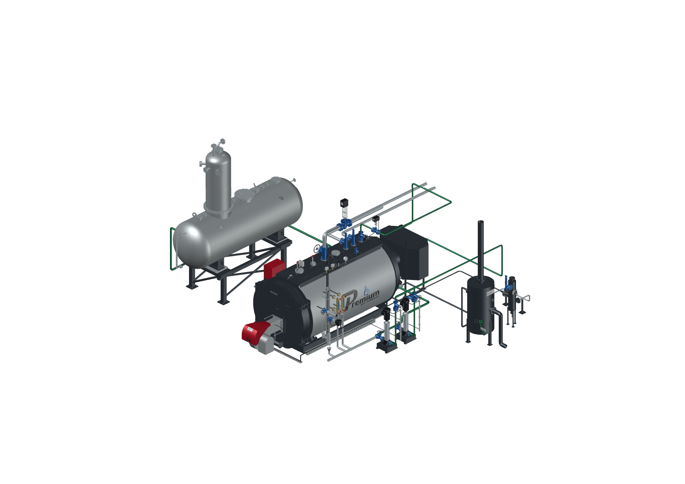
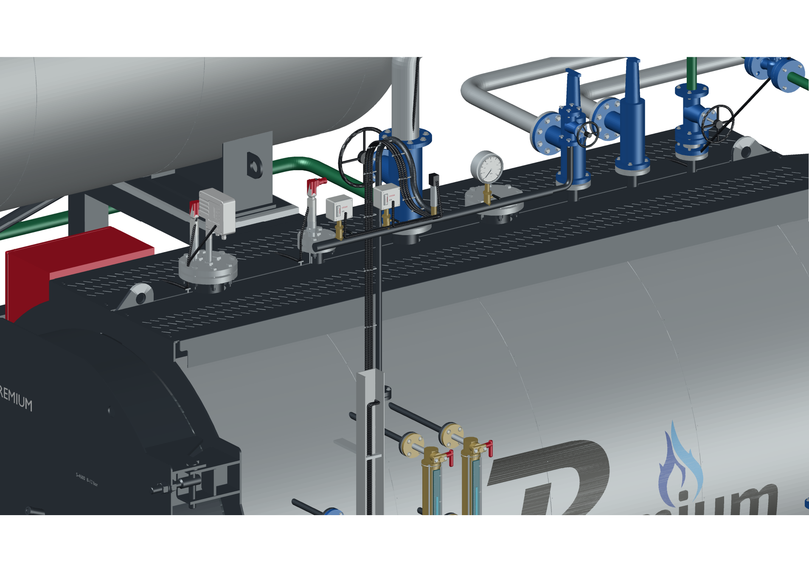
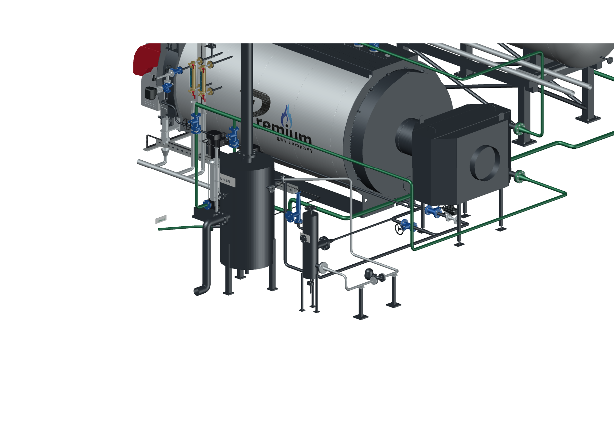
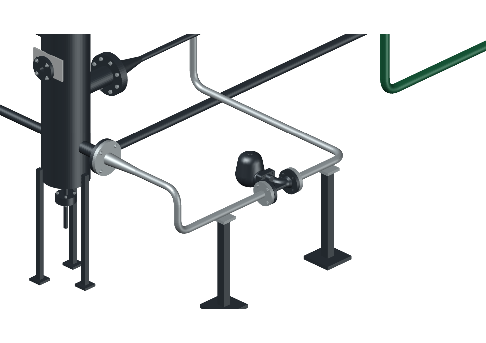
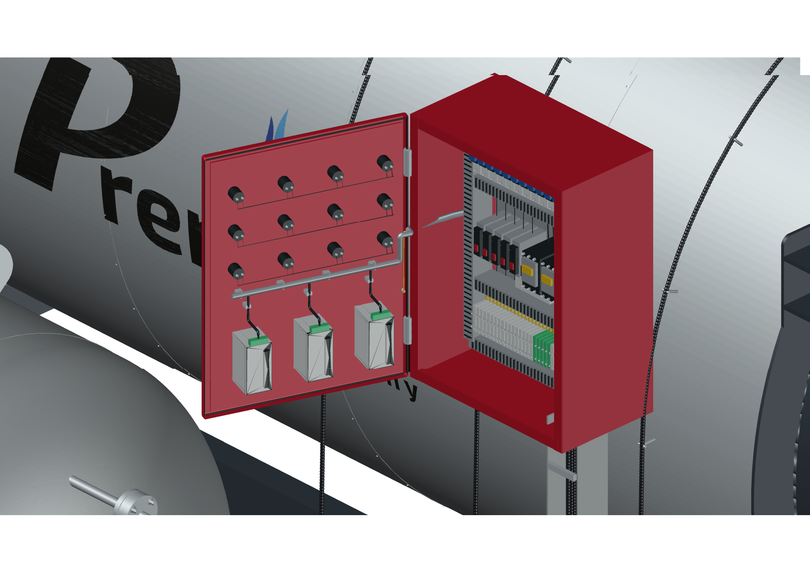
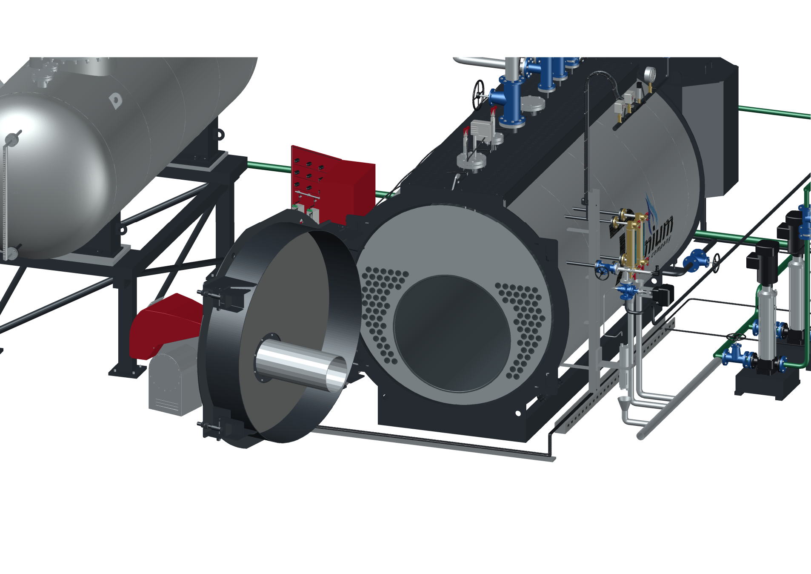

# PREMIUM S-4000 — исправления по видео в существующей сборке

**2026.09.11.1 · поправка от 11.09.2026 · Codex / GPT-6 Astra.** Комплектация «Комфорт», котлы **8–12 бар**, текущая ведомость на 12 бар. Имена файлов выпуска сохранены.

Последняя поправка от **11.09.2026**: добавленные закрытые кабель-каналы убраны по замечанию владельца. Провода вновь проложены в **чёрной гофре** по прежним закреплённым трассам к нижнему вводу шкафа. Дверца шкафа возвращена к предыдущему виду; нижние открытые монтажные лотки сохранены. Исполнитель — **Codex / GPT-6 Astra**.

**Blender, DXF и оба DWG обновлены.** Закрытый вариант и вариант с открытыми дверями сохранены и независимо проверены после повторного открытия. Существующие архивы обновлены под прежними именами; их контрольные суммы находятся в протоколах комплектов.

## Что исправлено

- Убраны добавленные закрытые короба. Вернулась чёрная гофра, закреплённая на прежних трассах от приборов, датчиков, насосов и приводов к шкафу.
- Вылеты двух сбросных труб котла **поменяны местами**. Отводы не пересекаются, прямые участки идут параллельно. Между осями — **340 мм**, между наружными поверхностями прямых участков — **263,9 мм**. Присоединения к клапанам сохранены. Проверены также пересечения с экономайзером и его водяными трубами — их нет.
- А31 развёрнут на 90° вокруг оси трубопровода: камера сбоку, пробка сверху. Исходная поверхность и фланцы сохранены.
- Привод BCV7432 повёрнут, красный элемент направлен вверх.
- Линия FV → ДА удалена. Предохранительный клапан FV поставлен на **малый верхний DN25**, подтверждённый владельцем. Центральный DN50 свободен.
- Кабели насосов идут сбоку, через крепления и прежний нижний лоток к шкафу.
- С экономайзером питание проходит по цепочке **насосы → нижний вход экономайзера → верхний выход → выбранная модуляция → штатный задний DN32 котла**. Модуляция находится горизонтально рядом с котлом. Без экономайзера работает прямое питание через тот же участок.
- Вентиль приборного коллектора поднят над трубой и подключён отводом. Сохранены два реле, преобразователь и манометр.
- CP930 отцентрирован по отверстию PCF. Стержни LP200, LP400 и LCS600 укорочены: они заканчиваются выше жаровой трубы.
- Отбор пробы перенесён на круглый торец BCV925 напротив привода.

FV остаётся на полу, ДА-15 — на отметке +1000 мм с рамой под обеими сёдлами. Разворот ДА на 180°, проставка 500 мм, 96 дымогарных труб и жаровая труба сохранены. [Состав поправок и уточнения](../../s4000-floor-layout-20260911.md).

## Проверенные виды сохранённого DWG

Все **10 изображений** получены AutoCAD 2027 из окончательно сохранённого закрытого DWG. Открытые положения создавались штатными командами сборки. Все виды просмотрены.

## Проверка

- Гофра: 11 трасс, 99 проверенных сечений фактической геометрии с рифлением. Удалены все 19 добавленных закрытых каналов. Дверца шкафа совпадает с вариантом до установки каналов. Сохранены 96 остальных частей сцены и 912 вершин тел приводов.
- Blender: все **193 кадра** открывания; 78 незатронутых частей сохранена по контрольным отпечаткам. Подтверждены отметки FV и ДА, опоры и жёсткое перемещение 553 объектов деаэратора.
- Для изменённой геометрии проверены оси присоединений А31, кабели насосов, зазор стержней до жаровой трубы не менее 405 мм и параллельность сбросов. Проверка треугольных поверхностей не обнаружила пересечений между сбросами и с соседними трубами экономайзера.
- Проверены **64 графа** питания и продувок. Расхождения в проверенных точках присоединения — 0.
- В каждом DWG: **105 блоков, 1035 MESH, 5 046 729 вершин, 8 213 829 треугольников**. Миллиметры, без упрощения исходных поверхностей.
- **Оба DWG независимо открыты повторно.** Сравнены все блоки и сетки с обновлённым DXF. Максимальное расхождение координат — **0 мм**; топология и цвета сохранены.
- В AutoCAD Core Console проверены **20 сочетаний оборудования полной сборки DWG и девять состояний дверей**. Максимальная погрешность положения — 0,000000000001 мм. AUDIT — 0 ошибок. Файл при проверке не сохранялся и не изменился. Проверочная модель с теми же файлами управления ранее прошла 64 состояния.
- Вариант OPEN прочитан в отдельном процессе AutoCAD. Обе двери уже открыты в сохранённом файле; максимальная погрешность положения — менее 0,000000000002 мм, AUDIT — 0 ошибок.
- Просмотрены все **10 актуальных видов окончательного DWG**. Шкаф, трубы за дверью котла, DN25 на FV и параллельные сбросы видны в контрольных ракурсах.
- CI и нажатия кнопок оконного интерфейса этой поправки не проверялись. Сайт не обновлялся.

Текущий [протокол](verification.json) содержит контрольные суммы окончательных DWG и результаты независимого чтения. Результаты первого выпуска сохранены отдельно как история до видео.

## Файлы и управление

| Файл | Состояние поправки |
|---|---|
| S4000_COMFORT_OPENING_v2026.09.11.1.blend | Исправлен, сохранён и проверен; [комплект Blender](../s4000-blender-v2026.09.11.1/README.md) |
| S4000_COMFORT_8-12bar_v2026.09.11.1.dxf | Обновлён; источник сравнения окончательных DWG |
| S4000_COMFORT_8-12bar_v2026.09.11.1.dwg | Сохранён, все поправки применены, независимое повторное чтение пройдено |
| S4000_COMFORT_8-12bar_OPEN_v2026.09.11.1.dwg | Сохранён с открытыми дверями; геометрия и положения независимо проверены |
| S4000_AutoCAD_OPENING_v2026.09.11.1.zip | Обновлён под прежним именем; [контрольная сумма и проверка комплекта](package.json) |

SHA-256 DXF: `7ff03653a7a412e4d1d38361c3294b23e47173373eeaeb69961cc596a4ee7e85`.

SHA-256 закрытого DWG: `849694a4ff153d6cf274e5f525b01886e398be9554f5fe87ba1686a6aab01fb1`.

SHA-256 открытого DWG: `bff8ff68a16bb689c86b55067b2b5296bbf4030d39b5afa8b757374d5c7b82dc`.

Команды сохранены: **S4000PANEL** — двери, **S4000OPTIONS** — комплектация, **S4000DAVIEW** — ДА, **S4000BLOWDOWNVIEW** — сепараторы, **S4000TRAPVIEW** — А31. Дверь котла с горелкой открывается на 105°, дверца шкафа с приборами — на 110°. [Инструкция](../../s4000-autocad-opening-guide-20260910.md).

Принимающий штуцер SC9 остаётся неподтверждённым; прежний зазор у охладителя сохранён. Марка и настройка клапана FV не заданы. А31 выбран для компоновки, его пропускная способность и напорный подъём после него не рассчитаны. Эти вопросы перечислены в существующей ведомости уточнений.

Подробные CAD/Blender-файлы и переданные материалы находятся локально. В Git опубликованы инструменты, описание, виды и протоколы без прайсов и исходных конструкторских файлов. Новая папка версии не создавалась. Теги первого выпуска не перемещаются; поправка определяется новым коммитом и текущими контрольными суммами.
