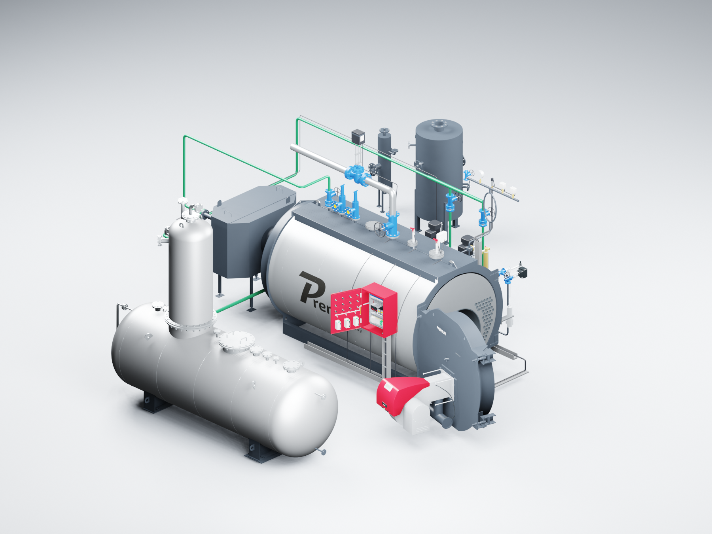
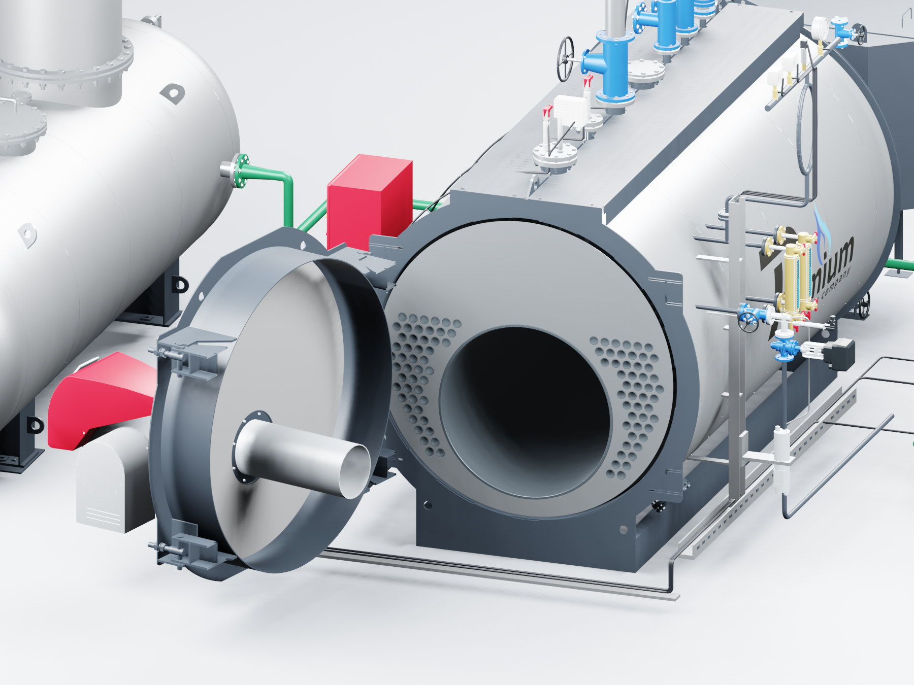
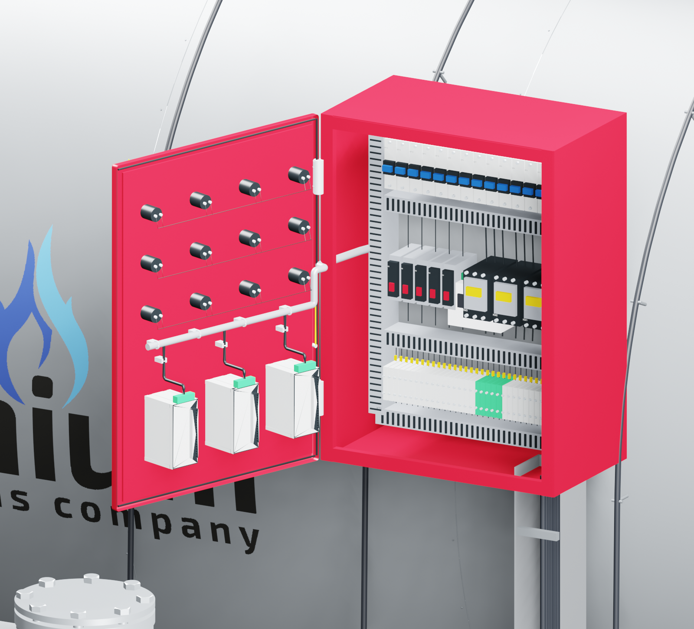

# PREMIUM S-4000 «Комфорт» — открывание дверей в Blender

**Версия:** 2026.09.10.2. **Дата:** 10.09.2026. **Исполнитель:** Codex / GPT-6 Astra.

Отдельный выпуск Blender для принятой сборки S-4000 «Комфорт», котлы **8–12 бар**. Дверь котла открывается вместе с горелкой. Дверца шкафа открывается вместе с приборами и закреплённым на ней жгутом. Монтажная панель шкафа и остальное оборудование остаются неподвижными.

## Как открыть двери

Откройте `S4000_COMFORT_OPENING_v2026.09.10.2.blend`. Наведите курсор на область модели и нажмите **Пробел**, чтобы запустить или остановить анимацию. Для общего вида через подготовленную камеру нажмите **0 на цифровой клавиатуре**.

Для точного положения введите номер в поле текущего кадра на нижней шкале. Перед вводом выделите старое число сочетанием **Ctrl+A**.

| Кадр | Дверь котла | Дверца шкафа |
|---|---|---|
| 1 | Закрыта | Закрыта |
| 49 | Открыта на 105° | Закрыта |
| 97 | Открыта на 105° | Открыта на 110° |
| 145 | Закрыта | Открыта на 110° |
| 193 | Закрыта | Закрыта |

Можно выбрать промежуточный кадр. Оси `DOOR_BOILER` и `DOOR_CABINET` находятся в коллекции «00 Управление дверьми». Для собственного положения изменяйте только поворот Z и сохраняйте ключ анимации. В файле также есть текст «НАЧАТЬ ЗДЕСЬ — двери S4000.txt».

Анимация использует штатные ключи и ограничения Blender. Для открытия дверей не нужны дополнения, Python-драйверы или разрешение на автоматическое исполнение сценариев. Проверено в установленном Blender 3.3.3.

## Геометрия

- Передняя дверь выделена из наружной CAD-геометрии S-4000 по стыку корпуса. Ось поворота определена по петлям; корпус, обвязка и опоры остаются на месте.
- Из полного конструкционного STEP **S-4000 1,2 МПа** перенесены **96 дымогарных труб и одна жаровая труба**. Остальные **571** конструкционная деталь исключены. Модель S-3000 для этих труб не масштабировалась.
- Вид отверстий трубной доски и внутренняя облицовка двери созданы отдельно для показа. Они не объявляются импортированными конструкционными деталями.
- Сохранены принятые узлы «Комфорт»: насосы V4-19, экономайзер EQS2-4000, ДА-15, модуляция, ГПЗ, два сепаратора, трассы и проставка дымохода 500 мм. Альтернативные трассы из исходной сцены сохранены; в этом выпуске добавлено управление именно дверями.
- Шкаф сохраняет компоновку по предоставленной фотографии и условный ПР200 из предыдущей сборки. Точная компоновка шкафа «Комфорт» с ПР200 остаётся для замены после предоставления исходных данных.

## Проверки

| Проверка | Подтверждённый результат |
|---|---|
| Независимое открывание и закрывание | Проверены 193 кадра и пять контрольных положений |
| Крепление горелки и приборов к своим дверям | Чистое вращение вокруг постоянных осей, без изменения масштаба и взаимного расположения |
| Неподвижная геометрия | 67 исходных узлов сохранили отпечатки; 71 статический узел проверен в открытых положениях |
| Закрытое состояние | Сохранены 10 исходных размещений сеток горелки и приборов |
| Повторное открытие | Новый процесс Blender, автоматическое исполнение Python отключено |
| Нативное окно Blender | Проверены запуск/остановка анимации и ввод кадра 97; обе двери показаны открытыми |
| Изображения | Просмотрены все шесть конечных изображений, включая промежуточное положение двери котла |
| Исходники | SHA-256 исходной Blender-сцены, конструкционного STEP и ранее выданного DWG совпадают |
| Архив | Проверяются CRC ZIP и SHA-256 каждого файла |
| Измерение стабильной частоты кадров | `NOT_RUN`; нативная проверка проводилась при параллельном рендеринге |
| Инженерная проверка столкновений и монтажных зазоров | `NOT_RUN`; проверено положение деталей и выполнен визуальный просмотр |

Подробные результаты находятся в `verification.json`, `native-ui-review.json`, `source-preservation.json` и `package.json`. Полный локальный комплект содержит файл Blender, шесть изображений, краткую инструкцию, описание источников, список моделей для замены и контрольные суммы.

Принятый выпуск AutoCAD `2026.09.10.1` и его подробная Blender-сцена сохранены отдельно. Этот выпуск не обновляет DWG и сайт. CAD-файлы и прайс-листы не публикуются в GitHub.

## Воспроизведение

Порядок и зависимости описаны в `tools/s4000/README.md` в репозитории. Основные этапы: инвентаризация полного STEP S-4000, извлечение только труб, построение отдельной сцены, проверка в новом процессе Blender, просмотр изображений, нативная проверка управления и упаковка.
