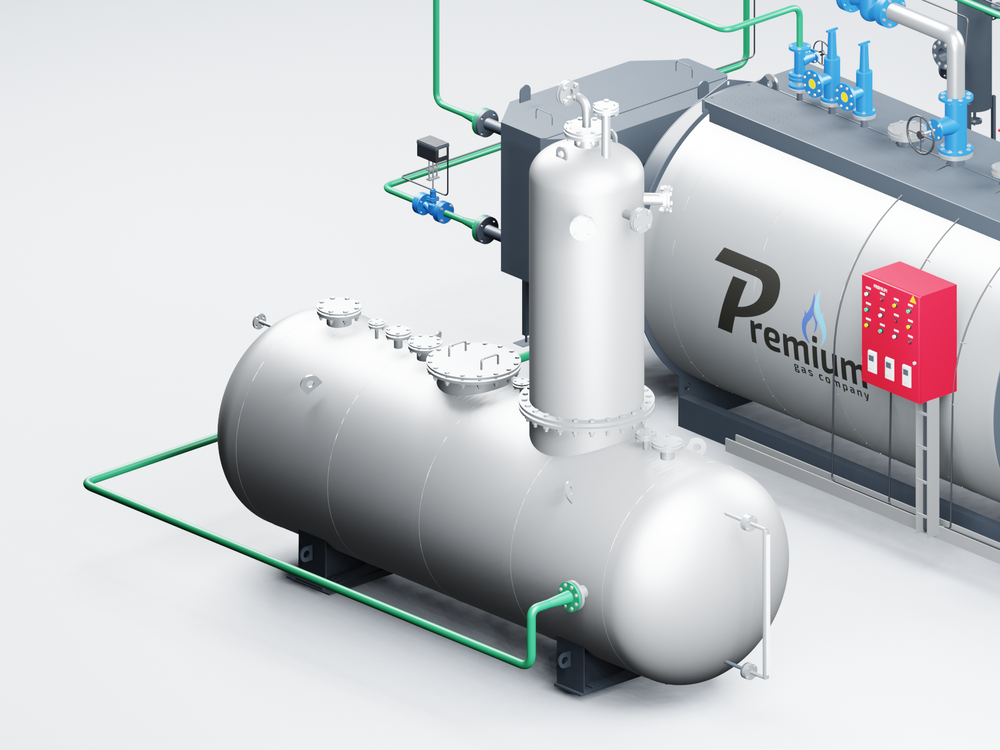
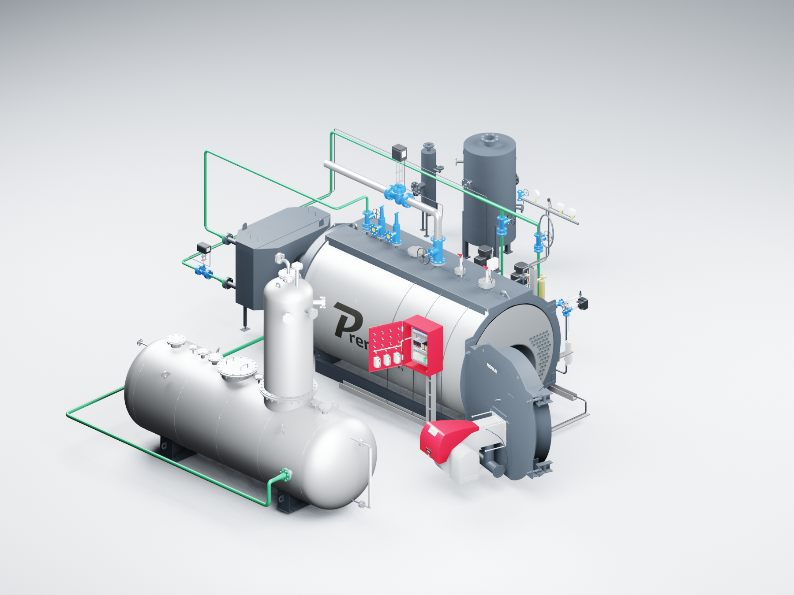

# PREMIUM S-4000 — разворот деаэратора на 180°

**Версия:** 2026.09.10.3. **Дата:** 10.09.2026. **Исполнитель:** Codex / GPT-6 Astra.

Обновлён отдельный вариант Blender для S-4000 «Комфорт», котлы **8–12 бар**. Деаэратор ДА-15 развёрнут на **180° вокруг вертикальной оси**. Вместе с баком повернуты колонка, патрубки, опоры, оцинкованная обшивка и присоединённый указатель уровня.

Выход деаэратора теперь направлен в противоположную сторону. Участок трубы от нового положения фланца до общего всасывающего коллектора насосов построен заново: сначала по оси выходного патрубка, затем вокруг бака к прежней точке подключения. Насосы и дальнейшая подача воды в котёл или экономайзер сохраняют свои места.

## Двери и управление

Дверь котла открывается вместе с горелкой на **105°**. Дверца шкафа открывается вместе с приборами и закреплённым жгутом на **110°**. Внутренняя монтажная панель и остальные узлы остаются неподвижными.

Внутри котла сохранены **96 дымогарных труб и одна жаровая труба из STEP S-4000**. Другие 571 деталь полного конструкторского STEP не переносились. Вид отверстий трубной доски и внутренняя облицовка двери — отдельная геометрия для показа.

Откройте `S4000_COMFORT_OPENING_v2026.09.10.3.blend`. Наведите курсор на модель и нажмите **Пробел**, чтобы запустить или остановить анимацию. **0 на цифровой клавиатуре** показывает общий вид через подготовленную камеру.

| Кадр | Положение |
|---|---|
| 1 | Обе двери закрыты |
| 49 | Открыт котёл |
| 97 | Открыты обе двери |
| 145 | Открыт шкаф |
| 193 | Обе двери снова закрыты |

Введите номер в поле текущего кадра на нижней шкале; перед вводом выделите старое число сочетанием **Ctrl+A**. Можно выбрать промежуточный кадр. Для собственного угла используйте поворот Z объектов `DOOR_BOILER` и `DOOR_CABINET` и сохраните ключ анимации.

## Подтверждение результата

- После сохранения файл повторно открыт в новом процессе Blender 3.3.3 с отключённым автоисполнением Python. Дополнения для дверей не требуются.
- Проверены все **193 кадра**, пять контрольных положений, неизменность осей и жёсткое крепление горелки и приборов к дверям.
- Разворот проверяется по исходной матрице каждого объекта деаэратора: ровно 180° вокруг Z, без изменения масштаба и взаимного расположения. Указатель уровня перемещается вместе со своими соединениями.
- Проверены начало и конец новой трубы, направление от фланца и сохранность точки подключения насосного коллектора.
- В графе трасс проверены **64 сочетания опций**, разрыв между объявленными точками подключения — **0**.
- Просмотрены семь изображений актуальной сцены, включая открытые и закрытые двери и отдельный вид деаэратора.
- Проверены контрольные суммы исходного DWG, конструкционного STEP, исходной CAD-сцены Blender и предыдущего выпуска с дверями `2026.09.10.2`.
- Для архива проверяются CRC и SHA-256 каждого файла. `package.json` находится рядом с архивом, чтобы его контрольная сумма не зависела от самой себя.

Результаты: `verification.json`, `configuration-checks.json`, `source-preservation.json`, `package.json`.

Нажатия в интерфейсе Blender в этой редакции отдельно не повторялись. Их проверка выполнена в предыдущем выпуске; сами двери и их управление не изменены. Проверка текущей редакции включает повторное открытие файла и все кадры анимации. Стабильная частота кадров и полный инженерный анализ монтажных зазоров не измерялись.

Шкаф сохраняет компоновку по предоставленной фотографии и условный ПР200. Точная компоновка шкафа «Комфорт» остаётся для замены по будущим исходным данным. Остальные временные элементы перечислены в файле «Недостающие модели.md» локального комплекта.

## Состав выпуска

Локально передаются подробная сцена Blender, семь изображений, инструкция, ведомость структуры, список моделей для замены и отчёты. В публичный GitHub включены код, документация, изображения и контрольные суммы. Исходные CAD и цены не публикуются.

Редакции `2026.09.10.1` и `2026.09.10.2` сохранены. DWG и сайт этим выпуском не обновляются. Порядок воспроизведения добавлен в `tools/s4000/README.md` репозитория.
