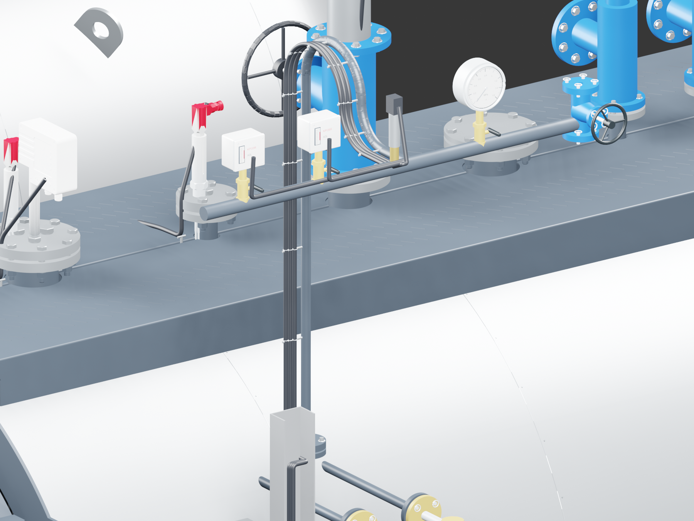
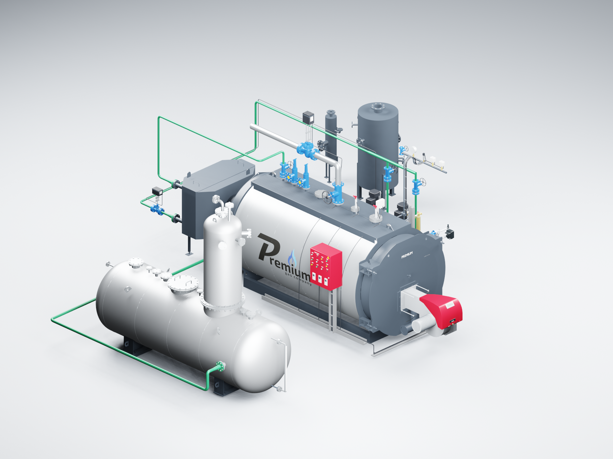

# PREMIUM S-4000 — открытый отвод группы давления

**Версия 2026.09.10.5 · 10.09.2026 · Codex / GPT-6 Astra.**

В сборке S-4000 «Комфорт», котлы **8–12 бар**, исправлена форма отвода приборного коллектора. Замкнутая овальная петля заменена открытым отводом с плавным верхним изгибом по образцу предоставленного чертежа ДА-15-8. Два реле, преобразователь давления, манометр и вентиль сохраняют прежние места.

Три кабеля проходят вдоль трубы, закреплены хомутами и подсоединены к прежнему кабель-каналу, ведущему к шкафу. Остальные кабельные линии сохранены. Перенесена форма изгиба; абсолютные установочные размеры и приборы деаэратора на котёл не переносились. [Принятое уточнение и границы правки](../../s4000-pressure-gooseneck-20260910.md).

Сохранены открывающиеся двери, горелка, ДА-15 с разворотом 180°, экономайзер и дымовая проставка 500 мм, насосы, модуляция питания, ГПЗ и сепараторы. Все опции сохраняют согласованные маршруты воды к штатному заднему DN32.

## Открыть и посмотреть

Откройте локальный файл **S4000_COMFORT_OPENING_v2026.09.10.5.blend**. Анимация дверей сохранена: кадр **1** — закрыты, **49** — открыт котёл, **97** — открыты обе двери, **145** — открыт шкаф, **193** — закрыты. Дверь котла поворачивается с горелкой на **105°**, дверь шкафа с приборами — на **110°**.

В сцене добавлена камера **CAM_Pressure** для исправленного узла. В локальной папке `previews` находится его крупное изображение.

## Проверка этой редакции

- Сохранённый файл повторно открыт в новом процессе Blender 3.3.3. Автоматическое исполнение сценариев выключено; дополнения для дверей не нужны.
- Проверены все **193 кадра**, оси и жёсткое крепление подвижных деталей.
- Сверены сохранённые положения и сетки пяти приборных объектов. При создании сцены сверены **72 остальных узла** и вся не затронутая правкой часть кабельной сетки.
- Проверены открытая осевая линия нового отвода и её концевые точки, три кабельные трассы до вводов шкафа.
- Проверены разворот всех 548 объектов деаэратора и соединение его выхода с насосным коллектором.
- Проверены **64 сочетания опций**; разрыв между объявленными точками подключения — **0**.
- Просмотрены два изображения именно этой редакции: общий вид и крупный план исправления. Работа дверей дополнительно проверяется в новой производной AutoCAD.

Точная компоновка шкафа «Комфорт» и прежний перечень моделей для последующей замены сохраняются. Нажатия в интерфейсе Blender этой редакции отдельно не повторялись; проверены файл, анимация и изображения.

Предыдущая сцена `.3` сохранена. Подробная новая `.blend` хранится локально; в публичном репозитории находятся код, изображения и отчёты. [AutoCAD того же выпуска](../s4000-autocad-v2026.09.10.5/README.md).
