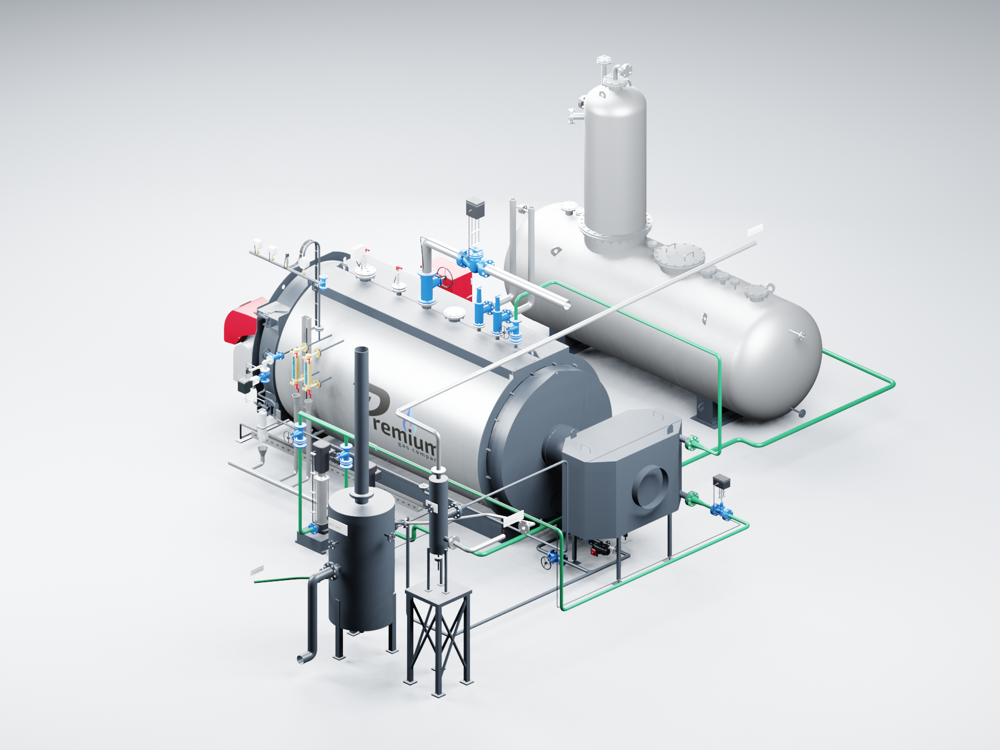
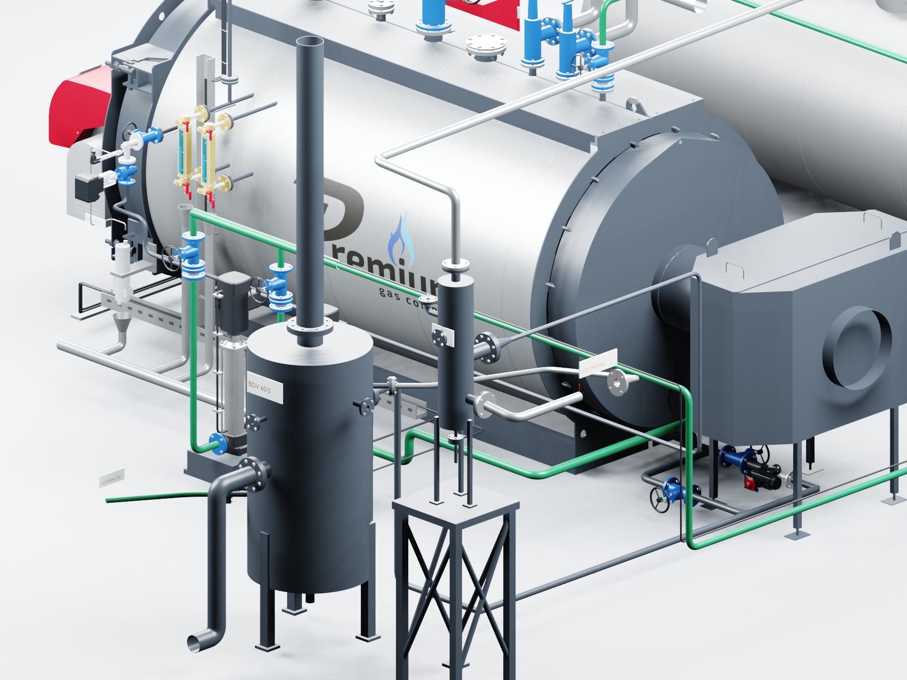

# PREMIUM S-4000 — обвязка FV8 и BDV

**Версия 2026.09.10.6 · 10.09.2026 · Codex / GPT-6 Astra.**

Сборка «Комфорт», котлы **8–12 бар**. Обвязка существующего оборудования сопоставлена с предоставленными PDF и DWG тепловой схемы на 30 т/ч. Трубы переработаны по назначению потоков, с собственными размерами и патрубками S-4000, ДА-15, FV8 и BDV60/5. Аппараты из более богатой комплектации «Комфорт+» не добавлены.

## Изменения

- Непрерывная продувка от BCV925 направлена в N FV8. При отключении FV8 доступна отдельная линия к D BDV.
- Периодическая продувка направлена в C BDV. Два имеющихся ручных вентиля и BCV7432 выровнены и собраны в основную и обходную ветви.
- От O FV8 построен возврат вторичного пара к стороне деаэратора. Назначение выбранного DN50 ДА-15 пока не подтверждено; линия заканчивается обозначенной границей.
- Конденсат от P FV8 подведён к месту конденсатоотводчика, от него — к D BDV. Аппарат отсутствует в текущем составе и не добавлен: между участками оставлен разрыв **320 мм** с табличкой **KO / MISSING**.
- Отметки FV8 уточнены по его чертежу: дренаж S находится в 400 мм над основанием аппарата. Показана опорная рама высотой 1200 мм, позволяющая опустить конденсатную линию к BDV без подъёмов.
- Добавлены вентиляция и слив BDV, подвод охлаждения до отсутствующего регулирующего узла, отдельные отводы двух предохранительных клапанов и открытые воронки сливов указателей уровня.
- Подвод SC9 оставлен с явно обозначенным разрывом до подтверждения соответствия штуцеров CAD контурам пробы и охлаждения. Сама непрерывная продувка выделена в отдельную геометрическую группу.

Сопоставление участков, конфликт позиционных ссылок на исходной схеме и весь список отсутствующего оборудования: [проверка обвязки](../../s4000-piping-audit-20260910.md). Это компоновка с отмеченными пропусками, а не законченная монтажная схема.

## Открыть

Локальный файл: **S4000_COMFORT_OPENING_v2026.09.10.6.blend**. Камеры **CAM_Blowdown**, **CAM_Routing** и **CAM_LowerBlowdown** показывают новую обвязку. Кадры дверей: **1** — закрыты, **49** — открыт котёл, **97** — обе открыты, **145** — открыт шкаф, **193** — закрыты.

Дверь котла и горелка поворачиваются на 105°, дверь шкафа с приборами — на 110°. ДА-15 сохраняет разворот на 180°, экономайзер — дымовую проставку 500 мм. Насосы, модуляция, ГПЗ и подача к штатному заднему DN32 сохраняют согласованные маршруты.

## Проверка

- Свежий процесс Blender 3.3.3 открыл сохранённый файл и проверил все **193 кадра** анимации, **98 неподвижных частей**, 10 исходных положений сеток, 96 дымогарных труб и одну жаровую трубу.
- Проверены сохранённые сетки и положения **66 исходных частей**, которых не касается эта правка. Изменены 8 существующих частей; добавлены 27 групп труб, опоры и обозначений. Всего в исходной ведомости 101 часть, в производной AutoCAD — 105 с четырьмя частями открывания котла.
- Проверены **64 конфигурации**, назначения продувочных линий, отсутствие сквозного обхода пропущенного конденсатоотводчика, понижение конденсатных участков и сохранение схем питания.
- Просмотрены три изображения именно сохранённой новой редакции. Проверки геометрии и анимации не являются расчётом трубопроводов или полной проверкой монтажных зазоров.

Исходные PDF/DWG и редакция `.5` сохранены. Подробные CAD/Blender-файлы находятся в локальном комплекте. В публичном Git — код, изображения и отчёты. [Производная AutoCAD](../s4000-autocad-v2026.09.10.6/README.md).
