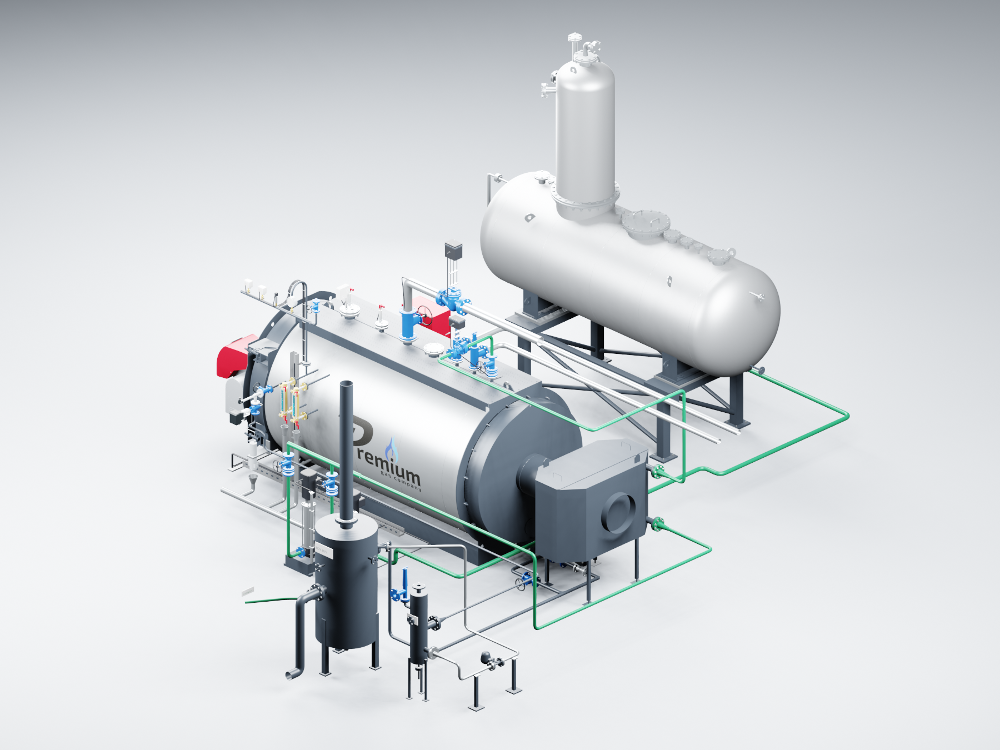
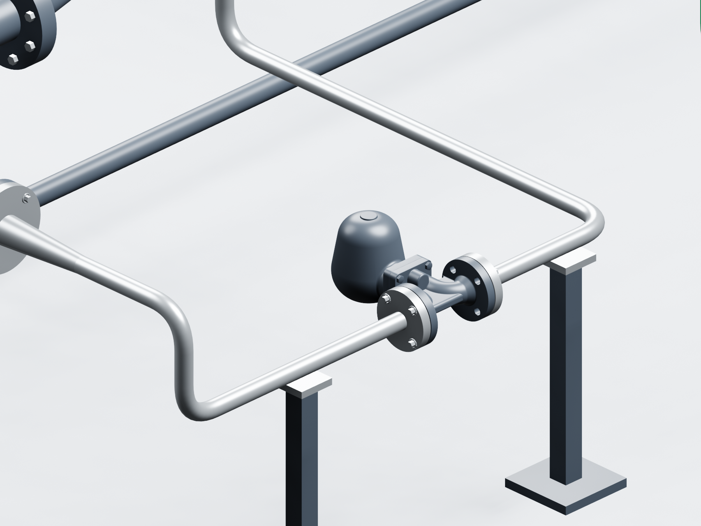
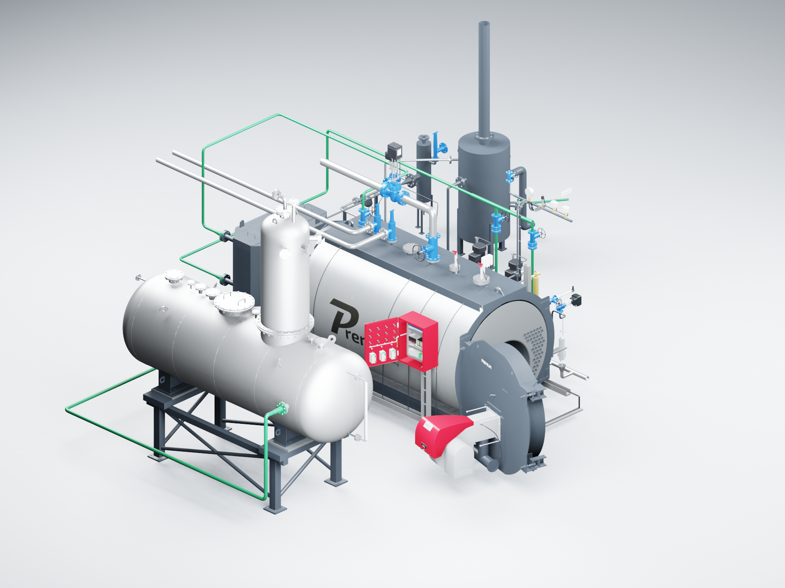

# PREMIUM S-4000 — Blender, исправления по видео

**2026.09.11.1 · поправка от 11.09.2026 · Codex / GPT-6 Astra.** Комплектация «Комфорт», котлы **8–12 бар**. Исправлен существующий файл по видео `2026-09-11 14-17-47.mkv`; имена сцены и архива прежние.

А31 повёрнут на 90°, пневмопривод продувки направлен вверх. Модуляция перенесена после экономайзера на горизонтальный участок у котла. Провода обходят насосы. Поднятый вентиль приборной группы соединён отводом, CP930 отцентрирован по PCF. Стержни датчиков укорочены, отбор SC9 перенесён на круглый торец BCV925 напротив привода. Два сброса котла идут горизонтально за экономайзер.

Линия FV → ДА удалена. По отдельному подтверждению владельца предохранительный клапан FV установлен на **малый верхний DN25**.

Дополнительная поправка 11.09.2026: **вылеты сбросных труб котла поменяны местами**. Отводы не пересекаются, прямые участки идут параллельно. Расстояние между осями 340 мм; зазор между наружными поверхностями прямых труб — 263,9 мм. Проверены пересечения фактических поверхностей двух труб, экономайзера и его водяной обвязки: пересечений нет.

FV остаётся на Z=0. ДА остаётся на раме +1000 мм с разворотом 180°. Сохранены 500-мм дымовая проставка и исходные 96 дымогарных труб с жаровой трубой. Оригинальная геометрия А31: 41 681 вершина, 83 390 треугольников; присоединительное расстояние 160 мм.

## Открывание и проверка

Откройте **S4000_COMFORT_OPENING_v2026.09.11.1.blend**. Кадры: **1** — закрыто, **49** — открыт котёл, **97** — обе двери, **145** — шкаф, **193** — закрыто. Углы 105° и 110°, приборы и горелка движутся вместе с дверями.

- Сохранённый файл повторно открыт в Blender 3.3.3; проверены **193 кадра** и неподвижность трубопроводов.
- Сверены отпечатки **81 части вне замечаний**, положение 553 деталей ДА и обе опоры.
- Проверены все **64 сочетания** питания и продувок, соединения А31 и обход насосов кабельными трассами.
- Концы LP200/LP400/LCS600 находятся на +1800 мм, минимум на 405 мм выше жаровой трубы под ними.
- Просмотрены **шесть актуальных видов**. Проверены CRC и SHA-256 всех **18 файлов** существующего архива.

Принимающий штуцер SC9 ещё не подтверждён; прежний зазор у охладителя сохранён. Клапан FV — визуальная модель с неопределёнными маркой и настройкой. Подбор А31 по расходу и перепаду не выполнен. [Полный перечень поправок и уточнений](../../s4000-floor-layout-20260911.md).

## Контрольные суммы

Сцена SHA-256: `dbec531da829becad50614e71b519335b537015ce176f4cf7c9c830448cd466d`.

Архив **S4000_Blender_OPENING_v2026.09.11.1.zip** обновлён под прежним именем. Размер и контрольная сумма находятся в [проверенном паспорте архива](package.json).

Подробные CAD, фотографии и прайсы остаются локально. В Git обновлены существующие инструменты, описание, изображения и протоколы. Первоначальные теги выпуска сохранены; текущую поправку определяет коммит этой ветки.
