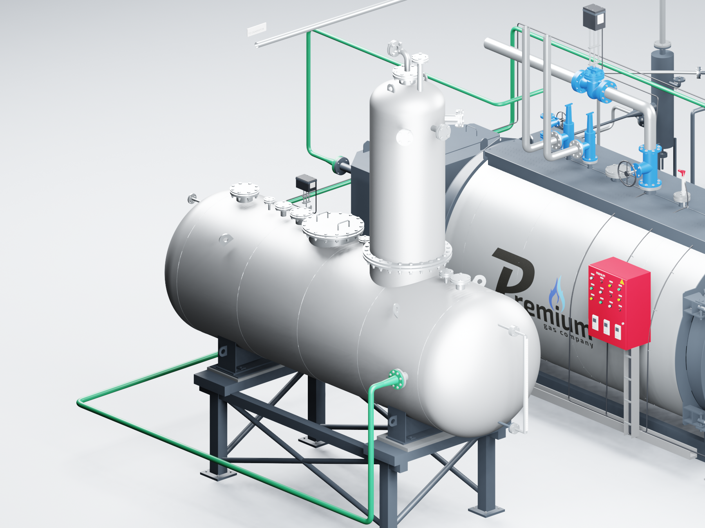

# PREMIUM S-4000 — Blender, отметки аппаратов и А31

**Версия 2026.09.11.1 · 11.09.2026 · Codex / GPT-6 Astra.** Комплектация «Комфорт», котлы **8–12 бар**.

FV8 опущен на пол Z=0. ДА-15 целиком поднят на 1000 мм. Под обеими штатными сёдлами построена рама с подкладками по исходным несущим плоскостям. Приборы и указатель уровня перемещены вместе с аппаратом, выход заново соединён с прежним всасывающим коллектором насосов. Поворот ДА на 180° сохранён.

В линию конденсата FV8 → BDV установлен **Стимакс А31 DN25 Ф/Ф** из предоставленного DWG: 41 681 вершина, 83 390 треугольников, расстояние между фланцами 160 мм. В Excel «Комфорт» и «Комфорт+» точной позиции не найдено. Поплавковая серия выбрана для компоновки непрерывного отвода конденсата. [Подбор, источники и оставшиеся уточнения](../../s4000-floor-layout-20260911.md).

После А31 показан один напорный подъём 1125 мм к входу D BDV. Перепад, расход и исполнение отверстия не рассчитаны. Фильтр перед А31 и обратный клапан после него остаются отсутствующими позициями. Назначение DN50 деаэратора и подключения SC9 ещё требуют уточнения.

## Открывание и проверка

Откройте **S4000_COMFORT_OPENING_v2026.09.11.1.blend**. Кадры: **1** — закрыто, **49** — открыт котёл, **97** — обе двери, **145** — шкаф, **193** — закрыто. Углы 105° и 110° сохранены, горелка и приборы движутся с соответствующими дверями. Автоматический запуск Python не нужен.

- Сохранённый файл повторно открыт в Blender 3.3.3. Проверены все 193 кадра и неподвижность трубопроводов.
- Проверены 553 перемещённых объекта и 90 неизменённых частей, отметки аппаратов, обе опоры и фланцы А31.
- Проверены 64 сочетания питания и продувок. А31 включается вместе с FV8. Напорный подъём явно отмечен в проверке.
- Повторное извлечение из неизменённого оригинала А31 подтвердило совпадение всей сетки. Ошибочный заголовок единиц DWG заменён подтверждённым масштабом миллиметров.
- Просмотрены шесть актуальных изображений. Контрольные суммы и CRC архива проверены. Нажатия кнопок оконного интерфейса в этой редакции отдельно не испытаны.

Подробная сцена и ZIP находятся в локальном комплекте **S4000-Blender-v2026.09.11.1**. В Git опубликованы инструменты, описание, виды и протоколы; исходные чертежи и прайсы остаются локально. Последняя версия AutoCAD — **2026.09.11.1**, S-3000 — **2026.09.09.5**.
