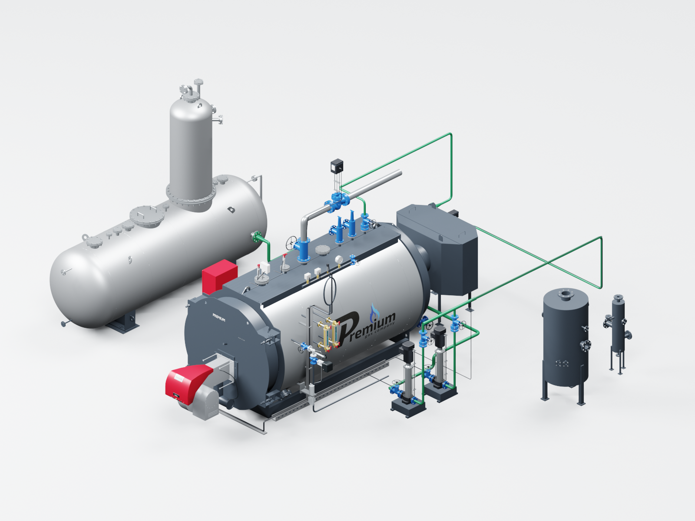
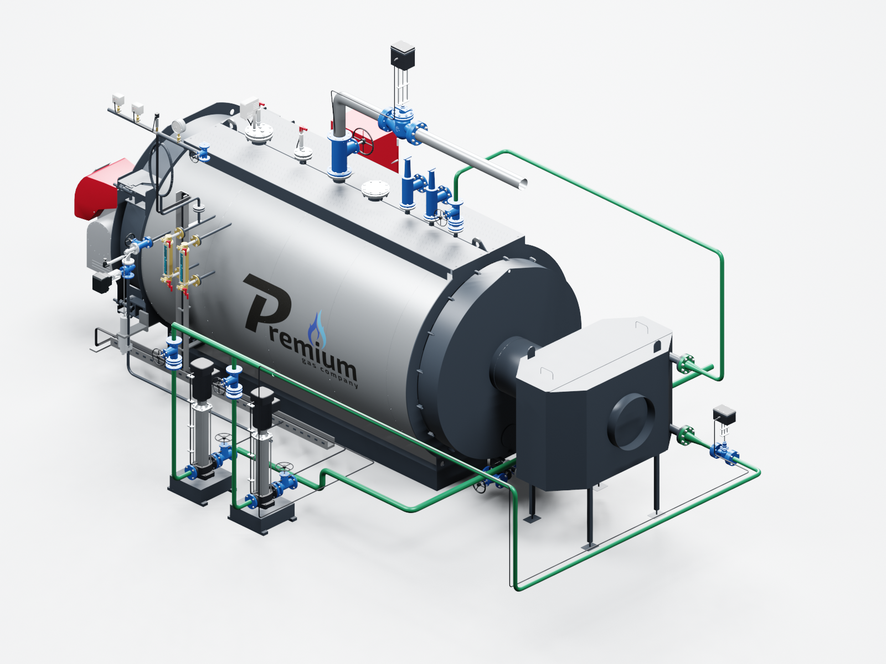
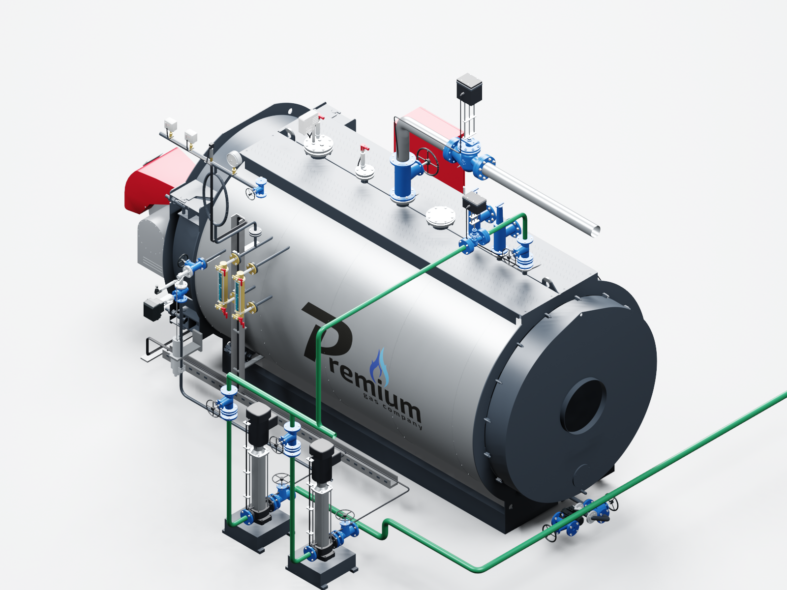
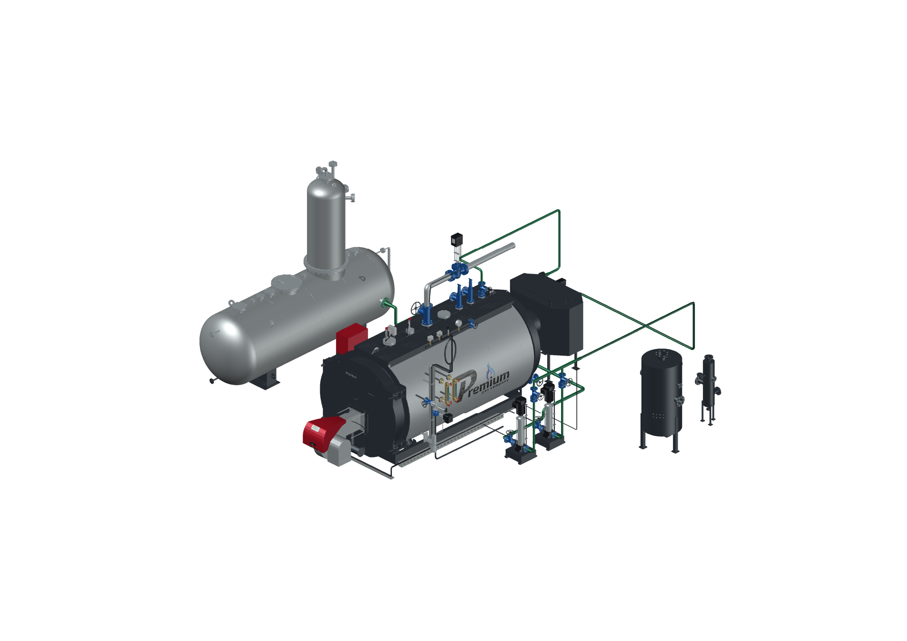

# PREMIUM S-4000 «Комфорт» — версия 2026.09.10.1

**Дата:** 10.09.2026. **Исполнитель:** Codex / GPT-6 Astra. **Статус:** `PASSED_LOCAL_CAD_RELEASE`.

Это первый выпуск сборки S-4000 «Комфорт» в AutoCAD. Общий внешний вид предназначен для котлов **8 и 12 бар**; текущая ведомость соответствует выбранному исполнению на 12 бар. Внешний вид реле KPI35R для двух вариантов согласован владельцем.

## Реализовано

- 74 отдельных блока и слоя, 879 объектов MESH, 6 489 225 треугольников. DWG формата AutoCAD 2018, миллиметры. Применены исходные габариты каждой приложенной модели.
- Котёл S-4000, экономайзер EQS2-4000, ДА-15, два насоса JETEX V4-19 и LCS600 взяты из предоставленных STEP. Из двух DWG получены реальные объёмные корпуса КМ125 DN32 и КМ225 DN100. Горелка и часть оборудования ATECH перенесены из S-3000.
- Четыре независимые опции: экономайзер, деаэратор, модуляция питательной воды и ГПЗ. Два сепаратора по PDF добавлены отдельно, без внешней обвязки, с собственными переключателями.
- При наличии экономайзера: насосы → регулирующий узел при его выборе → нижний фланец экономайзера → верхний фланец → штатный задний DN32 котла. При отключении экономайзера маршрут идёт прямо в тот же DN32. Модуляция перемещается перед действующим входом. Без деаэратора остаётся подводящая труба с его стороны.
- Электрическая ГПЗ стоит далее на подающем паропроводе после базового ручного вентиля. При отключении регулирующего узла или ГПЗ на их месте появляется вставка.
- Проставка дымохода длиной 500 мм, приборная группа над водоуказательными стёклами, крепления кабелей и нижний кабельный канал, присоединённый указатель уровня ДА-15.
- Ведомость из 31 строки без цен с привязкой к ячейкам исходного Excel, список недостающих точных моделей, описание открытия и переключения опций.
- Данные трёх комплектаций S-4000 — «Стандарт», «Комфорт», «Комфорт+» — извлечены для последующего подключения к сайту. CAD-сборка в этом выпуске реализована для «Комфорт».

## Подтверждённые проверки

| Проверка | Результат |
|---|---|
| Все сочетания шести переключателей в графе трасс | 64 из 64; разрыв в контрольных точках — 0 |
| Исполнение AutoLISP на отдельном чертеже | 64 из 64; проверены слои, актуальное сохранённое состояние и единственная запись состояния |
| Переключения в полном детальном DWG | 20 состояний: все 16 сочетаний четырёх основных опций и четыре состояния сепараторов |
| Повторное открытие в новом процессе AutoCAD | Успешно; AUDIT — 0 ошибок |
| Сравнение DWG → DXF с исходной производной геометрией | Все блоки, цвета, вершины при точности сравнения 0,001 мм и топология сохранены; 10 сеток получили целиком обратный порядок обхода граней |
| Проверка источников | 12 файлов сохранены побайтно; исходная сцена после извлечения не изменена |
| Повторное чтение трёх XLSX | Совпадают опубликованные описания, количества и исходные ячейки; цены не извлекались новым загрузчиком |
| Визуальная проверка | Просмотрены 7 изображений геометрии и 2 вывода из AutoCAD |
| Архив | 25 файлов; проверены CRC ZIP и SHA-256 содержимого |
| Нажатия в графическом диалоге AutoCAD | `NOT_RUN`; проверены команды, вызываемые панелью |
| Публикация новой сборки на сайте | `NOT_RUN` |

Подробные результаты: [verification.json](verification.json), [паспорт архива](package.json). Сам DWG и архив находятся в локальном комплекте; исходные CAD и прайс-листы в репозиторий не добавлены.

В ходе проверки устранены две ошибки сохранения/загрузки опций: слишком длинные строки команд AutoLISP и накопление данных при обновлении XRECORD в AutoCAD 2027. Состояние теперь записывается одной записью, проверяемой после каждого переключения.

## Ограничения геометрии

Включены оба предоставленных сепаратора как рабочее допущение. LCS600 оставлен длиной **600 мм** по приложенному STEP; в ведомости указано **800 мм**. Требуются уточнение этого размера и собственная компоновка шкафа «Комфорт» с ПР200. Часть арматуры и приводов построена по фотографиям и габаритам. Монтажные длины и присоединения этих заменителей ещё не утверждены.

Полный [список моделей для замены](../../s4000-missing-models-20260910.md), [инструкция AutoCAD](../../s4000-autocad-guide-20260910.md), [воспроизведение сборки](../../../tools/s4000/README.md).

