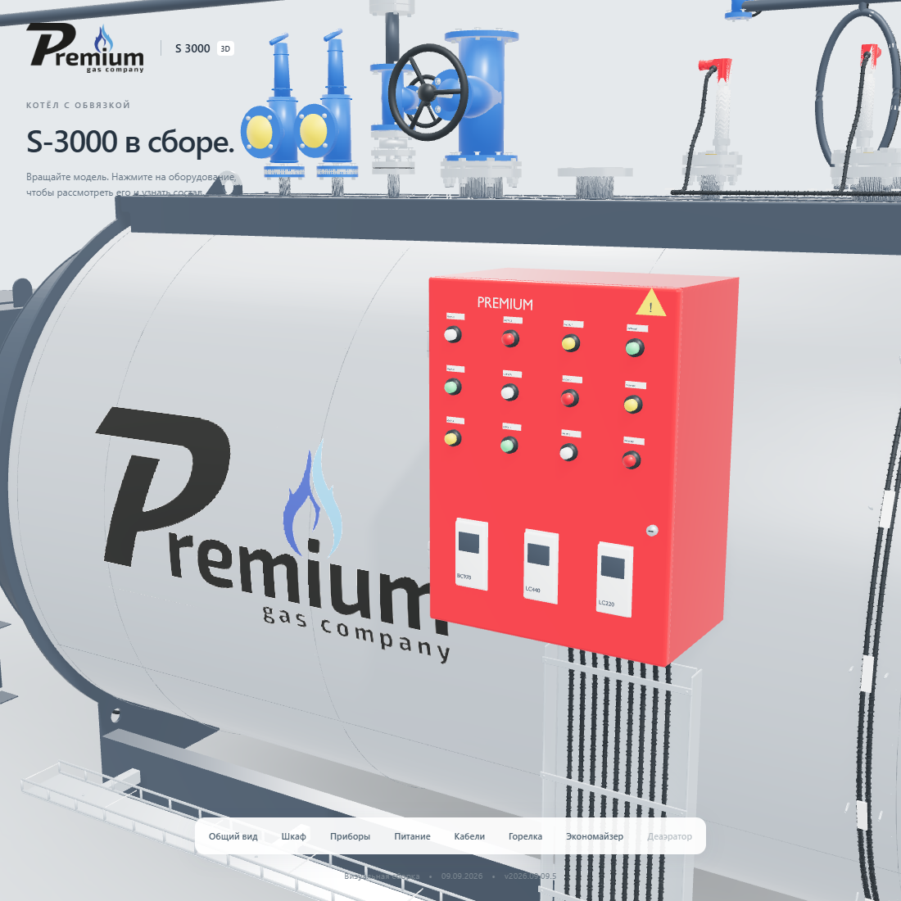
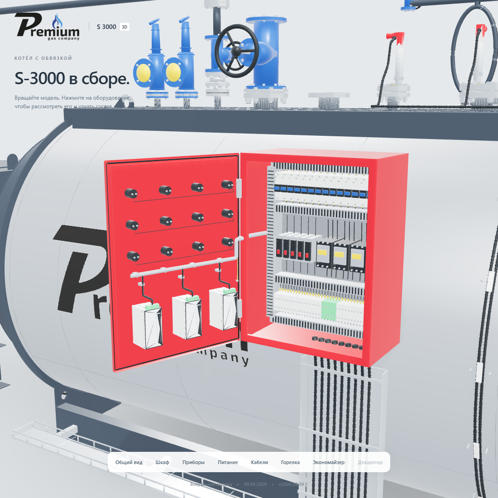

# Шкаф PREMIUM S-3000: выравнивание прибора и проводов

Версия **2026.09.09.5**, 9 сентября 2026 года. Исполнитель: **Codex / GPT-6 Astra**.
Основа — `c0bc72b`, исходники исправления — `3edc725`.

На закрытой двери правый нижний прибор стоял с наклоном. При открывании
этот наклон оставался, а его подводка проходила по диагонали и заканчивалась
у отдельной клеммной колодки над корпусом. Причина — поворот самой геометрии
корпуса в модели поставщика на 15,866°, при правильном положении объекта
относительно двери.

У LC220 выровнены только 29 947 вершин модели поставщика. 512 вершин
добавленной передней панели, дисплея и маркировки оставлены на месте.
Наклон широких боковых граней после исправления — 0°.

Нижний общий жгут идёт вдоль кромок двери. Три ответвления имеют прямые
вертикальные участки, ограниченные скругления и входы в клеммы на корпусах.
Добавлены семь креплений. Дверная часть жгута начинается на оси петли,
совпадающей с концом неподвижной подводки. Провода и приборы сохраняют
положение относительно двери при её открывании на 110°.

Исправление внесено в копию принятой Blender-сцены. Отпечатки геометрии и
положений остальных 52 компонентов совпали. Сохранены проставка 500 мм,
поворот экономайзера, обе водяные трассы, деаэратор, трубный пучок и механизм
открывания двери котла.

Веб-модели: 1 277 077 треугольников и 11 551 412 байт в четырёх GLB.
Прирост к предыдущей версии — 66 536 байт. Ограничения 6 МБ на файл и
12 МБ суммарно сохранены. Подробная модель содержит 3 277 745 треугольников.

Локально проверены сборка, семь сценариев состава и бюджета, положение
широких граней трёх приборов в декодированной веб-модели и неизменность
дверной проводки в обоих состояниях. Подробный GLB повторно открыт в
Blender: 54 компонента, максимальное отклонение границ 0,00012 мм.

Опубликована на [prgz.ru/komplektacii4](https://prgz.ru/komplektacii4/) из
коммита `3edc725`. Все 24 публичных файла совпали с манифестом по SHA-256.
На проверочной странице прошли 11 общих сценариев, 9 сценариев дверей,
5 проверок проставки и 3 проверки корпуса/проводки. После публикации
повторены 9 сценариев дверей и 3 проверки шкафа: 0 ошибок, 0 кадров в простое.
Предыдущая версия сохранена на
[адресе версии 2026.09.09.4](https://prgz.ru/komplektacii4-v2026.09.09.4/).

Оба DWG повторно открыты в AutoCAD 2027. Сохранены вершины с точностью
1 мкм, топология и цвета; AUDIT — 0 ошибок. Проверены семь состояний дверей
для 53 блоков с экономайзером и 51 блока без него. Закрытый и открытый шкаф,
трубный пучок и проставка просмотрены на изображениях, полученных из AutoCAD.

Архив `S3000_AutoCAD_OPENING_v2026.09.09.5.zip` содержит 15 файлов,
174 977 941 байт. Проверены CRC архива и SHA-256 каждого файла.
SHA-256 архива: `b2906b9a4cb7b9960ee3860036578f6b3fa625456cd707a1a5d10c12cee08826`.

[Сводный протокол](s3000-cabinet-verification-20260909.json) содержит
результаты сборки, проверки сайта, повторного открытия DWG и упаковки.
CI не настроен. Проверки выполнены локально и на опубликованной странице.

Воспроизведение: `fix_cabinet_alignment.py` принимает сцену 2026.09.09.4,
её ведомость и исходную сетку поставщика LC220. Он проверяет исходный угол,
находит вершины поставщика с допуском 3 мкм, исправляет только корпус и
восемь выделенных частей старой подводки. Затем используется существующий
процесс экспорта GLB и DWG. Предыдущие исходники не перезаписываются.
