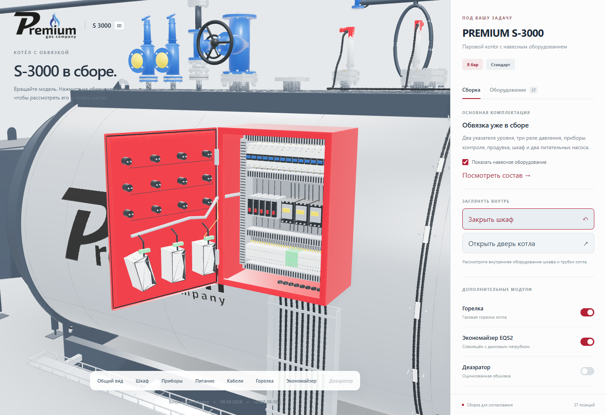
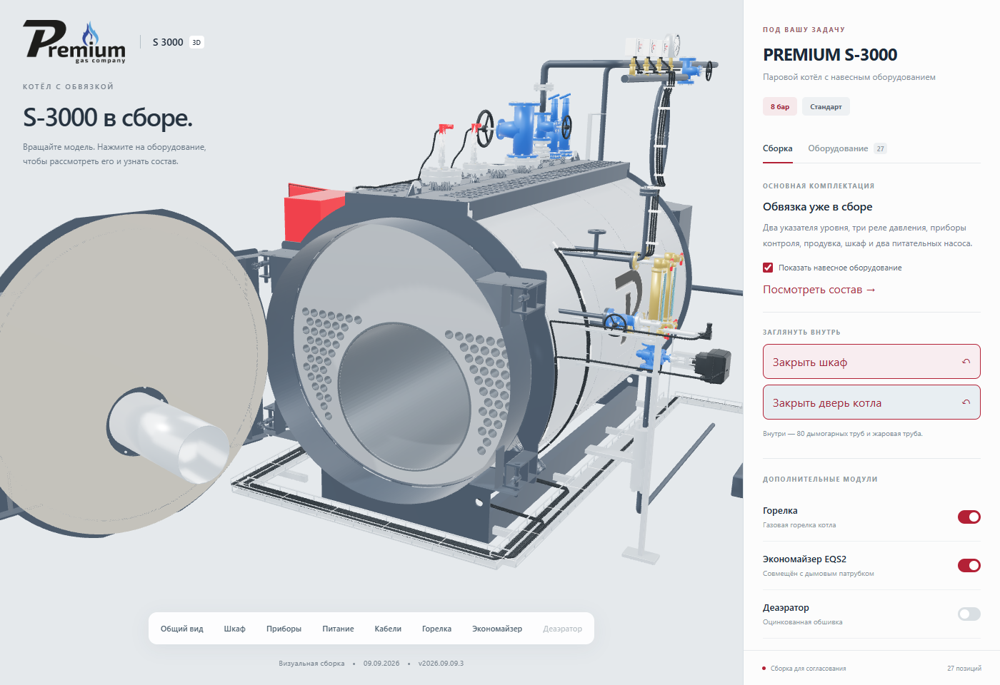
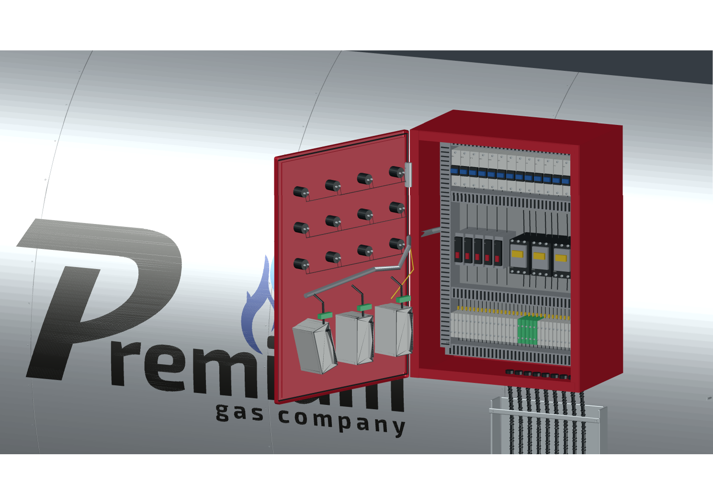
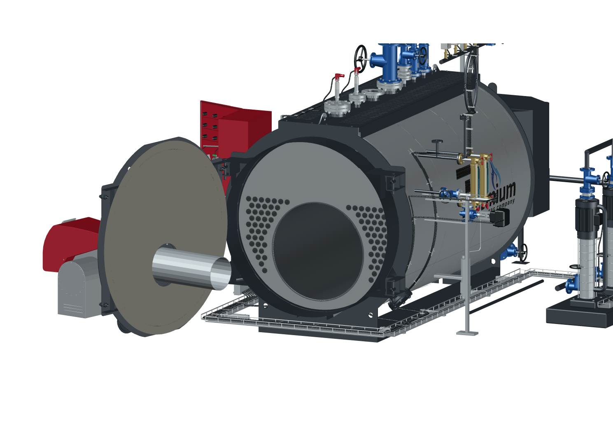

# PREMIUM S-3000: открывание шкафа и двери котла

Версия **2026.09.09.3**, **9 сентября 2026 года**. Исполнитель **Codex / GPT-6 Astra**. Пользователь выбрал реализацию на сайте и в AutoCAD.

## Что изменилось

На сайте появились кнопки «Открыть шкаф» и «Открыть дверь котла». Повторное нажатие закрывает выбранную дверь, в том числе во время движения. Камера приближает соответствующий узел. На мобильном экране страница возвращается к модели. Поддерживается системная настройка уменьшения движения.

Дверь шкафа поворачивается на 110° вместе с тремя существовавшими контроллерами. Корпус остаётся неподвижным. По фотографии `P1270796.jpg` построены монтажная панель, три DIN-рейки, 14 автоматов, три контактора, пять реле, 34 клеммы, проводка и кабельные каналы. На двери показаны обратные стороны 12 органов управления. Неподвижная и подвижная части жгута соединяются на оси петли. Это визуальное восстановление по фотографии; точная схема электрических соединений из фотографии не выводилась.

Дверь котла поворачивается на 105° вместе с горелкой. Трубный пучок остаётся неподвижным. Из исходного STEP перенесены **только 81 тело: 80 дымогарных труб Ø51/46 мм длиной 2770 мм и одна жаровая труба**. Из 615 тел исходника исключены 534. Индексы отбора: `0`, `128–167`, `169–208`. Остальные узлы конструкторской сборки не импортировались. Для открытия обзора в существующем BIM-торце отдельно построена простая поверхность с отверстиями; она не выдаётся за перенесённую конструкторскую деталь.

SHA-256 STEP: `0685c791c2b7fe277a2b99595d1048afb08aed18c734e168d04166e5380e1651`.

Предыдущая исходная Blender-сцена сохранена: `2ed8602f487c5edf2fc26adf16cb702c923ce8c0d57b0f24e8011e20605fbc76`. Новая сцена `S3000_OPENING_v2026.09.09.3.blend`: кадр **1** — закрыто, кадр **48** — обе двери открыты.

## AutoCAD

В поставке два DWG в миллиметрах, формат AutoCAD 2018/AC1032:

- `S3000_ADL_8bar_WITH_ECONOMIZER_v2026.09.09.3.dwg` — с экономайзером, 53 блока.
- `S3000_ADL_8bar_DIRECT_v2026.09.09.3.dwg` — прямое питание котла, 51 блок.

Для быстрого запуска на компьютере владельца архив содержит `OPEN_WITH_ECONOMIZER.cmd` и `OPEN_DIRECT.cmd`. После распаковки выбранный файл запускает установленный AutoCAD, открывает DWG и загружает команды через `S3000-start.scr`. Обе двери открываются, вид приближается к трубкам. Введите `S3000PANEL`, чтобы показать кнопки. Запуск варианта с экономайзером выполнен в отдельном окне AutoCAD и подтверждён маркером `READY` после команд открытия.

Для обычного открытия на другом компьютере рядом с DWG находятся `S3000-doors.lsp` и `S3000-doors.dcl`. Откройте чертёж, выполните `APPLOAD`, выберите LSP, затем введите `S3000PANEL`. Панель содержит кнопки открывания, закрывания и ракурсы. После выбора действия нажмите «Вернуться к модели», чтобы вращать вид.

| Команда | Действие |
|---|---|
| `S3000OPEN` / `S3000CLOSE` | Открыть / закрыть обе двери |
| `S3000CABINETOPEN` / `S3000CABINETCLOSE` | Открыть / закрыть шкаф |
| `S3000DOOROPEN` / `S3000DOORCLOSE` | Открыть / закрыть дверь котла |
| `S3000CABINETVIEW` | Шкаф крупно |
| `S3000DOORVIEW` | Трубки котла |
| `S3000ALLVIEW` | Вся сборка |

Команды перемещают только именованные блоки дверей и закреплённых на них деталей. Повторное открывание не накапливает угол. Закрывание возвращает исходные координаты. Глобальные настройки безопасности AutoCAD не меняются. Внутренние ракурсы скрывают деаэратор, чтобы он не перекрывал обзор; «Вся сборка» возвращает общий вид.

DWG содержит подробные цветные полигональные модели, без упрощения исходной сетки. Это редактируемые блоки MESH; история параметрического проектирования STEP в них не переносилась. Графика логотипа преобразована в геометрию, внешние файлы текстур для открытия DWG не нужны.

## Проверка

- `npm run test:s3000`: **7/7**. Проверяются обе схемы питания, скрытие обвязки и бюджет загрузки.
- `npm run build`: TypeScript и Vite выполнены без ошибок.
- Браузер: совместное движение деталей, неподвижность труб/корпуса, независимые двери, закрывание и быстрый реверс, скрытие обвязки, переключение экономайзера, мобильная ширина 390 px и уменьшение движения. Ошибок JavaScript не обнаружено. После завершения движения — **0 кадров за 1,5 с**. Телефон проверялся в эмуляции настольного браузера.
- AutoCAD 2027: каждый DWG повторно открыт и выведен в контрольный DXF. Сохранились все вершины, грани, их связи и цвета. AutoCAD целиком развернул порядок обхода граней у девяти небольших сеток шкафа; проверка допускает только точное полное обращение сетки, а не произвольное изменение граней. Трубный пучок не изменён.
- В каждом DWG проверены семь состояний: закрыто, шкаф открыт, обе открыты, повторное открывание, только котёл открыт, закрыто, повторное закрывание. Проверяются все 53/51 блока. Максимальное расхождение координат при возврате — порядка `1e-12` мм; это проверка преобразований, а не заявление о точности модели по фотографиям. `AUDIT`: **0 ошибок**.

Веб-производная: **1 269 997** треугольников; полная модель: **3 270 373**. Четыре веб-файла суммарно **11 475 072 байта**, каждый менее 6 МБ. Сохранены кеширование по имени содержимого и отрисовка по запросу. Новая детализация увеличила загрузку моделей на 1 272 796 байт относительно версии 2026.09.09.2. Новый полный замер скорости интернета не подменяется прежними результатами оптимизации.

Подробные исходники, фотографии и конструкторский STEP остаются локально. В репозитории сохранены инструменты воспроизведения, производные модели, метаданные происхождения и протоколы. Публикация выполняется через отдельный проверенный каталог с резервной копией версии 2026.09.09.2. Итоговый адрес: [prgz.ru/komplektacii4](https://prgz.ru/komplektacii4/).

## Опубликованный результат

На [основном сайте](https://prgz.ru/komplektacii4/) опубликована версия **2026.09.09.3** из исходного коммита `118703d8dbf8bea0429b1ee5e50b6f43ef5229a8`. Все 24 публичных файла проверены через HTTPS по SHA-256; манифест: `e72c3b3f7d18442bbd6707b7164e8d8f64a47cf52794e5135c37077380d87d4b`. На проверочном адресе прошли 11 прежних сценариев и 9 сценариев дверей. На основном адресе повторно прошли все 9 сценариев дверей. Ошибок JavaScript — 0, кадров в простое — 0. Проверенные соседние страницы не изменились.

Предыдущая публикация доступна по [адресу версии 2026.09.09.2](https://prgz.ru/komplektacii4-v2026.09.09.2/). Локальная копия также сохранена и сверена с исходными файлами.

Архив AutoCAD: `S3000_AutoCAD_OPENING_v2026.09.09.3.zip`, **173 870 700 байт**, 13 файлов. Проверены CRC архива и SHA-256 каждого вложения. SHA-256 архива: `ecd2c5e6dbc89b62e1b7a43eda0522b9915b726ed7088f4af6f7f0e9438cf7ee`.

[Сводный протокол](s3000-opening-verification-20260909.json). Проверенные изображения:

## Воспроизведение

`inspect_step_internals.py` составляет инвентаризацию STEP; `extract_visible_tubes.py` извлекает белый список тел. `build_opening_scene.py` создаёт новую Blender-сцену и метаданные осей. `build-web-model.mjs`, `split-web-model.mjs` и `optimize_glb.mjs` готовят производные GLB.

`extract_autocad_meshes.py` и `create_autocad_dxf.py` формируют подробные блоки. `convert_autocad_dwg.py` использует установленный AutoCAD Core Console и проверяет обратное преобразование. `check_autocad_opening.py` запускает реальные команды в AutoCAD. `check-opening-browser.mjs` проверяет движения в браузере; `check-web-browser.mjs` проверяет прежние функции конфигуратора. Инструменты принимают локальные пути; ключи и учётные данные в них не записаны.
