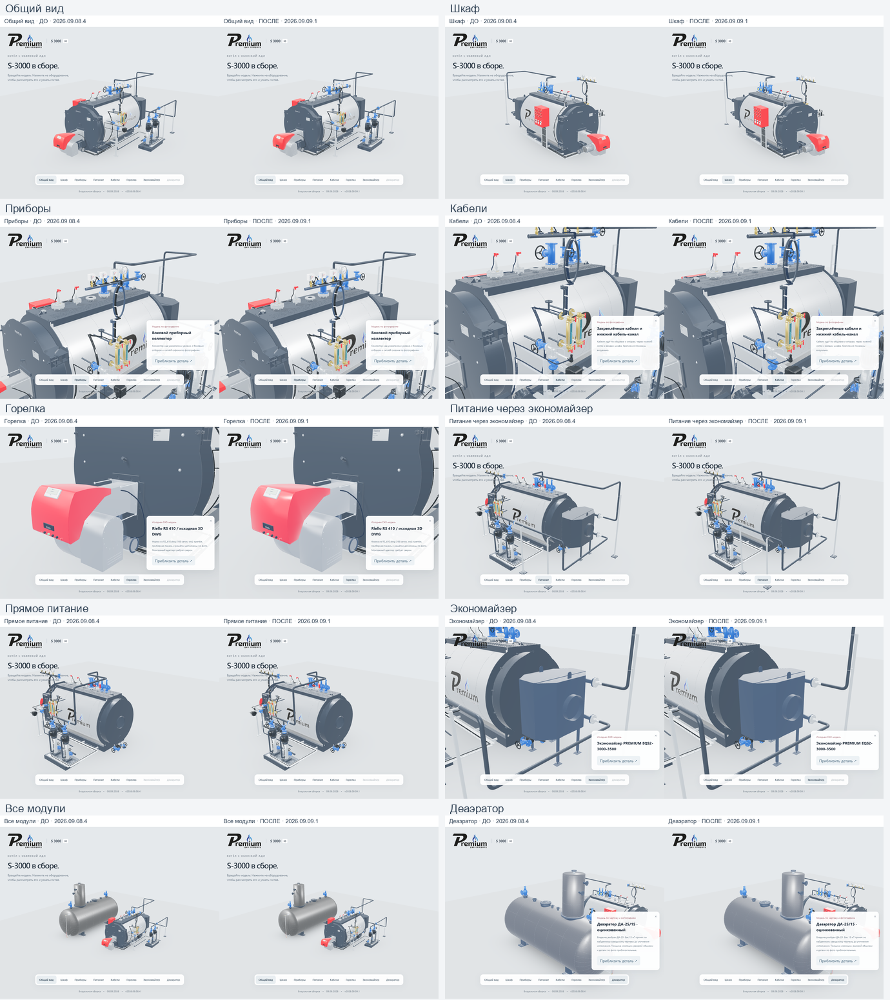

# S-3000: измеренное сравнение до и после

Версия **2026.09.09.1 от 9 сентября 2026**. Исполнитель: **Codex / GPT-6**.
На каждый размер экрана — два холодных и два повторных входа. В таблице медианы. Параметры сети, экран, Chrome и аппаратный рендер совпадают; другие пользовательские приложения не закрывались, фоновая нагрузка не фиксировалась.

| Измерение | До · 2026.09.08.4 | После · 2026.09.09.1 |
|---|---:|---:|
| Компьютер · 10 Мбит/с · 100 мс · Холодный вход | 22.32 с | 9.55 с |
| Компьютер · 10 Мбит/с · 100 мс · Повторный вход | 21.83 с | 0.66 с |
| Компьютер · 10 Мбит/с · 100 мс · отрисованные кадры/с, медиана | 15.2 | 50.2 |
| Мобильный размер · 4 Мбит/с · 150 мс · Холодный вход | 51.40 с | 22.82 с |
| Мобильный размер · 4 Мбит/с · 150 мс · Повторный вход | 50.91 с | 0.98 с |
| Мобильный размер · 4 Мбит/с · 150 мс · отрисованные кадры/с, медиана | 15.4 | 50.0 |

В исходной сцене 3 164 288 треугольников; в производной — 1 163 573 (−63,2%). Во время вращения учитывались все проходы WebGL: 5 473 766 → 1 076 937 треугольников/кадр, 319 → 160 вызовов. Число логических компонентов остается 49. В покое после оптимизации измерено 0 кадров отрисовки за контрольные 1,5 секунды.

В данной конфигурации Chrome холодная передача составила 23 865 840 → 10 627 607 байт. При повторном входе: 23 865 840 → 600 байт. JS/CSS/GLB новой версии повторно получены из HTTP-кеша. Объем браузера отличается от сжатых серверных файлов: локальное ПО проверки трафика изменяет HTML. Его не отключали. Поэтому это результат данной машины и методики, не универсальная скорость хостинга.

Пик JS heap на холодном входе: около 169 МБ → 73 МБ на компьютере. При повторном входе новая версия сохраняет больше данных в памяти кеша: около 151 МБ. Пик vertex/index buffers новой версии — около 39–41 МБ; исходной, на мобильном размере — 72–82 МБ. Это **не полная память процесса или видеокарты**: текстуры, драйвер и RSS отдельно не измерены.

Для раннего промежуточного варианта с тем же финальным кодом отрисовки измерено около 72 кадров/с. В окончательном повторном прогоне: 49,7–53,2 на компьютере и 38,4–54,7 на мобильном размере. Отчет использует окончательный прогон; лучший результат не подменяет весь диапазон. Физический телефон не тестировался.

## Внешний вид и поведение

Сравнены 10 пар снимков: общий вид, шкаф, приборы, кабели, горелка, обе схемы питания, экономайзер, все модули и деаэратор. Проверены исходные изображения логотипа и оцинковки, материалы, положение каждого компонента и сохранение габаритов после декодирования. Среднее поканальное отличие снимков в выбранной области — 0,09–0,93 из 255; это описательная метрика, не допуск формы.

Крупные планы: [горелка](performance/burner.png), [кабели](performance/cables.png), [приборы](performance/instruments.png), [питание через экономайзер](performance/feed-economizer.png), [прямое питание](performance/feed-direct.png), [деаэратор](performance/deaerator.png).

Браузер проверяет реальные visible-флаги обеих ветвей питания, выбор мышью, все 27 строк оборудования, отключение навесного оборудования и горелки, URL после перезагрузки, отсутствие горизонтального переполнения и плавный переход камеры после простоя. Приемка на staging и после публикации хранится отдельно и привязана к SHA-256 манифеста.

## Воспроизведение

Методика: [параметры, ограничения и решения](s3000-performance-design-20260909.md). Сырые результаты: [до, компьютер](performance/before-desktop.json), [после, компьютер](performance/after-desktop.json), [до, мобильный размер](performance/before-mobile.json), [после, мобильный размер](performance/after-mobile.json). CLI-сценарии находятся в `tools/s3000`.

Подробная сборка версии 2026.09.08.4 и ее Blender-файл сохранены. Основной URL остается https://prgz.ru/komplektacii4/. Протокол публикации указывает фактический адрес архива и способ отката. CI не настроен; проверки выполнены локально и отдельно на опубликованной странице.
