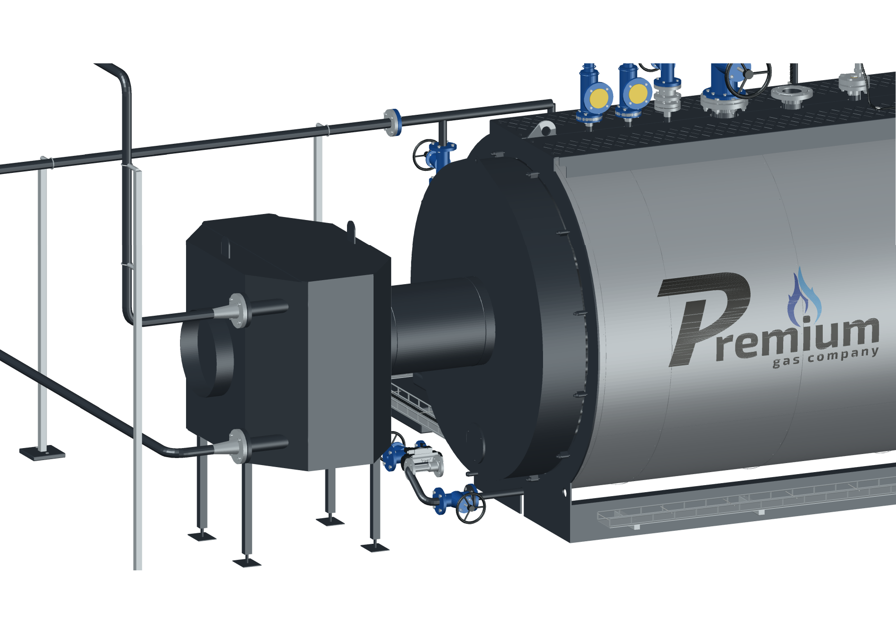
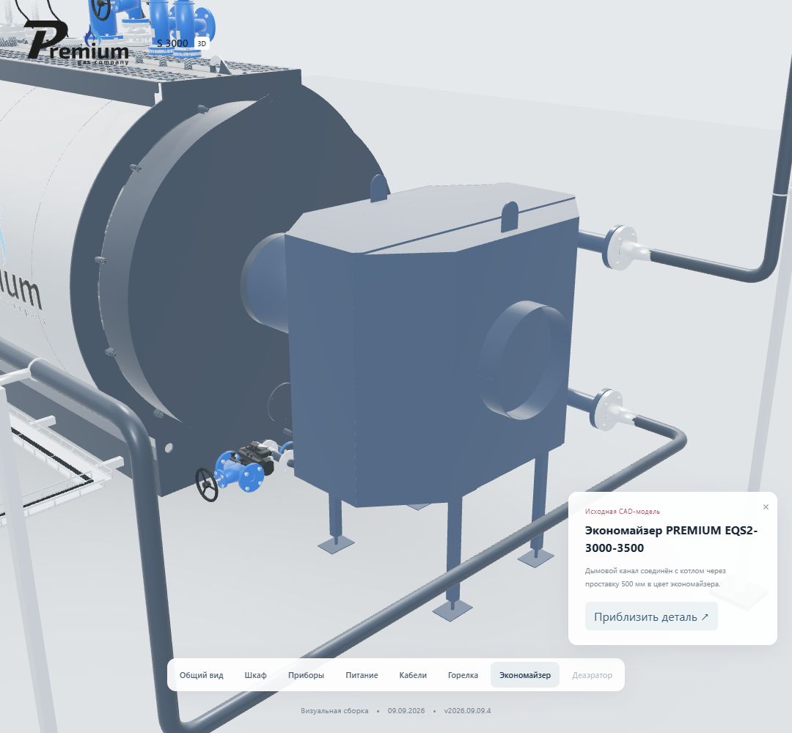

# PREMIUM S-3000 — проставка дымового канала 500 мм

Версия **2026.09.09.4**, 9 сентября 2026 года. Исполнитель: **Codex / GPT-6 Astra**.
Основа: `27eb79686f12c16e013ce2263230cb5343b36b7d`, версия с открываемыми дверями.

По запросу владельца между дымовым выходом котла и экономайзером добавлена
проставка длиной 500 мм. Проход 450 мм и наружный диаметр 456 мм повторяют
присоединительные патрубки исходных моделей. Открытый проход, стенка 3 мм,
небольшие сварные валики на торцах. Материал совпадает с корпусом экономайзера.

В координатах Blender начало — `(0, 1.688, 1.06)` м, конец — `(0, 2.188, 1.06)` м.
Экономайзер сдвинут на 500 мм по оси дымового канала. Его поворот сохранён.
Нижний водяной фланец находится в `(-0.525, 3.202, 0.700)` м, верхний —
`(-0.525, 3.202, 1.420)` м. Две соответствующие водяные трассы удлинены
по прямым участкам. Фланцы, отводы и диаметры сохранены.

Проставка включена в группу экономайзера. Она исчезает вместе с ним при
переключении на прямую подачу воды в котёл. Число логических компонентов — 54.
У 51 компонента геометрия, материалы граней и положения сохранены без изменений,
в том числе у прямой водяной трассы, датчиков, кабелей и открываемых дверей.

## Проверка и выпуск

Проверяется повторное чтение экспортированной геометрии, размер и открытый проход
проставки, материал, соединения водяных трасс и переключение комплектации.
Для сайта сохраняются пределы: до 12 МБ для моделей, до 6 МБ для одного файла.
Проверка AutoCAD включает сохранение DWG, повторное чтение и открывание дверей.
Результаты выпуска записываются в `s3000-spacer-verification-20260909.json`.

Исходная версия `.3` сохраняется. Новая поставка создаётся в отдельной папке
`S3000-Spacer-v2026.09.09.4`. Промышленная конструкторская приёмка не выполнялась.

## Результат выпуска

Опубликовано на https://prgz.ru/komplektacii4/ из исходного коммита `355a3fa`.
Предыдущая версия `.3` сохранена в отдельной папке сайта. SHA-256 всех 24
публичных файлов проверены по HTTPS. На временном адресе прошли 11 общих
сценариев, 9 сценариев дверей и 5 проверок проставки. После публикации повторены
9 сценариев дверей и 5 проверок проставки. Ошибок JavaScript нет; в простое 0 кадров.

Четыре модели занимают 11 484 876 байт: прирост 9 804 байта. Веб-сетка содержит
1 271 717 треугольников, подробная — 3 272 421. Размер после повторного чтения:
Blender 500.000000 мм, веб 500.000104 мм, CAD 500.000067 мм.

Оба DWG сохранены и повторно открыты в AutoCAD 2027. Проверены геометрия,
связность граней, цвета и 7 положений дверей для 53/51 блока. AUDIT при повторном
открытии — 0 ошибок. Архив из 14 файлов проверен по CRC и SHA-256.

Первый проверочный DXF прямой комплектации оказался неполным; причина не
установлена. Повторный экспорт в отдельную папку на диске E: прошёл сравнение.
Исправлено сохранение служебного SCR между разными дисками; исходники не заменялись.

