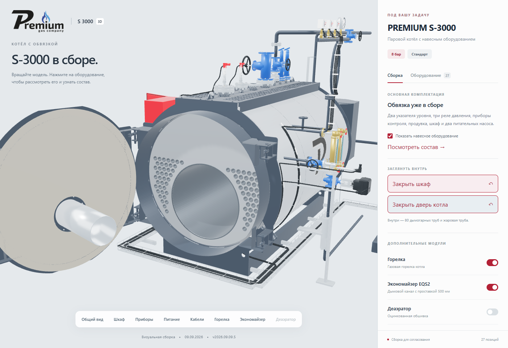
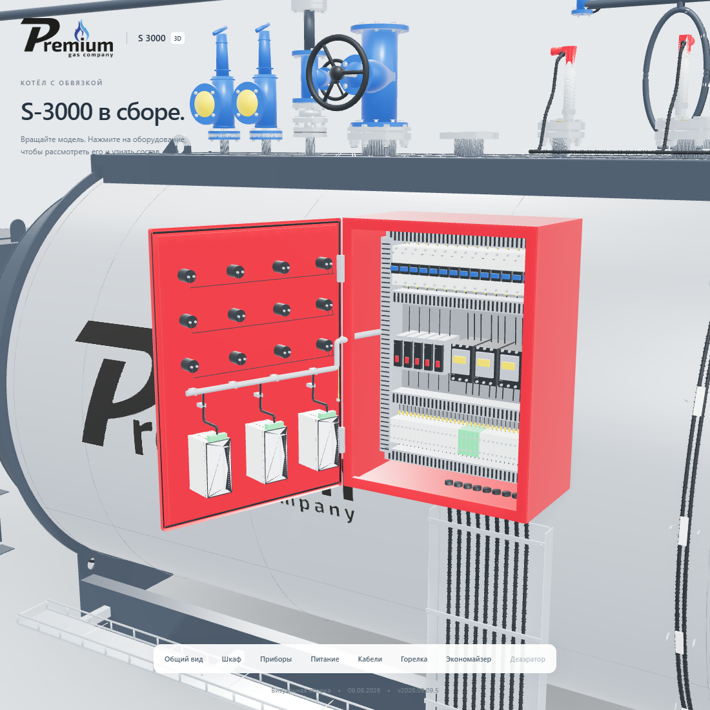

# Приёмка обновлённого котла и шкафа для сайта

Проверена версия **2026.09.09.5 от 9 сентября 2026 года**. Проверку и измерения выполнил **Codex / GPT-6**. Геометрия и веб-производная получены из задачи «Спроектировать 3D-визуализацию котла», коммит поставки `f6105e3`, исходный коммит приложения `3edc725`.

На момент передачи версия уже была оптимизирована и опубликована на [основном адресе](https://prgz.ru/komplektacii4/). Веб-задача приняла точную последнюю поставку и независимо проверила её. Повторное упрощение, новая версия и перезапись одинаковых файлов сайта не потребовались.

Сохранены открывание двери котла с горелкой, трубный пучок, открывание шкафа с приборами и проводкой, исправленный наклон контроллера, проставка экономайзера 500 мм, обе схемы питания, 27 карточек и публичные описания с брендом Premium.

## Пригодность для сети

Подробная модель: 3 277 745 треугольников. Веб-модель: 1 277 077, уменьшение на 61,0%. Четыре GLB занимают 11 551 412 байт после распаковки; по сети с gzip — 6 344 790 байт. Все четыре файла отдаются как `model/gltf-binary` с годовым неизменяемым кешем. Каждый файл меньше 6 МБ, сумма меньше 12 МБ.

Свежий замер на опубликованном HTTPS-адресе, Chrome 152 / Windows / Intel UHD 770:

| Профиль | Холодный вход | Повторный вход | Отрисованные кадры/с: холодный / повторный |
|---|---:|---:|---:|
| Компьютер · 10 Мбит/с · 100 мс | 9.03 с | 0.68 с | 71.3 / 71.5 |
| Мобильный размер · 4 Мбит/с · 150 мс | 17.03 с | 0.91 с | 71.5 / 71.8 |

По одному холодному и повторному прогону на каждый размер экрана. Проверки и замеры запускались последовательно. При повторном входе передано 300 байт, ресурсы использованы из кеша. В покое — 0 отрисованных кадров за 1,5 секунды. Это свежие контрольные измерения, а не медианы нескольких прогонов и не гарантированное время загрузки. Сравнение скорости с предыдущей версией в одинаковой фоновой нагрузке не проводилось. Физический телефон не использовался.

## Проверки

- Все 24 публичных файла совпали с манифестом по HTTPS/SHA-256. Манифест повторно сверён после браузерных измерений.
- 7 локальных тестов состава и бюджета; структурная проверка сборки — успешно.
- 9 сценариев дверей: совместное движение деталей, возврат координат, быстрое изменение направления, переключение трасс, мобильные элементы и остановка отрисовки.
- 3 проверки шкафа: корпуса приборов стоят ровно, проводка закреплена на двери, геометрия подводки относительно двери одинакова в открытом и закрытом состоянии.
- Ошибок страницы нет. Виды открытого котла и исправленного шкафа просмотрены.
- Архив [2026.09.09.4](https://prgz.ru/komplektacii4-v2026.09.09.4/) доступен; SHA-256 его HTML совпал. Полный архив повторно не проверялся, фактический откат не выполнялся.

[Полный протокол](s3000-web-handoff-20260909.json), [замер компьютера](performance/handoff-v2026.09.09.5/desktop.json), [мобильный размер](performance/handoff-v2026.09.09.5/mobile.json). Полная память процесса и видеокарты не измерялась. CI не настроен.
