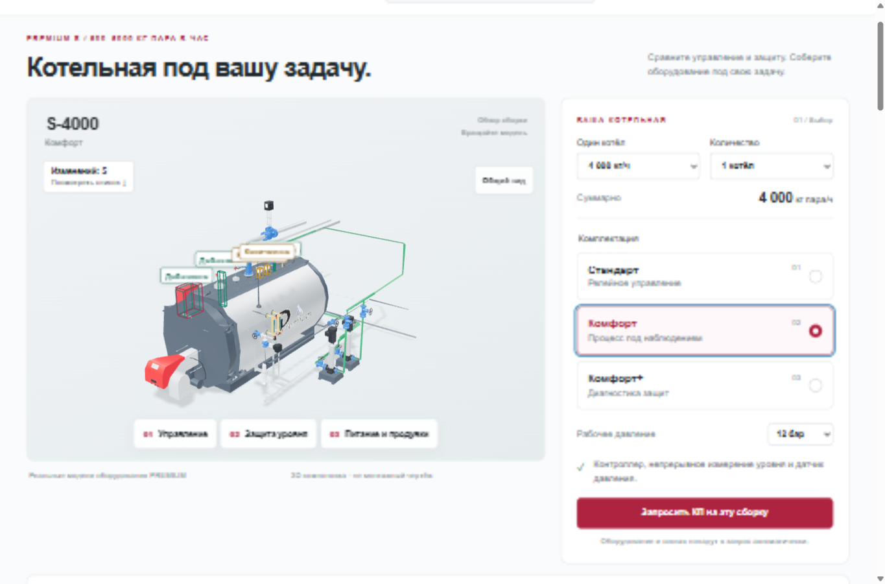
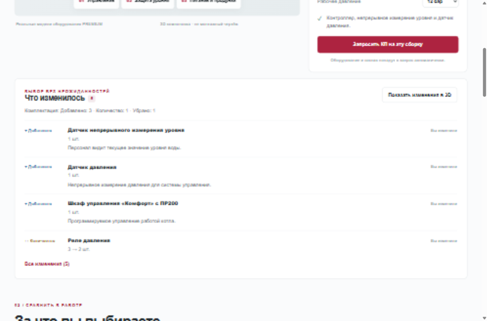
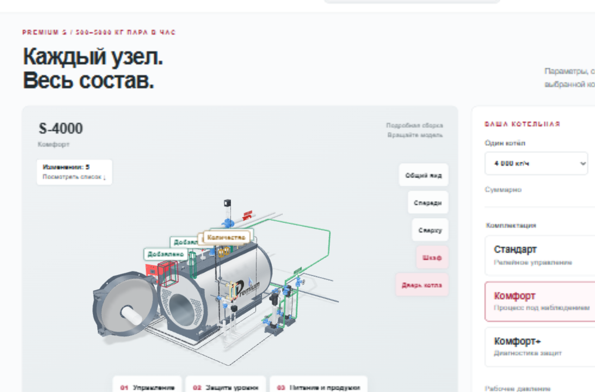
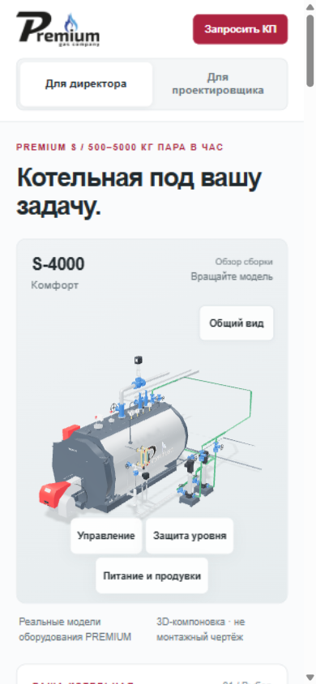

# Приёмка PREMIUM /komplektacii5 — 2026.10.01.1

01.10.2026 · Codex / GPT-6 · **LOCAL_REVIEW / NOT_DEPLOYED**.

## Результат

Локальная версия готова для согласования. Источник: cc919366206eb317e7f21e90247ed1870cb276cd (2026.09.29.6). Работа только в sites/komplektacii5. Незавершённые изменения соседнего чата не включены. Публикации на Beget и реальных писем пока не было.

## Подтверждённые проверки

- TypeScript и production Vite build: PASS.
- 270 базовых конфигураций, URL round-trip и единый состав: PASS; 45 вариантов подбора деаэратора: PASS.
- 270 серверных конфигураций и 14 PHP-сценариев: PASS. Включены валидация, fixed recipient, concurrency, replay, два лимита, отказ транспорта, повреждённое состояние, приватное хранилище и временная блокировка файла Windows. См. reports/lead-qa.json и lead-qa-recovery.md. Реальных email: **0**.
- 22 400 нормализованных сочетаний проверены по графу ассетов, scopes, каталожным ID и бюджетам. 105 лёгких GLB; 80 исходных моделей и 81 подробная копия сохранили контрольные суммы.
- Все 27 сочетаний мощность × комплектация открыты в браузере без отказа сцены. Включение/выключение всех семи опций, автоматическое отключение модуляции, автоматическая замена ДА, количество и быстрые переключения проверены.
- Добавления, удаления, замены и количество берутся из одного Delta для 3D, состава и пояснений. Подсветка исчезает через 4 секунды после готовности модели; текст сохраняется, повторная подсветка доступна. Удалённый BDV фокусируется по прежней сцене.
- Оба режима сохраняют конфигурацию; само переключение режима не создаёт Delta. Подробный S-4000 открывает двери по исходным углам −105° и +105° для фото-шкафа. Выбор и разметка дверей используют общее состояние.
- STEP S-4000 и PDF EQS2-4000 скачаны через элементы страницы. Все 16 документов и логотип проверены по pinned Git blobs и SHA-256.
- Принудительный отказ WebGL, GLB и JS-чанка просмотрщика сохраняет сравнение и форму. Локальный отказ отправки показывает ошибку, не «Заявка принята».
- Управление моделью с клавиатуры, prefers-reduced-motion, экран 390×844 и увеличение текста до 200% проверены. При 200% clientWidth=375 и scrollWidth=375: горизонтального переполнения страницы нет; таблица имеет собственную прокрутку.
- Read-only WebMCP чтение выбранного состава: valid input PASS, invalid input rejected. Отправка заявки через WebMCP не предоставляется.

## Измеренные бюджеты

| Метрика | Цель | Локальный результат |
|---|---:|---:|
| JS первого экрана с Three.js | ≤350 000 Б gzip | 232 733 Б gzip |
| Весь JS, включая подробный режим | справочно | 251 612 Б gzip |
| Передача до первой сцены по умолчанию | ≤1 500 000 Б | 1 217 651 Б |
| Максимальный набор выбранных GLB | ≤2 500 000 Б | 1 999 036 Б |
| Первый полезный 3D-кадр, 10 Мбит/с + 100 мс | ≤4 с | 1,915 с финальный запуск; три предварительных 1,903–1,932 с |
| Пять S-4000 Комфорт+ со всеми опциями | ≤500 000 треугольников | 483 673 в кадре, включая 2 треугольника пола |
| Вращение этого каскада | медиана ≥30 FPS | 74,63 FPS; 179 интервалов; p95 13,5 мс |
| Перерисовка в покое | отсутствует | 0 дополнительных кадров за 1,2 с |

Профиль: Codex In-app Browser, 1366×900, DPR≈1, без CPU throttling. Cold-load: cache disabled, 10 Mbps down/up, latency100 ms, gzip HTML/CSS/JS/JSON/GLB. Замеры относятся к локальной production-сборке и указанному профилю. Beget, физический телефон и другие GPU ещё не замерялись. Без HTTP-сжатия GLB исходный ранний замер был 1,622 МБ; поэтому фактический Content-Encoding на промежуточном Beget-адресе входит в проверку перед публикацией.

## Снимки

## Следующий согласуемый шаг

Согласовать страницу и одну контрольную заявку на premium-gas@mail.ru. Затем промежуточная загрузка внутри public_html, проверка HTTPS/хешей/сжатия и фактического получения письма. После успешной проверки — публикация https://prgz.ru/komplektacii5/ и повторная проверка без изменений /komplektacii4/. PHP accepted подтверждает приём почтовым транспортом; получение письма подтверждается отдельно.
