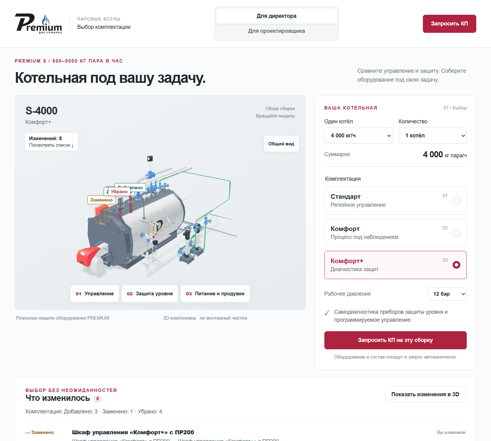
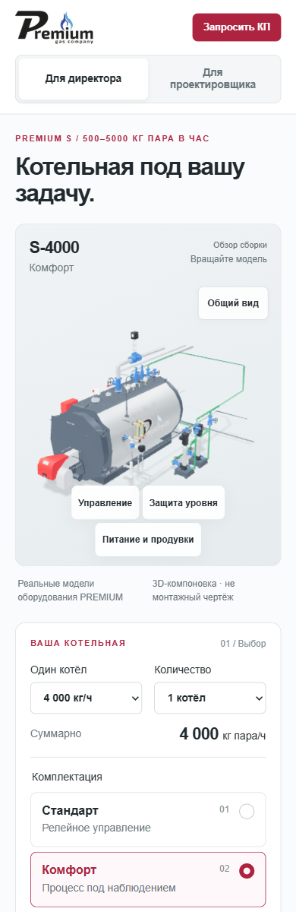
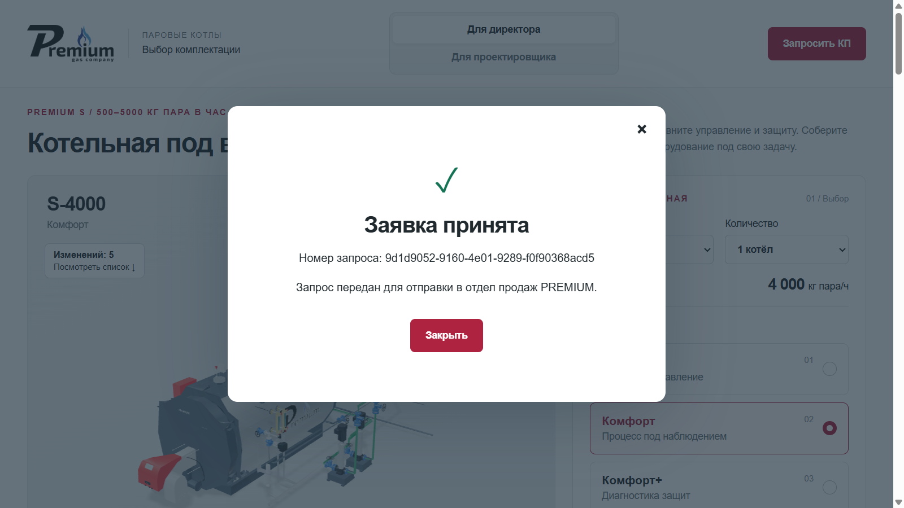

# Публикация PREMIUM /komplektacii5 · 2026.10.01.1

**Статус: PUBLISHED_VERIFIED.** Сайт: [https://prgz.ru/komplektacii5/](https://prgz.ru/komplektacii5/).

Дата версии: **01.10.2026**. Опубликовано **01.10.2026, 17:08:22 Europe/Saratov (13:08:22 UTC)**. Исполнитель: **Codex / GPT-6**.

Коммит приложения: `0c8b8ccdc97617285a09265efcf8dc5bc1277792`. Согласованная заводская база: `cc919366206eb317e7f21e90247ed1870cb276cd`, версия 2026.09.29.6. Ветка `codex/komplektacii5-sales-20261001`, [PR #16](https://github.com/lexcrirovs-prog/3d_komplektacii_na_par/pull/16).

## Согласование и фактическая публикация

Пользователь сообщил «согласовано» после предложения разместить конкретную сборку на промежуточном адресе Beget, отправить одну контрольную заявку и после проверки опубликовать `/komplektacii5/`. Дополнительное разрешение не требовалось.

До записи проверены отсутствие `/komplektacii5/` и промежуточной папки, доступность PHP 5.6.40 и свободное место. Сохранена полная инвентаризация 126 файлов `/komplektacii4/` с SHA-256. У существующей страницы не менялись файлы или права.

Загружен согласованный ZIP размером **150 274 348 байт**, SHA-256 `b45509a94e7fcf5fc7167520cd894c20c99aa35aa603fc751d106c9b8cf8e106`. Копия пакета сохранена вне `public_html`, с правами 0600. Содержимое извлечено в `public_html/komplektacii5-review-20261001-1/` после проверки имён, отсутствия ссылок и совпадения SHA архива.

После проверок и подтверждения реального получения письма эта папка атомарно переименована в `public_html/komplektacii5/`. Перед переименованием повторно проверены все файлы и отсутствие целевого каталога. Промежуточной папки после переноса нет. Общая конфигурация домена и `/komplektacii4/` не изменялись.

## Проверки Beget

| Проверка | Результат |
|---|---|
| SHA-256 и размер файлов на сервере | 227/227 совпадают с пакетом, включая manifest |
| HTTPS и SHA-256 публичных файлов | 224/224 совпадают, на промежуточном и итоговом адресах |
| GLB по HTTPS | Все 186 файлов имеют `Content-Encoding: gzip`, MIME `model/gltf-binary` |
| PHP | `php -l` на Beget PHP 5.6.40: без ошибок; реальный HTTP endpoint также PHP 5.6.40 |
| GET endpoint | 405, JSON UTF-8, `Allow: POST`, `Cache-Control: no-store` |
| Неполный POST `{}` | 422, JSON; письмо не отправляется |
| `.htaccess` и `api/.htaccess` | HTTP 403; исходные настройки не выдаются |
| Приватное хранилище заявок | Вне `public_html`, права 0700; accepted-запись сохранена после переноса |
| Адрес без завершающего `/` | Конечный адрес HTTPS с `/`, статус 200 |
| `/komplektacii4/` | Все 126 путей, размеров и SHA-256 совпадают до и после публикации |

PHP исполняется, а `.htaccess` закрыт, поэтому три этих файла сверялись по SHA непосредственно на сервере. Остальные файлы, включая 9 STEP и 7 PDF, также прочитаны по HTTPS и сверены после распаковки gzip. Существующая серверная цепочка для адреса без `/`: HTTPS → HTTP со слешем → HTTPS со слешем; итоговая страница работает по HTTPS. Ссылки приложения используют канонический адрес с `/`.

## Контрольная заявка

Через пользовательскую форму промежуточной страницы отправлена **одна реальная заявка** с явным техническим комментарием, без коммерческого обращения.

- UUID: **`9d1d9052-9160-4e01-9289-f0f90368acd5`**.
- Отправитель: `PREMIUM <no-reply@prgz.ru>`; фактический получатель: **premium-gas@mail.ru**.
- Отправлено 13:06:01 UTC; получено во **«Входящих» 13:06:02 UTC** (17:06:02 Europe/Saratov).
- В письме: 1 × S-4000, «Комфорт», 12 бар, 4000 кг/ч, **32 позиции**; горелка и ГПЗ с электроприводом присутствуют.
- Версия приложения и исходный commit совпали; ссылка содержит точную выбранную конфигурацию и итоговый путь `/komplektacii5/`.

Получение подтверждено поиском точного UUID и чтением найденного письма через Mail.ru gateway. Команды отправки из почтового коннектора и изменения ящика не выполнялись. Ответ формы и получение письма — две отдельные проверки. После переноса повторной реальной отправки не было.

## Браузер и производительность

На Beget проверены автоматическая загрузка лёгкой сцены, «Стандарт → Комфорт → Комфорт+», подсветка и повтор изменений, сохранение состава при переключении режимов, подробная модель и открывание дверей. На итоговом адресе проверено автоматическое снятие модуляции при переходе на «Стандарт»: список явно показывает «Автоматически» и причину. Новых ошибок JavaScript при проверке не обнаружено.

Мобильный профиль **390×844**: ширина содержимого и прокрутки **375/375 px**, горизонтальной прокрутки нет. Снимок проверен визуально. Все временные настройки размеров и скорости сети сброшены после проверки. Физический телефон не проверялся.

Отдельный холодный запуск итогового HTTPS-адреса: IAB, viewport **1280×720**, cache disabled, download/upload **10 Мбит/с**, задержка **100 мс**, без CPU throttling:

| Метрика | Факт | Цель |
|---|---:|---:|
| Первый полезный вращаемый 3D-кадр | **2 956,5 мс** | ≤4 000 мс |
| Передача до первого кадра | **1 214 974 байт** | ≤1 500 000 байт |

Это один контрольный запуск с Beget. Другие GPU, физические телефоны и перцентили реального трафика этим измерением не подтверждаются. Локальные проверки 270 сочетаний, 45 подборов ДА, 22 400 состояний ассетов, отказов WebGL/GLB/JS, reduced motion, 200% текста и вращения каскада сохранены в [протоколе приёмки](ACCEPTANCE-2026.10.01.1.md). Код и ассеты при публикации не изменялись.

## Доказательства и неизменность пакета

В [deployment-2026.10.01.1](deployment-2026.10.01.1) сохранены до/после-инвентаризации, серверные проверки, результаты HTTPS по каждому файлу, подтверждение приёма и доставки, замер производительности и снимки. [publication.json](deployment-2026.10.01.1/publication.json) содержит итоговый статус.

Исходный `DEPLOY_MANIFEST.json` оставлен побайтно неизменным с историческим `LOCAL_REVIEW`: SHA-256 **`e964999f5dc5a514c8e993c4d6179bf1af9602b3c0f805e0b752d60fbabc13c0`**. Статус `PUBLISHED_VERIFIED` записан отдельно, чтобы не менять согласованный пакет. Последующий коммит фиксирует только документы и доказательства публикации, а не новую версию приложения. PR не сливался; соседние незавершённые изменения в сборку не включены.

## Снимки опубликованного сайта

