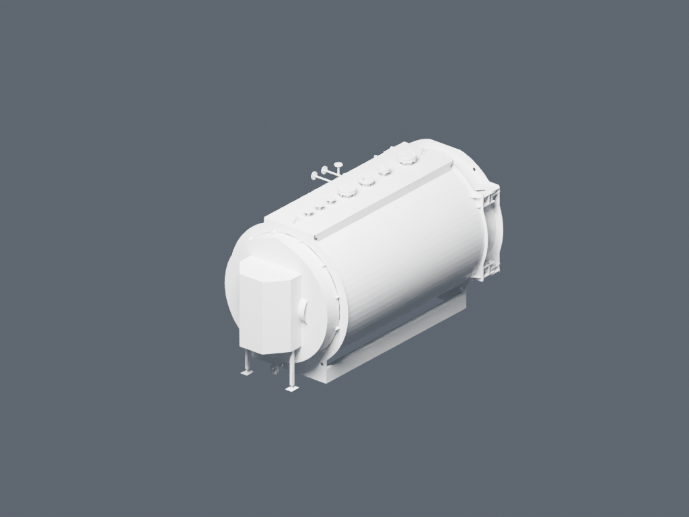

# Модели оборудования и первая сборка

Архивный отчёт **2026.09.08.1 от 8 сентября 2026 года**, уточнён в **2026.09.08.2**. Исполнитель: **Codex / GPT-6 Astra**. Актуальная сборка — [S-3000, АДЛ, 8 бар](../../README.md).

Все восемь имеющихся GLB прочитаны установленным Blender через инструменты Codex. Из котла PR.3000 и экономайзера PREMIUM EQS2-3000-3500 была сохранена предварительная пара в Blender и GLB. Она повторно открыта в отдельном процессе Blender: два объекта геометрии, габариты и 101 962 невырожденных треугольника сохранились. Исходные GLB совпадали с файлами в Git по SHA-256. Первоначальная подпись EQS2 как горелки была ошибочной. Положение пары на архивном изображении не является правильной сборкой.

Это контрольное изображение геометрии. Материалы, окраска и рекламное освещение ещё не подготовлены. Проверка фланцев, креплений, зазоров и применимости этой пары к конкретному заказу не выполнялась.

## Каталог

Размеры ниже — ограничивающий параллелепипед сетки по осям **X × Y × Z Blender** после импорта с коэффициентом **0,001**. Это численная проверка импорта. Они не заменяют заводские габаритные и присоединительные размеры. Число треугольников указано для исходного GLB.

| Файл | Габариты сетки, м | Треугольники |
| --- | --- | ---: |
| `bcv_7250.glb` | 0.404 × 0.167 × 0.259 | 123 702 |
| `bcv_925.glb` | 0.162 × 0.136 × 0.475 | 159 892 |
| `boiler.glb` | 2.086 × 3.469 × 2.131 | 90 614 |
| `cp_930.glb` | 0.084 × 0.038 × 0.762 | 33 092 |
| `deaerator.glb` | 1.564 × 3.295 × 3.858 | 71 998 |
| `dn32h50.glb` | 0.165 × 0.460 × 0.194 | 69 911 |
| `elbow_pc_f20.glb` | 0.105 × 0.143 × 0.159 | 8 736 |
| `rs_410.glb` | 1.014 × 1.302 × 1.670 | 11 372 |

В исходных GLB нет материалов. В репозитории также находятся девять STEP/STP: котёл, экономайзер, деаэратор, два варианта DN32/DN40, два BCV, CP930 и колено PC F20. Единицы STEP следует читать в контексте геометрического представления: встречаются метры, миллиметры и сантиметры. Коэффициент старого GLB нельзя автоматически переносить на новый STEP-конвертер.

## Первая пара

- Котёл: `boiler.glb`, исходник `PR.3000.01.001(S).stp`.
- Экономайзер: `rs_410.glb`. Несмотря на имя файла, [коммит его добавления](https://github.com/lexcrirovs-prog/3d_komplektacii_na_par/commit/1e6b848ec0630958eb463d4715f356dc4b81cb4a) указывает исходник `PREMIUM EQS2-3000-3500 (BIM).stp`. Это не модель горелки RS 410.
- Обе детали импортированы с одинаковым коэффициентом 0,001 и сохранёнными исходными началами координат. Общий поворот на 180° вокруг Z выбран только для ракурса. Дополнительные перемещения деталей относительно друг друга не применялись.
- На архивном изображении экономайзер ошибочно находился у передней двери. Совпадение нижних отметок опор с разницей около 0,5 мм не подтверждало правильного соединения. В версии 2026.09.08.2 он перенесён назад, повёрнут на 90° и состыкован по портам исходных STEP.
- Общие габариты сеток: **2,085943 × 3,906252 × 2,131000 м**. GLB занимает около **7,22 МиБ**; облегчение для сайта ещё не выполнялось.
- Первичный импорт Blender исключил 24 треугольника котла с повторяющимися индексами вершин и нулевой площадью. Это подтверждено чтением исходного GLB. Все остальные треугольники сохранились при экспорте и повторном импорте.

## Состояние прежнего прототипа на дату версии .1

Пункты ниже описывают архивный режим `?assembly=legacy`. Их нельзя переносить на новую сборку S-3000: её масштаб деаэратора, экономайзер, спецификация и модели ATECH заменены проверенной поставкой .2.

1. **Горелка условная.** В `PlaceholderModels.tsx` применяется процедурный `BurnerModel`. Файл `rs_410.glb` относится к экономайзеру и не подходит для замены горелки.
2. **Масштаб деаэратора отличается вдвое.** Его `baseScale=0.0005`, у котла и остальных подключённых GLB — 0,001. Нужна сверка с известным заводским размером перед установлением общего масштаба.
3. **DN32h50 — предохранительный клапан АСТА.** Поле PRODUCT исходного STEP содержит «ПК DN32х50 PN40х16 АСТА». Неверное название «переходник» исправлено в интерфейсе .2. Размещение в прежнем режиме остаётся условным. CP930 также переименован в датчик проводимости; охладитель проб — SC9.
4. **Часть оборудования пока условная.** Задвижки, датчики, предохранительный клапан, насосы, автоматика и экономайзер в текущем коде построены из простых фигур. Для соответствия реальному изделию нужны выбранные марки, готовые модели либо фотографии с размерами.
5. **Сборка котельной ждёт проект.** Для первого рабочего примера нужны DWG плана и схем, спецификация, отметки высот и известный контрольный размер. Проверенный сейчас AutoCAD MCP читает стандартные свойства открытого DWG; трассы труб и специальные связи Plant 3D автоматически не восстановлены.

## Свидетельства и результаты

Машинный каталог: [asset-readiness-20260908.json](asset-readiness-20260908.json).

Локальный каталог Blender bridge содержит `runtime/pilot-export-roundtrip-20260908.json`, сохранённые Blender/GLB/PNG в `runtime/outputs` и исходные протоколы проверки. Тяжёлые результаты и локальные настройки в Git не включены. Пользователю передана отдельная папка `boiler-3d-pilot-20260908` с короткими именами файлов.

Архивные статусы: **PASSED_CODEX_NATIVE_MCP**, **PASSED_GLB_ROUNDTRIP**. Они подтверждали импорт и экспорт, но не правильную компоновку пары. Актуальные результаты веб-сборки и геометрии см. в [отчёте версии .2](../../docs/s3000-verification-20260908.json).
